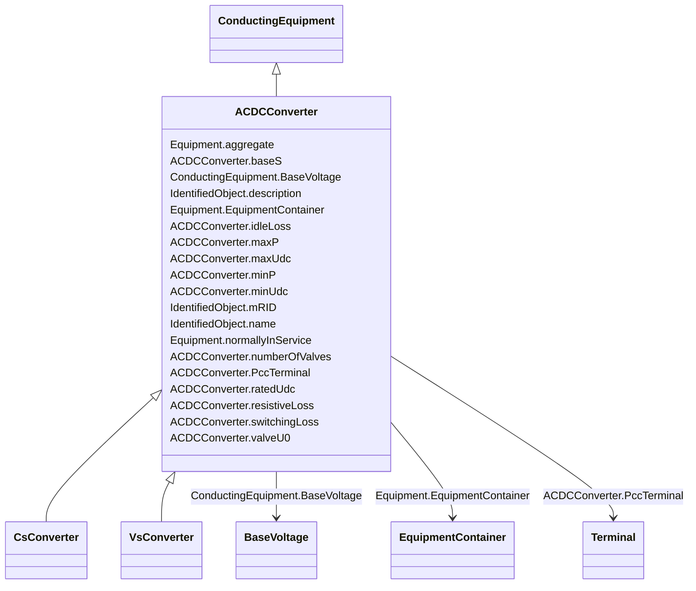

# ACDCConverter

_A unit with valves for three phases, together with unit control equipment, essential protective and switching devices, DC storage capacitors, phase reactors and auxiliaries, if any, used for conversion._

* __NOTE__: this is an abstract class and should not be instantiated directly

**URI**: [cim:ACDCConverter](http://iec.ch/TC57/CIM100#ACDCConverter) 
**Type**: Class

## Inheritance
* [IdentifiedObject](IdentifiedObject.md)
    * [PowerSystemResource](PowerSystemResource.md)
        * [Equipment](Equipment.md)
            * [ConductingEquipment](ConductingEquipment.md)
                * **ACDCConverter**
                    * [CsConverter](CsConverter.md)
                    * [VsConverter](VsConverter.md)

## Attributes

| Name | URI | Cardinality and Range | Description | Inheritance |
| ---  | --- | --- | --- | --- |
| baseS | [cim:ACDCConverter.baseS](http://iec.ch/TC57/CIM100#ACDCConverter.baseS) | 0..1    [ApparentPower](ApparentPower.md)  | Base apparent power of the converter pole | direct |
| idleLoss | [cim:ACDCConverter.idleLoss](http://iec.ch/TC57/CIM100#ACDCConverter.idleLoss) | 0..1    [ActivePower](ActivePower.md)  | Active power loss in pole at no power transfer | direct |
| maxP | [cim:ACDCConverter.maxP](http://iec.ch/TC57/CIM100#ACDCConverter.maxP) | 0..1    [ActivePower](ActivePower.md)  | Maximum active power limit | direct |
| maxUdc | [cim:ACDCConverter.maxUdc](http://iec.ch/TC57/CIM100#ACDCConverter.maxUdc) | 0..1    [Voltage](Voltage.md)  | The maximum voltage on the DC side at which the converter should operate | direct |
| minP | [cim:ACDCConverter.minP](http://iec.ch/TC57/CIM100#ACDCConverter.minP) | 0..1    [ActivePower](ActivePower.md)  | Minimum active power limit | direct |
| minUdc | [cim:ACDCConverter.minUdc](http://iec.ch/TC57/CIM100#ACDCConverter.minUdc) | 0..1    [Voltage](Voltage.md)  | The minimum voltage on the DC side at which the converter should operate | direct |
| numberOfValves | [cim:ACDCConverter.numberOfValves](http://iec.ch/TC57/CIM100#ACDCConverter.numberOfValves) | 0..1    integer  | Number of valves in the converter | direct |
| ratedUdc | [cim:ACDCConverter.ratedUdc](http://iec.ch/TC57/CIM100#ACDCConverter.ratedUdc) | 0..1    [Voltage](Voltage.md)  | Rated converter DC voltage, also called UdN | direct |
| resistiveLoss | [cim:ACDCConverter.resistiveLoss](http://iec.ch/TC57/CIM100#ACDCConverter.resistiveLoss) | 0..1    [Resistance](Resistance.md)  | It is converter’s configuration data used in power flow | direct |
| switchingLoss | [cim:ACDCConverter.switchingLoss](http://iec.ch/TC57/CIM100#ACDCConverter.switchingLoss) | 0..1    [ActivePowerPerCurrentFlow](ActivePowerPerCurrentFlow.md)  | Switching losses, relative to the base apparent power 'baseS' | direct |
| valveU0 | [cim:ACDCConverter.valveU0](http://iec.ch/TC57/CIM100#ACDCConverter.valveU0) | 0..1    [Voltage](Voltage.md)  | Valve threshold voltage, also called Uvalve | direct |
| PccTerminal | [cim:ACDCConverter.PccTerminal](http://iec.ch/TC57/CIM100#ACDCConverter.PccTerminal) | 0..1    [Terminal](Terminal.md)  | Point of common coupling terminal for this converter DC side | direct |
| BaseVoltage | [cim:ConductingEquipment.BaseVoltage](http://iec.ch/TC57/CIM100#ConductingEquipment.BaseVoltage) | 0..1    [BaseVoltage](BaseVoltage.md)  | Base voltage of this conducting equipment | [ConductingEquipment](ConductingEquipment.md) |
| aggregate | [cim:Equipment.aggregate](http://iec.ch/TC57/CIM100#Equipment.aggregate) | 0..1    boolean  | The aggregate flag provides an alternative way of representing an aggregated ... | [Equipment](Equipment.md) |
| normallyInService | [cim:Equipment.normallyInService](http://iec.ch/TC57/CIM100#Equipment.normallyInService) | 0..1    boolean  | Specifies the availability of the equipment under normal operating conditions | [Equipment](Equipment.md) |
| EquipmentContainer | [cim:Equipment.EquipmentContainer](http://iec.ch/TC57/CIM100#Equipment.EquipmentContainer) | 0..1    [EquipmentContainer](EquipmentContainer.md)  | Container of this equipment | [Equipment](Equipment.md) |
| mRID | [cim:IdentifiedObject.mRID](http://iec.ch/TC57/CIM100#IdentifiedObject.mRID) | 1    string  | Master resource identifier issued by a model authority | [IdentifiedObject](IdentifiedObject.md) |
| description | [cim:IdentifiedObject.description](http://iec.ch/TC57/CIM100#IdentifiedObject.description) | 0..1    string  | The description is a free human readable text describing or naming the object | [IdentifiedObject](IdentifiedObject.md) |
| name | [cim:IdentifiedObject.name](http://iec.ch/TC57/CIM100#IdentifiedObject.name) | 1    string  | The name is any free human readable and possibly non unique text naming the o... | [IdentifiedObject](IdentifiedObject.md) |

## Usages

| used by | used in | type | used |
| ---  | --- | --- | --- |
| [ACDCConverterDCTerminal](ACDCConverterDCTerminal.md) | DCConductingEquipment | range | [ACDCConverter](ACDCConverter.md) |

## Identifier and Mapping Information

### Schema Source

* from schema: http://iec.ch/TC57/2020/CPSM-CoreEquipment#

## Mappings

| Mapping Type | Mapped Value |
| ---  | ---  |
| self | cim:ACDCConverter |
| native | this:ACDCConverter |

