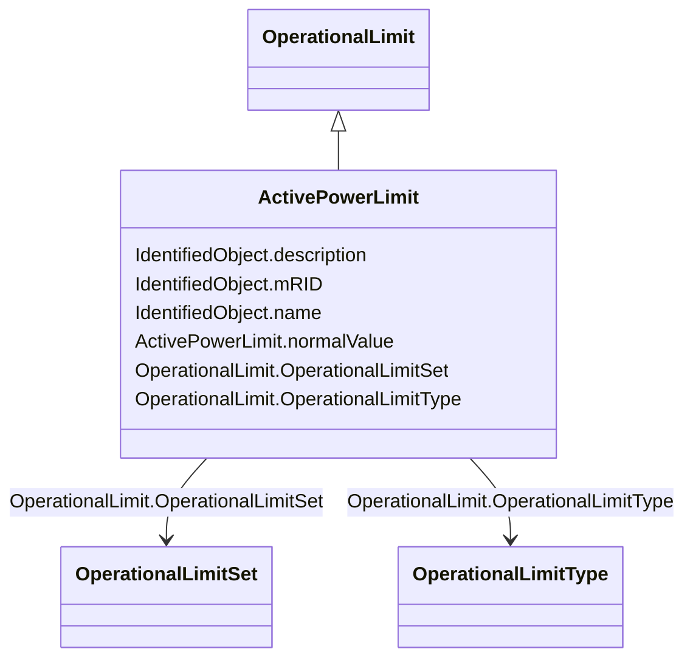

# ActivePowerLimit

_Limit on active power flow._

**URI**: [cim:ActivePowerLimit](http://iec.ch/TC57/CIM100#ActivePowerLimit) 
**Type**: Class

## Inheritance
* [IdentifiedObject](IdentifiedObject.md)
    * [OperationalLimit](OperationalLimit.md)
        * **ActivePowerLimit**

## Attributes

| Name | URI | Cardinality and Range | Description | Inheritance |
| ---  | --- | --- | --- | --- |
| normalValue | [cim:ActivePowerLimit.normalValue](http://iec.ch/TC57/CIM100#ActivePowerLimit.normalValue) | 1    [ActivePower](ActivePower.md)  | The normal value of active power limit | direct |
| OperationalLimitSet | [cim:OperationalLimit.OperationalLimitSet](http://iec.ch/TC57/CIM100#OperationalLimit.OperationalLimitSet) | 1    [OperationalLimitSet](OperationalLimitSet.md)  | The limit set to which the limit values belong | direct |
| OperationalLimitType | [cim:OperationalLimit.OperationalLimitType](http://iec.ch/TC57/CIM100#OperationalLimit.OperationalLimitType) | 1    [OperationalLimitType](OperationalLimitType.md)  | The limit type associated with this limit | direct |
| mRID | [cim:IdentifiedObject.mRID](http://iec.ch/TC57/CIM100#IdentifiedObject.mRID) | 1    string  | Master resource identifier issued by a model authority | [IdentifiedObject](IdentifiedObject.md) |
| description | [cim:IdentifiedObject.description](http://iec.ch/TC57/CIM100#IdentifiedObject.description) | 0..1    string  | The description is a free human readable text describing or naming the object | [IdentifiedObject](IdentifiedObject.md) |
| name | [cim:IdentifiedObject.name](http://iec.ch/TC57/CIM100#IdentifiedObject.name) | 1    string  | The name is any free human readable and possibly non unique text naming the o... | [IdentifiedObject](IdentifiedObject.md) |

## Identifier and Mapping Information

### Schema Source

* from schema: http://iec.ch/TC57/2020/CPSM-CoreEquipment#

## Mappings

| Mapping Type | Mapped Value |
| ---  | ---  |
| self | cim:ActivePowerLimit |
| native | this:ActivePowerLimit |

