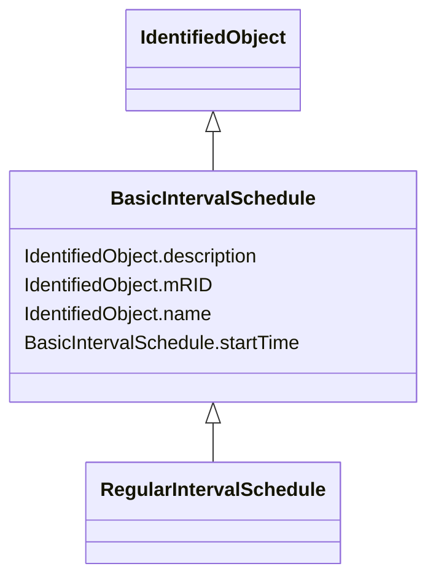

# BasicIntervalSchedule

_Schedule of values at points in time._

* __NOTE__: this is an abstract class and should not be instantiated directly

**URI**: [cim:BasicIntervalSchedule](http://iec.ch/TC57/CIM100#BasicIntervalSchedule) 
**Type**: Class

## Inheritance
* [IdentifiedObject](IdentifiedObject.md)
    * **BasicIntervalSchedule**
        * [RegularIntervalSchedule](RegularIntervalSchedule.md)

## Attributes

| Name | URI | Cardinality and Range | Description | Inheritance |
| ---  | --- | --- | --- | --- |
| startTime | [cim:BasicIntervalSchedule.startTime](http://iec.ch/TC57/CIM100#BasicIntervalSchedule.startTime) | 1    datetime  | The time for the first time point | direct |
| mRID | [cim:IdentifiedObject.mRID](http://iec.ch/TC57/CIM100#IdentifiedObject.mRID) | 1    string  | Master resource identifier issued by a model authority | [IdentifiedObject](IdentifiedObject.md) |
| description | [cim:IdentifiedObject.description](http://iec.ch/TC57/CIM100#IdentifiedObject.description) | 0..1    string  | The description is a free human readable text describing or naming the object | [IdentifiedObject](IdentifiedObject.md) |
| name | [cim:IdentifiedObject.name](http://iec.ch/TC57/CIM100#IdentifiedObject.name) | 1    string  | The name is any free human readable and possibly non unique text naming the o... | [IdentifiedObject](IdentifiedObject.md) |

## Identifier and Mapping Information

### Schema Source

* from schema: http://iec.ch/TC57/2020/CPSM-CoreEquipment#

## Mappings

| Mapping Type | Mapped Value |
| ---  | ---  |
| self | cim:BasicIntervalSchedule |
| native | this:BasicIntervalSchedule |

