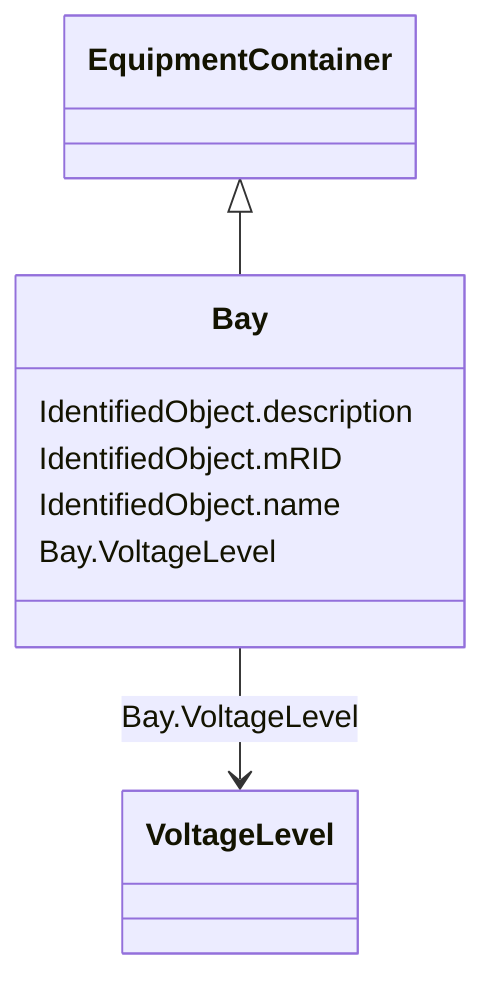

# Bay

_A collection of power system resources (within a given substation) including conducting equipment, protection relays, measurements, and telemetry.  A bay typically represents a physical grouping related to modularization of equipment._

**URI**: [cim:Bay](http://iec.ch/TC57/CIM100#Bay) 
**Type**: Class

## Inheritance
* [IdentifiedObject](IdentifiedObject.md)
    * [PowerSystemResource](PowerSystemResource.md)
        * [ConnectivityNodeContainer](ConnectivityNodeContainer.md)
            * [EquipmentContainer](EquipmentContainer.md)
                * **Bay**

## Attributes

| Name | URI | Cardinality and Range | Description | Inheritance |
| ---  | --- | --- | --- | --- |
| VoltageLevel | [cim:Bay.VoltageLevel](http://iec.ch/TC57/CIM100#Bay.VoltageLevel) | 1    [VoltageLevel](VoltageLevel.md)  | The voltage level containing this bay | direct |
| mRID | [cim:IdentifiedObject.mRID](http://iec.ch/TC57/CIM100#IdentifiedObject.mRID) | 1    string  | Master resource identifier issued by a model authority | [IdentifiedObject](IdentifiedObject.md) |
| description | [cim:IdentifiedObject.description](http://iec.ch/TC57/CIM100#IdentifiedObject.description) | 0..1    string  | The description is a free human readable text describing or naming the object | [IdentifiedObject](IdentifiedObject.md) |
| name | [cim:IdentifiedObject.name](http://iec.ch/TC57/CIM100#IdentifiedObject.name) | 1    string  | The name is any free human readable and possibly non unique text naming the o... | [IdentifiedObject](IdentifiedObject.md) |

## Comments

* -  The Bay class is used as a container for Switches.  Switches can either be contained by Bays or by VoltageLevels.  If Switches are contained by VoltageLevels rather than by Bays in the sending system, then Bays are not required.

## Identifier and Mapping Information

### Schema Source

* from schema: http://iec.ch/TC57/2020/CPSM-CoreEquipment#

## Mappings

| Mapping Type | Mapped Value |
| ---  | ---  |
| self | cim:Bay |
| native | this:Bay |

