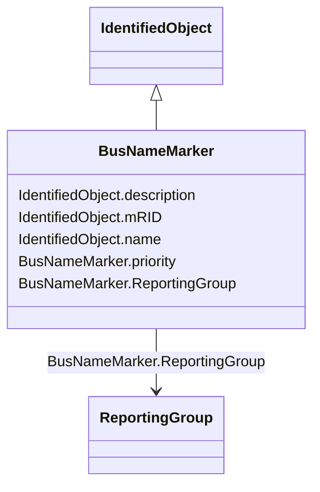

# BusNameMarker

_Used to apply user standard names to TopologicalNodes. Associated with one or more terminals that are normally connected with the bus name.    The associated terminals are normally connected by non-retained switches. For a ring bus station configuration, all BusbarSection terminals in the ring are typically associated.   For a breaker and a half scheme, both BusbarSections would normally be associated.  For a ring bus, all BusbarSections would normally be associated.  For a straight busbar configuration, normally only the main terminal at the BusbarSection would be associated._

**URI**: [cim:BusNameMarker](http://iec.ch/TC57/CIM100#BusNameMarker) 
**Type**: Class

## Inheritance
* [IdentifiedObject](IdentifiedObject.md)
    * **BusNameMarker**

## Attributes

| Name | URI | Cardinality and Range | Description | Inheritance |
| ---  | --- | --- | --- | --- |
| priority | [cim:BusNameMarker.priority](http://iec.ch/TC57/CIM100#BusNameMarker.priority) | 0..1    integer  | Priority of bus name marker for use as topology bus name | direct |
| ReportingGroup | [cim:BusNameMarker.ReportingGroup](http://iec.ch/TC57/CIM100#BusNameMarker.ReportingGroup) | 0..1    [ReportingGroup](ReportingGroup.md)  | The reporting group to which this bus name marker belongs | direct |
| mRID | [cim:IdentifiedObject.mRID](http://iec.ch/TC57/CIM100#IdentifiedObject.mRID) | 1    string  | Master resource identifier issued by a model authority | [IdentifiedObject](IdentifiedObject.md) |
| description | [cim:IdentifiedObject.description](http://iec.ch/TC57/CIM100#IdentifiedObject.description) | 0..1    string  | The description is a free human readable text describing or naming the object | [IdentifiedObject](IdentifiedObject.md) |
| name | [cim:IdentifiedObject.name](http://iec.ch/TC57/CIM100#IdentifiedObject.name) | 1    string  | The name is any free human readable and possibly non unique text naming the o... | [IdentifiedObject](IdentifiedObject.md) |

## Usages

| used by | used in | type | used |
| ---  | --- | --- | --- |
| [ACDCConverterDCTerminal](ACDCConverterDCTerminal.md) | BusNameMarker | range | [BusNameMarker](BusNameMarker.md) |
| [ACDCTerminal](ACDCTerminal.md) | BusNameMarker | range | [BusNameMarker](BusNameMarker.md) |
| [DCBaseTerminal](DCBaseTerminal.md) | BusNameMarker | range | [BusNameMarker](BusNameMarker.md) |
| [DCTerminal](DCTerminal.md) | BusNameMarker | range | [BusNameMarker](BusNameMarker.md) |
| [Terminal](Terminal.md) | BusNameMarker | range | [BusNameMarker](BusNameMarker.md) |

## Identifier and Mapping Information

### Schema Source

* from schema: http://iec.ch/TC57/2020/CPSM-CoreEquipment#

## Mappings

| Mapping Type | Mapped Value |
| ---  | ---  |
| self | cim:BusNameMarker |
| native | this:BusNameMarker |

