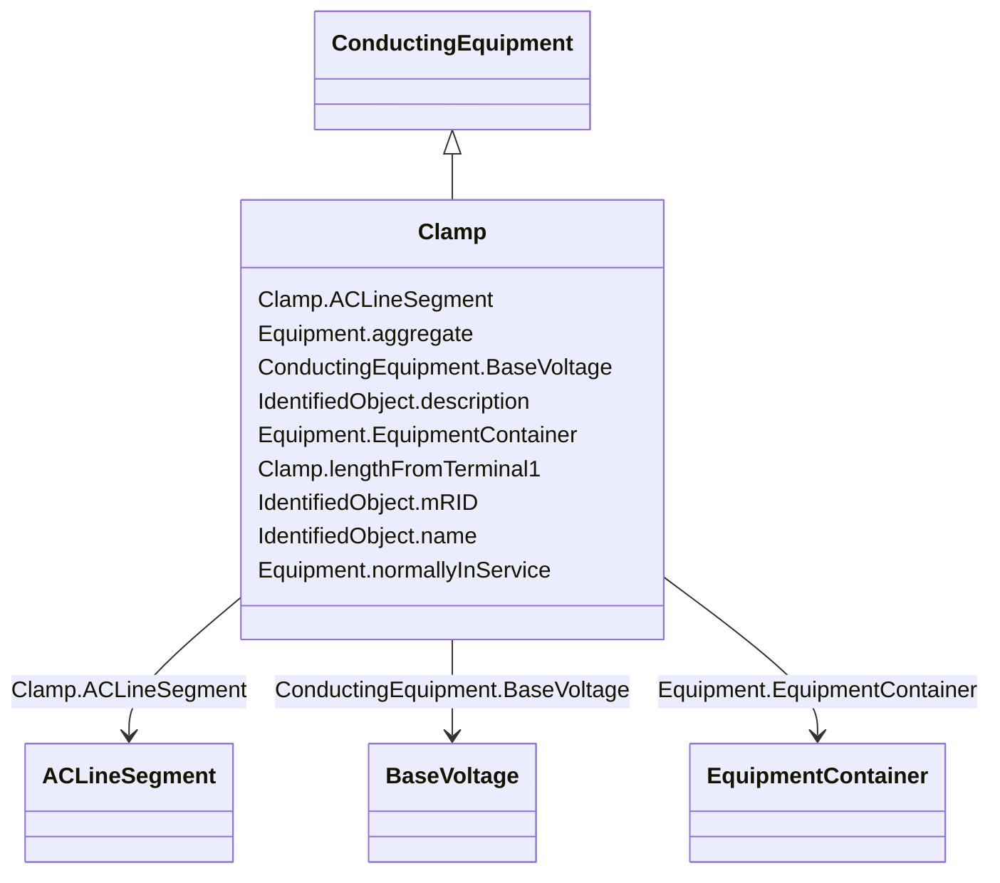

# Clamp

_A Clamp is a galvanic connection at a line segment where other equipment is connected. A Clamp does not cut the line segment.A Clamp is ConductingEquipment and has one Terminal with an associated ConnectivityNode. Any other ConductingEquipment can be connected to the Clamp ConnectivityNode._

**URI**: [cim:Clamp](http://iec.ch/TC57/CIM100#Clamp) 
**Type**: Class

## Inheritance
* [IdentifiedObject](IdentifiedObject.md)
    * [PowerSystemResource](PowerSystemResource.md)
        * [Equipment](Equipment.md)
            * [ConductingEquipment](ConductingEquipment.md)
                * **Clamp**

## Attributes

| Name | URI | Cardinality and Range | Description | Inheritance |
| ---  | --- | --- | --- | --- |
| lengthFromTerminal1 | [cim:Clamp.lengthFromTerminal1](http://iec.ch/TC57/CIM100#Clamp.lengthFromTerminal1) | 0..1    [Length](Length.md)  | The length to the place where the clamp is located starting from side one of ... | direct |
| ACLineSegment | [cim:Clamp.ACLineSegment](http://iec.ch/TC57/CIM100#Clamp.ACLineSegment) | 1    [ACLineSegment](ACLineSegment.md)  | The line segment to which the clamp is connected | direct |
| BaseVoltage | [cim:ConductingEquipment.BaseVoltage](http://iec.ch/TC57/CIM100#ConductingEquipment.BaseVoltage) | 0..1    [BaseVoltage](BaseVoltage.md)  | Base voltage of this conducting equipment | [ConductingEquipment](ConductingEquipment.md) |
| aggregate | [cim:Equipment.aggregate](http://iec.ch/TC57/CIM100#Equipment.aggregate) | 0..1    boolean  | The aggregate flag provides an alternative way of representing an aggregated ... | [Equipment](Equipment.md) |
| normallyInService | [cim:Equipment.normallyInService](http://iec.ch/TC57/CIM100#Equipment.normallyInService) | 0..1    boolean  | Specifies the availability of the equipment under normal operating conditions | [Equipment](Equipment.md) |
| EquipmentContainer | [cim:Equipment.EquipmentContainer](http://iec.ch/TC57/CIM100#Equipment.EquipmentContainer) | 0..1    [EquipmentContainer](EquipmentContainer.md)  | Container of this equipment | [Equipment](Equipment.md) |
| mRID | [cim:IdentifiedObject.mRID](http://iec.ch/TC57/CIM100#IdentifiedObject.mRID) | 1    string  | Master resource identifier issued by a model authority | [IdentifiedObject](IdentifiedObject.md) |
| description | [cim:IdentifiedObject.description](http://iec.ch/TC57/CIM100#IdentifiedObject.description) | 0..1    string  | The description is a free human readable text describing or naming the object | [IdentifiedObject](IdentifiedObject.md) |
| name | [cim:IdentifiedObject.name](http://iec.ch/TC57/CIM100#IdentifiedObject.name) | 1    string  | The name is any free human readable and possibly non unique text naming the o... | [IdentifiedObject](IdentifiedObject.md) |

## Identifier and Mapping Information

### Schema Source

* from schema: http://iec.ch/TC57/2020/CPSM-CoreEquipment#

## Mappings

| Mapping Type | Mapped Value |
| ---  | ---  |
| self | cim:Clamp |
| native | this:Clamp |

