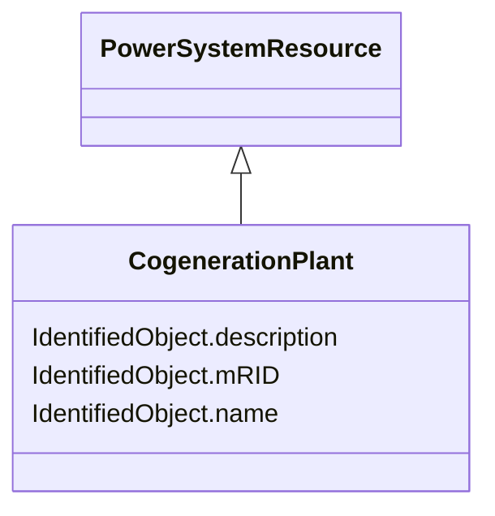

# CogenerationPlant

_A set of thermal generating units for the production of electrical energy and process steam (usually from the output of the steam turbines). The steam sendout is typically used for industrial purposes or for municipal heating and cooling._

**URI**: [cim:CogenerationPlant](http://iec.ch/TC57/CIM100#CogenerationPlant) 
**Type**: Class

## Inheritance
* [IdentifiedObject](IdentifiedObject.md)
    * [PowerSystemResource](PowerSystemResource.md)
        * **CogenerationPlant**

## Attributes

| Name | URI | Cardinality and Range | Description | Inheritance |
| ---  | --- | --- | --- | --- |
| mRID | [cim:IdentifiedObject.mRID](http://iec.ch/TC57/CIM100#IdentifiedObject.mRID) | 1    string  | Master resource identifier issued by a model authority | [IdentifiedObject](IdentifiedObject.md) |
| description | [cim:IdentifiedObject.description](http://iec.ch/TC57/CIM100#IdentifiedObject.description) | 0..1    string  | The description is a free human readable text describing or naming the object | [IdentifiedObject](IdentifiedObject.md) |
| name | [cim:IdentifiedObject.name](http://iec.ch/TC57/CIM100#IdentifiedObject.name) | 1    string  | The name is any free human readable and possibly non unique text naming the o... | [IdentifiedObject](IdentifiedObject.md) |

## Usages

| used by | used in | type | used |
| ---  | --- | --- | --- |
| [ThermalGeneratingUnit](ThermalGeneratingUnit.md) | CogenerationPlant | range | [CogenerationPlant](CogenerationPlant.md) |

## Identifier and Mapping Information

### Schema Source

* from schema: http://iec.ch/TC57/2020/CPSM-CoreEquipment#

## Mappings

| Mapping Type | Mapped Value |
| ---  | ---  |
| self | cim:CogenerationPlant |
| native | this:CogenerationPlant |

