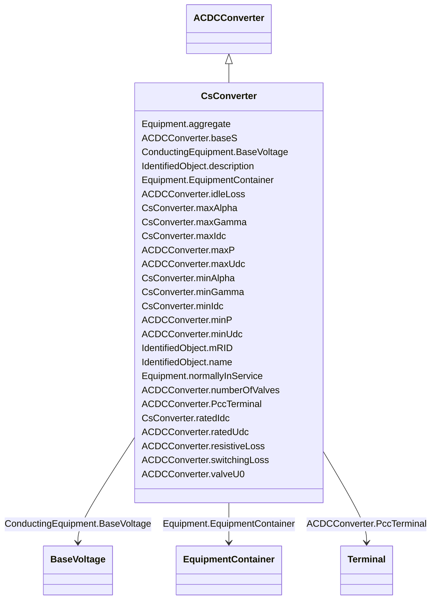

# CsConverter

_DC side of the current source converter (CSC).The firing angle controls the dc voltage at the converter, both for rectifier and inverter. The difference between the dc voltages of the rectifier and inverter determines the dc current. The extinction angle is used to limit the dc voltage at the inverter, if needed, and is not used in active power control. The firing angle, transformer tap position and number of connected filters are the primary means to control a current source dc line. Higher level controls are built on top, e.g. dc voltage, dc current and active power. From a steady state perspective it is sufficient to specify the wanted active power transfer (ACDCConverter.targetPpcc) and the control functions will set the dc voltage, dc current, firing angle, transformer tap position and number of connected filters to meet this. Therefore attributes targetAlpha and targetGamma are not applicable in this case.The reactive power consumed by the converter is a function of the firing angle, transformer tap position and number of connected filter, which can be approximated with half of the active power. The losses is a function of the dc voltage and dc current.The attributes minAlpha and maxAlpha define the range of firing angles for rectifier operation between which no discrete tap changer action takes place. The range is typically 10-18 degrees.The attributes minGamma and maxGamma define the range of extinction angles for inverter operation between which no discrete tap changer action takes place. The range is typically 17-20 degrees._

**URI**: [cim:CsConverter](http://iec.ch/TC57/CIM100#CsConverter) 
**Type**: Class

## Inheritance
* [IdentifiedObject](IdentifiedObject.md)
    * [PowerSystemResource](PowerSystemResource.md)
        * [Equipment](Equipment.md)
            * [ConductingEquipment](ConductingEquipment.md)
                * [ACDCConverter](ACDCConverter.md)
                    * **CsConverter**

## Attributes

| Name | URI | Cardinality and Range | Description | Inheritance |
| ---  | --- | --- | --- | --- |
| maxAlpha | [cim:CsConverter.maxAlpha](http://iec.ch/TC57/CIM100#CsConverter.maxAlpha) | 0..1    [AngleDegrees](AngleDegrees.md)  | Maximum firing angle | direct |
| maxGamma | [cim:CsConverter.maxGamma](http://iec.ch/TC57/CIM100#CsConverter.maxGamma) | 0..1    [AngleDegrees](AngleDegrees.md)  | Maximum extinction angle | direct |
| maxIdc | [cim:CsConverter.maxIdc](http://iec.ch/TC57/CIM100#CsConverter.maxIdc) | 0..1    [CurrentFlow](CurrentFlow.md)  | The maximum direct current (Id) on the DC side at which the converter should ... | direct |
| minAlpha | [cim:CsConverter.minAlpha](http://iec.ch/TC57/CIM100#CsConverter.minAlpha) | 0..1    [AngleDegrees](AngleDegrees.md)  | Minimum firing angle | direct |
| minGamma | [cim:CsConverter.minGamma](http://iec.ch/TC57/CIM100#CsConverter.minGamma) | 0..1    [AngleDegrees](AngleDegrees.md)  | Minimum extinction angle | direct |
| minIdc | [cim:CsConverter.minIdc](http://iec.ch/TC57/CIM100#CsConverter.minIdc) | 0..1    [CurrentFlow](CurrentFlow.md)  | The minimum direct current (Id) on the DC side at which the converter should ... | direct |
| ratedIdc | [cim:CsConverter.ratedIdc](http://iec.ch/TC57/CIM100#CsConverter.ratedIdc) | 0..1    [CurrentFlow](CurrentFlow.md)  | Rated converter DC current, also called IdN | direct |
| baseS | [cim:ACDCConverter.baseS](http://iec.ch/TC57/CIM100#ACDCConverter.baseS) | 0..1    [ApparentPower](ApparentPower.md)  | Base apparent power of the converter pole | [ACDCConverter](ACDCConverter.md) |
| idleLoss | [cim:ACDCConverter.idleLoss](http://iec.ch/TC57/CIM100#ACDCConverter.idleLoss) | 0..1    [ActivePower](ActivePower.md)  | Active power loss in pole at no power transfer | [ACDCConverter](ACDCConverter.md) |
| maxP | [cim:ACDCConverter.maxP](http://iec.ch/TC57/CIM100#ACDCConverter.maxP) | 0..1    [ActivePower](ActivePower.md)  | Maximum active power limit | [ACDCConverter](ACDCConverter.md) |
| maxUdc | [cim:ACDCConverter.maxUdc](http://iec.ch/TC57/CIM100#ACDCConverter.maxUdc) | 0..1    [Voltage](Voltage.md)  | The maximum voltage on the DC side at which the converter should operate | [ACDCConverter](ACDCConverter.md) |
| minP | [cim:ACDCConverter.minP](http://iec.ch/TC57/CIM100#ACDCConverter.minP) | 0..1    [ActivePower](ActivePower.md)  | Minimum active power limit | [ACDCConverter](ACDCConverter.md) |
| minUdc | [cim:ACDCConverter.minUdc](http://iec.ch/TC57/CIM100#ACDCConverter.minUdc) | 0..1    [Voltage](Voltage.md)  | The minimum voltage on the DC side at which the converter should operate | [ACDCConverter](ACDCConverter.md) |
| numberOfValves | [cim:ACDCConverter.numberOfValves](http://iec.ch/TC57/CIM100#ACDCConverter.numberOfValves) | 0..1    integer  | Number of valves in the converter | [ACDCConverter](ACDCConverter.md) |
| ratedUdc | [cim:ACDCConverter.ratedUdc](http://iec.ch/TC57/CIM100#ACDCConverter.ratedUdc) | 0..1    [Voltage](Voltage.md)  | Rated converter DC voltage, also called UdN | [ACDCConverter](ACDCConverter.md) |
| resistiveLoss | [cim:ACDCConverter.resistiveLoss](http://iec.ch/TC57/CIM100#ACDCConverter.resistiveLoss) | 0..1    [Resistance](Resistance.md)  | It is converter’s configuration data used in power flow | [ACDCConverter](ACDCConverter.md) |
| switchingLoss | [cim:ACDCConverter.switchingLoss](http://iec.ch/TC57/CIM100#ACDCConverter.switchingLoss) | 0..1    [ActivePowerPerCurrentFlow](ActivePowerPerCurrentFlow.md)  | Switching losses, relative to the base apparent power 'baseS' | [ACDCConverter](ACDCConverter.md) |
| valveU0 | [cim:ACDCConverter.valveU0](http://iec.ch/TC57/CIM100#ACDCConverter.valveU0) | 0..1    [Voltage](Voltage.md)  | Valve threshold voltage, also called Uvalve | [ACDCConverter](ACDCConverter.md) |
| PccTerminal | [cim:ACDCConverter.PccTerminal](http://iec.ch/TC57/CIM100#ACDCConverter.PccTerminal) | 0..1    [Terminal](Terminal.md)  | Point of common coupling terminal for this converter DC side | [ACDCConverter](ACDCConverter.md) |
| BaseVoltage | [cim:ConductingEquipment.BaseVoltage](http://iec.ch/TC57/CIM100#ConductingEquipment.BaseVoltage) | 0..1    [BaseVoltage](BaseVoltage.md)  | Base voltage of this conducting equipment | [ConductingEquipment](ConductingEquipment.md) |
| aggregate | [cim:Equipment.aggregate](http://iec.ch/TC57/CIM100#Equipment.aggregate) | 0..1    boolean  | The aggregate flag provides an alternative way of representing an aggregated ... | [Equipment](Equipment.md) |
| normallyInService | [cim:Equipment.normallyInService](http://iec.ch/TC57/CIM100#Equipment.normallyInService) | 0..1    boolean  | Specifies the availability of the equipment under normal operating conditions | [Equipment](Equipment.md) |
| EquipmentContainer | [cim:Equipment.EquipmentContainer](http://iec.ch/TC57/CIM100#Equipment.EquipmentContainer) | 0..1    [EquipmentContainer](EquipmentContainer.md)  | Container of this equipment | [Equipment](Equipment.md) |
| mRID | [cim:IdentifiedObject.mRID](http://iec.ch/TC57/CIM100#IdentifiedObject.mRID) | 1    string  | Master resource identifier issued by a model authority | [IdentifiedObject](IdentifiedObject.md) |
| description | [cim:IdentifiedObject.description](http://iec.ch/TC57/CIM100#IdentifiedObject.description) | 0..1    string  | The description is a free human readable text describing or naming the object | [IdentifiedObject](IdentifiedObject.md) |
| name | [cim:IdentifiedObject.name](http://iec.ch/TC57/CIM100#IdentifiedObject.name) | 1    string  | The name is any free human readable and possibly non unique text naming the o... | [IdentifiedObject](IdentifiedObject.md) |

## Identifier and Mapping Information

### Schema Source

* from schema: http://iec.ch/TC57/2020/CPSM-CoreEquipment#

## Mappings

| Mapping Type | Mapped Value |
| ---  | ---  |
| self | cim:CsConverter |
| native | this:CsConverter |

