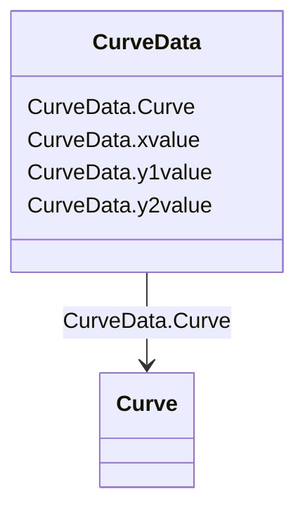

# CurveData

_Multi-purpose data points for defining a curve.  The use of this generic class is discouraged if a more specific class can be used to specify the X and Y axis values along with their specific data types._

**URI**: [cim:CurveData](http://iec.ch/TC57/CIM100#CurveData) 
**Type**: Class

<!-- no inheritance hierarchy -->

## Attributes

| Name | URI | Cardinality and Range | Description | Inheritance |
| ---  | --- | --- | --- | --- |
| xvalue | [cim:CurveData.xvalue](http://iec.ch/TC57/CIM100#CurveData.xvalue) | 1    float  | The data value of the X-axis variable,  depending on the X-axis units | direct |
| y1value | [cim:CurveData.y1value](http://iec.ch/TC57/CIM100#CurveData.y1value) | 1    float  | The data value of the  first Y-axis variable, depending on the Y-axis units | direct |
| y2value | [cim:CurveData.y2value](http://iec.ch/TC57/CIM100#CurveData.y2value) | 0..1    float  | The data value of the second Y-axis variable (if present), depending on the Y... | direct |
| Curve | [cim:CurveData.Curve](http://iec.ch/TC57/CIM100#CurveData.Curve) | 1    [Curve](Curve.md)  | The curve of  this curve data point | direct |

## Identifier and Mapping Information

### Schema Source

* from schema: http://iec.ch/TC57/2020/CPSM-CoreEquipment#

## Mappings

| Mapping Type | Mapped Value |
| ---  | ---  |
| self | cim:CurveData |
| native | this:CurveData |

