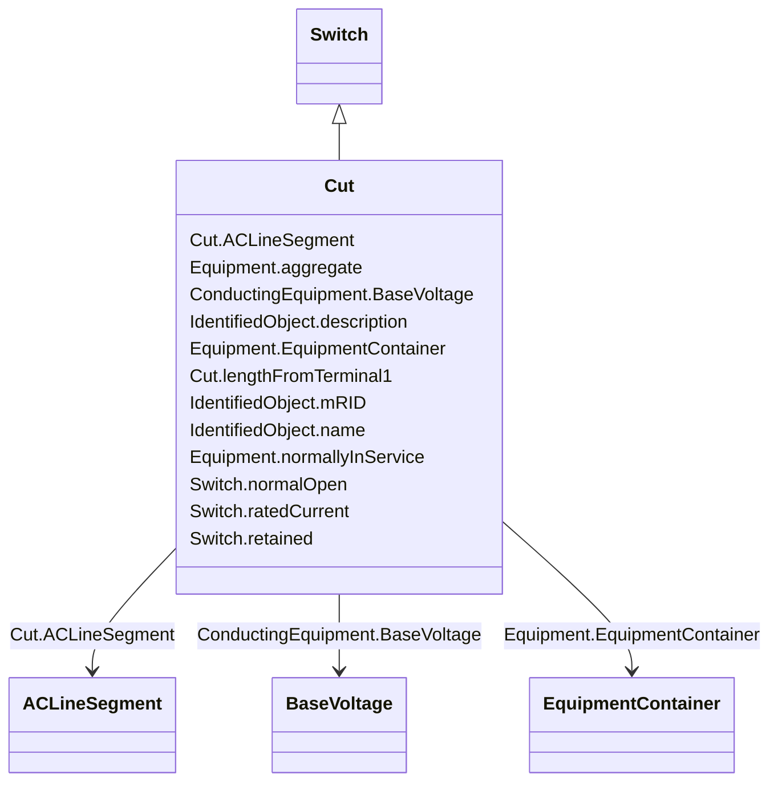

# Cut

_A cut separates a line segment into two parts. The cut appears as a switch inserted between these two parts and connects them together. As the cut is normally open there is no galvanic connection between the two line segment parts. But it is possible to close the cut to get galvanic connection.The cut terminals are oriented towards the line segment terminals with the same sequence number. Hence the cut terminal with sequence number equal to 1 is oriented to the line segment's terminal with sequence number equal to 1.The cut terminals also act as connection points for jumpers and other equipment, e.g. a mobile generator. To enable this, connectivity nodes are placed at the cut terminals. Once the connectivity nodes are in place any conducting equipment can be connected at them._

**URI**: [cim:Cut](http://iec.ch/TC57/CIM100#Cut) 
**Type**: Class

## Inheritance
* [IdentifiedObject](IdentifiedObject.md)
    * [PowerSystemResource](PowerSystemResource.md)
        * [Equipment](Equipment.md)
            * [ConductingEquipment](ConductingEquipment.md)
                * [Switch](Switch.md)
                    * **Cut**

## Attributes

| Name | URI | Cardinality and Range | Description | Inheritance |
| ---  | --- | --- | --- | --- |
| lengthFromTerminal1 | [cim:Cut.lengthFromTerminal1](http://iec.ch/TC57/CIM100#Cut.lengthFromTerminal1) | 0..1    [Length](Length.md)  | The length to the place where the cut is located starting from side one of th... | direct |
| ACLineSegment | [cim:Cut.ACLineSegment](http://iec.ch/TC57/CIM100#Cut.ACLineSegment) | 1    [ACLineSegment](ACLineSegment.md)  | The line segment to which the cut is applied | direct |
| normalOpen | [cim:Switch.normalOpen](http://iec.ch/TC57/CIM100#Switch.normalOpen) | 1    boolean  | The attribute is used in cases when no Measurement for the status value is pr... | [Switch](Switch.md) |
| ratedCurrent | [cim:Switch.ratedCurrent](http://iec.ch/TC57/CIM100#Switch.ratedCurrent) | 0..1    [CurrentFlow](CurrentFlow.md)  | The maximum continuous current carrying capacity in amps governed by the devi... | [Switch](Switch.md) |
| retained | [cim:Switch.retained](http://iec.ch/TC57/CIM100#Switch.retained) | 1    boolean  | Branch is retained in the topological solution | [Switch](Switch.md) |
| BaseVoltage | [cim:ConductingEquipment.BaseVoltage](http://iec.ch/TC57/CIM100#ConductingEquipment.BaseVoltage) | 0..1    [BaseVoltage](BaseVoltage.md)  | Base voltage of this conducting equipment | [ConductingEquipment](ConductingEquipment.md) |
| aggregate | [cim:Equipment.aggregate](http://iec.ch/TC57/CIM100#Equipment.aggregate) | 0..1    boolean  | The aggregate flag provides an alternative way of representing an aggregated ... | [Equipment](Equipment.md) |
| normallyInService | [cim:Equipment.normallyInService](http://iec.ch/TC57/CIM100#Equipment.normallyInService) | 0..1    boolean  | Specifies the availability of the equipment under normal operating conditions | [Equipment](Equipment.md) |
| EquipmentContainer | [cim:Equipment.EquipmentContainer](http://iec.ch/TC57/CIM100#Equipment.EquipmentContainer) | 0..1    [EquipmentContainer](EquipmentContainer.md)  | Container of this equipment | [Equipment](Equipment.md) |
| mRID | [cim:IdentifiedObject.mRID](http://iec.ch/TC57/CIM100#IdentifiedObject.mRID) | 1    string  | Master resource identifier issued by a model authority | [IdentifiedObject](IdentifiedObject.md) |
| description | [cim:IdentifiedObject.description](http://iec.ch/TC57/CIM100#IdentifiedObject.description) | 0..1    string  | The description is a free human readable text describing or naming the object | [IdentifiedObject](IdentifiedObject.md) |
| name | [cim:IdentifiedObject.name](http://iec.ch/TC57/CIM100#IdentifiedObject.name) | 1    string  | The name is any free human readable and possibly non unique text naming the o... | [IdentifiedObject](IdentifiedObject.md) |

## Identifier and Mapping Information

### Schema Source

* from schema: http://iec.ch/TC57/2020/CPSM-CoreEquipment#

## Mappings

| Mapping Type | Mapped Value |
| ---  | ---  |
| self | cim:Cut |
| native | this:Cut |

