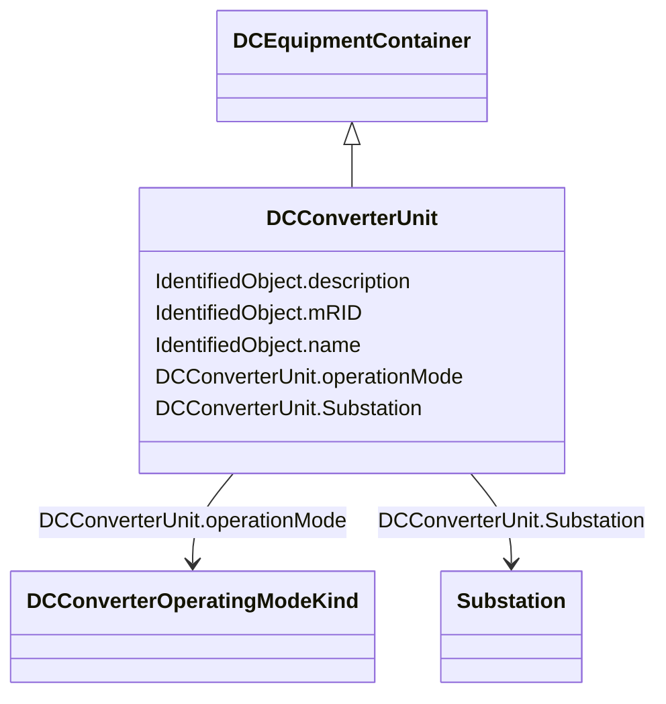

# DCConverterUnit

_Indivisible operative unit comprising all equipment between the point of common coupling on the AC side and the point of common coupling – DC side, essentially one or more converters, together with one or more converter transformers, converter control equipment, essential protective and switching devices and auxiliaries, if any, used for conversion._

**URI**: [cim:DCConverterUnit](http://iec.ch/TC57/CIM100#DCConverterUnit) 
**Type**: Class

## Inheritance
* [IdentifiedObject](IdentifiedObject.md)
    * [PowerSystemResource](PowerSystemResource.md)
        * [ConnectivityNodeContainer](ConnectivityNodeContainer.md)
            * [EquipmentContainer](EquipmentContainer.md)
                * [DCEquipmentContainer](DCEquipmentContainer.md)
                    * **DCConverterUnit**

## Attributes

| Name | URI | Cardinality and Range | Description | Inheritance |
| ---  | --- | --- | --- | --- |
| operationMode | [cim:DCConverterUnit.operationMode](http://iec.ch/TC57/CIM100#DCConverterUnit.operationMode) | 1    [DCConverterOperatingModeKind](DCConverterOperatingModeKind.md)  | The operating mode of an HVDC bipole (bipolar, monopolar metallic return, etc... | direct |
| Substation | [cim:DCConverterUnit.Substation](http://iec.ch/TC57/CIM100#DCConverterUnit.Substation) | 0..1    [Substation](Substation.md)  | The containing substation of the DC converter unit | direct |
| mRID | [cim:IdentifiedObject.mRID](http://iec.ch/TC57/CIM100#IdentifiedObject.mRID) | 1    string  | Master resource identifier issued by a model authority | [IdentifiedObject](IdentifiedObject.md) |
| description | [cim:IdentifiedObject.description](http://iec.ch/TC57/CIM100#IdentifiedObject.description) | 0..1    string  | The description is a free human readable text describing or naming the object | [IdentifiedObject](IdentifiedObject.md) |
| name | [cim:IdentifiedObject.name](http://iec.ch/TC57/CIM100#IdentifiedObject.name) | 1    string  | The name is any free human readable and possibly non unique text naming the o... | [IdentifiedObject](IdentifiedObject.md) |

## Identifier and Mapping Information

### Schema Source

* from schema: http://iec.ch/TC57/2020/CPSM-CoreEquipment#

## Mappings

| Mapping Type | Mapped Value |
| ---  | ---  |
| self | cim:DCConverterUnit |
| native | this:DCConverterUnit |

