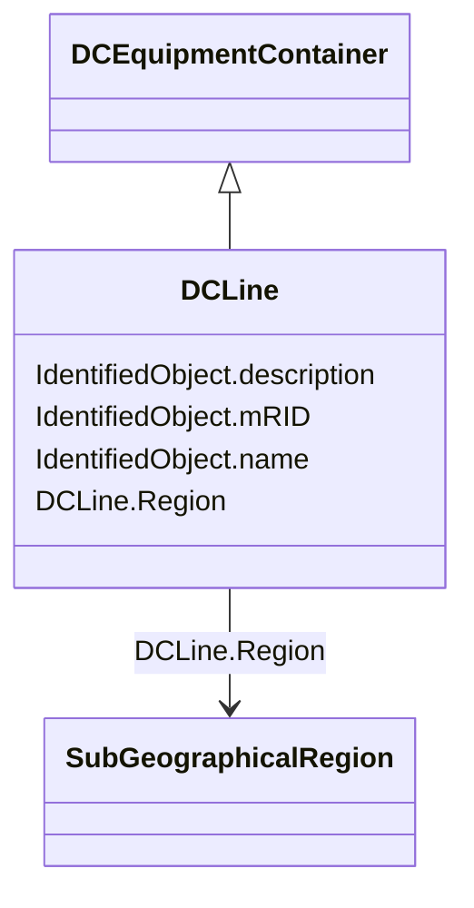

# DCLine

_Overhead lines and/or cables connecting two or more HVDC substations._

**URI**: [cim:DCLine](http://iec.ch/TC57/CIM100#DCLine) 
**Type**: Class

## Inheritance
* [IdentifiedObject](IdentifiedObject.md)
    * [PowerSystemResource](PowerSystemResource.md)
        * [ConnectivityNodeContainer](ConnectivityNodeContainer.md)
            * [EquipmentContainer](EquipmentContainer.md)
                * [DCEquipmentContainer](DCEquipmentContainer.md)
                    * **DCLine**

## Attributes

| Name | URI | Cardinality and Range | Description | Inheritance |
| ---  | --- | --- | --- | --- |
| Region | [cim:DCLine.Region](http://iec.ch/TC57/CIM100#DCLine.Region) | 0..1    [SubGeographicalRegion](SubGeographicalRegion.md)  | The SubGeographicalRegion containing the DC line | direct |
| mRID | [cim:IdentifiedObject.mRID](http://iec.ch/TC57/CIM100#IdentifiedObject.mRID) | 1    string  | Master resource identifier issued by a model authority | [IdentifiedObject](IdentifiedObject.md) |
| description | [cim:IdentifiedObject.description](http://iec.ch/TC57/CIM100#IdentifiedObject.description) | 0..1    string  | The description is a free human readable text describing or naming the object | [IdentifiedObject](IdentifiedObject.md) |
| name | [cim:IdentifiedObject.name](http://iec.ch/TC57/CIM100#IdentifiedObject.name) | 1    string  | The name is any free human readable and possibly non unique text naming the o... | [IdentifiedObject](IdentifiedObject.md) |

## Identifier and Mapping Information

### Schema Source

* from schema: http://iec.ch/TC57/2020/CPSM-CoreEquipment#

## Mappings

| Mapping Type | Mapped Value |
| ---  | ---  |
| self | cim:DCLine |
| native | this:DCLine |

