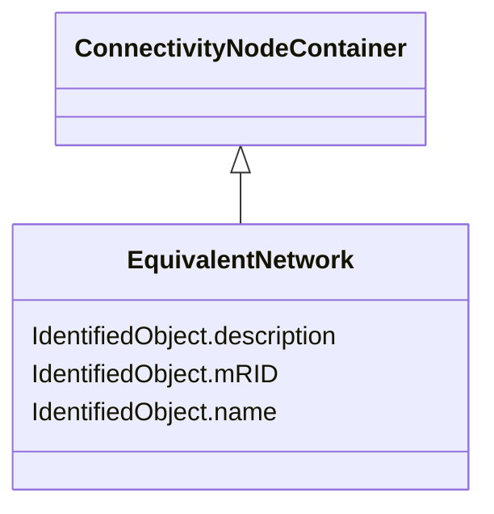

# EquivalentNetwork

_A class that groups electrical equivalents, including internal nodes, of a network that has been reduced. The ConnectivityNodes contained in the equivalent are intended to reflect internal nodes of the equivalent. The boundary Connectivity nodes where the equivalent connects outside itself are not contained by the equivalent._

**URI**: [cim:EquivalentNetwork](http://iec.ch/TC57/CIM100#EquivalentNetwork) 
**Type**: Class

## Inheritance
* [IdentifiedObject](IdentifiedObject.md)
    * [PowerSystemResource](PowerSystemResource.md)
        * [ConnectivityNodeContainer](ConnectivityNodeContainer.md)
            * **EquivalentNetwork**

## Attributes

| Name | URI | Cardinality and Range | Description | Inheritance |
| ---  | --- | --- | --- | --- |
| mRID | [cim:IdentifiedObject.mRID](http://iec.ch/TC57/CIM100#IdentifiedObject.mRID) | 1    string  | Master resource identifier issued by a model authority | [IdentifiedObject](IdentifiedObject.md) |
| description | [cim:IdentifiedObject.description](http://iec.ch/TC57/CIM100#IdentifiedObject.description) | 0..1    string  | The description is a free human readable text describing or naming the object | [IdentifiedObject](IdentifiedObject.md) |
| name | [cim:IdentifiedObject.name](http://iec.ch/TC57/CIM100#IdentifiedObject.name) | 1    string  | The name is any free human readable and possibly non unique text naming the o... | [IdentifiedObject](IdentifiedObject.md) |

## Usages

| used by | used in | type | used |
| ---  | --- | --- | --- |
| [EquivalentBranch](EquivalentBranch.md) | EquivalentNetwork | range | [EquivalentNetwork](EquivalentNetwork.md) |
| [EquivalentEquipment](EquivalentEquipment.md) | EquivalentNetwork | range | [EquivalentNetwork](EquivalentNetwork.md) |
| [EquivalentInjection](EquivalentInjection.md) | EquivalentNetwork | range | [EquivalentNetwork](EquivalentNetwork.md) |
| [EquivalentShunt](EquivalentShunt.md) | EquivalentNetwork | range | [EquivalentNetwork](EquivalentNetwork.md) |

## Identifier and Mapping Information

### Schema Source

* from schema: http://iec.ch/TC57/2020/CPSM-CoreEquipment#

## Mappings

| Mapping Type | Mapped Value |
| ---  | ---  |
| self | cim:EquivalentNetwork |
| native | this:EquivalentNetwork |

