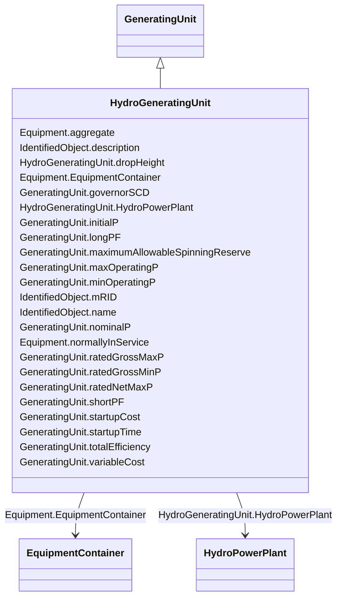

# HydroGeneratingUnit

_A generating unit whose prime mover is a hydraulic turbine (e.g., Francis, Pelton, Kaplan)._

**URI**: [cim:HydroGeneratingUnit](http://iec.ch/TC57/CIM100#HydroGeneratingUnit) 
**Type**: Class

## Inheritance
* [IdentifiedObject](IdentifiedObject.md)
    * [PowerSystemResource](PowerSystemResource.md)
        * [Equipment](Equipment.md)
            * [GeneratingUnit](GeneratingUnit.md)
                * **HydroGeneratingUnit**

## Attributes

| Name | URI | Cardinality and Range | Description | Inheritance |
| ---  | --- | --- | --- | --- |
| dropHeight | [cim:HydroGeneratingUnit.dropHeight](http://iec.ch/TC57/CIM100#HydroGeneratingUnit.dropHeight) | 0..1    [Length](Length.md)  | The height water drops from the reservoir mid-point to the turbine | direct |
| HydroPowerPlant | [cim:HydroGeneratingUnit.HydroPowerPlant](http://iec.ch/TC57/CIM100#HydroGeneratingUnit.HydroPowerPlant) | 0..1    [HydroPowerPlant](HydroPowerPlant.md)  | The hydro generating unit belongs to a hydro power plant | direct |
| governorSCD | [cim:GeneratingUnit.governorSCD](http://iec.ch/TC57/CIM100#GeneratingUnit.governorSCD) | 0..1    [PerCent](PerCent.md)  | Governor Speed Changer Droop | [GeneratingUnit](GeneratingUnit.md) |
| initialP | [cim:GeneratingUnit.initialP](http://iec.ch/TC57/CIM100#GeneratingUnit.initialP) | 1    [ActivePower](ActivePower.md)  | Default initial active power  which is used to store a powerflow result for t... | [GeneratingUnit](GeneratingUnit.md) |
| longPF | [cim:GeneratingUnit.longPF](http://iec.ch/TC57/CIM100#GeneratingUnit.longPF) | 0..1    float  | Generating unit long term economic participation factor | [GeneratingUnit](GeneratingUnit.md) |
| maximumAllowableSpinningReserve | [cim:GeneratingUnit.maximumAllowableSpinningReserve](http://iec.ch/TC57/CIM100#GeneratingUnit.maximumAllowableSpinningReserve) | 0..1    [ActivePower](ActivePower.md)  | Maximum allowable spinning reserve | [GeneratingUnit](GeneratingUnit.md) |
| maxOperatingP | [cim:GeneratingUnit.maxOperatingP](http://iec.ch/TC57/CIM100#GeneratingUnit.maxOperatingP) | 1    [ActivePower](ActivePower.md)  | This is the maximum operating active power limit the dispatcher can enter for... | [GeneratingUnit](GeneratingUnit.md) |
| minOperatingP | [cim:GeneratingUnit.minOperatingP](http://iec.ch/TC57/CIM100#GeneratingUnit.minOperatingP) | 1    [ActivePower](ActivePower.md)  | This is the minimum operating active power limit the dispatcher can enter for... | [GeneratingUnit](GeneratingUnit.md) |
| nominalP | [cim:GeneratingUnit.nominalP](http://iec.ch/TC57/CIM100#GeneratingUnit.nominalP) | 0..1    [ActivePower](ActivePower.md)  | The nominal power of the generating unit | [GeneratingUnit](GeneratingUnit.md) |
| ratedGrossMaxP | [cim:GeneratingUnit.ratedGrossMaxP](http://iec.ch/TC57/CIM100#GeneratingUnit.ratedGrossMaxP) | 0..1    [ActivePower](ActivePower.md)  | The unit's gross rated maximum capacity (book value) | [GeneratingUnit](GeneratingUnit.md) |
| ratedGrossMinP | [cim:GeneratingUnit.ratedGrossMinP](http://iec.ch/TC57/CIM100#GeneratingUnit.ratedGrossMinP) | 0..1    [ActivePower](ActivePower.md)  | The gross rated minimum generation level which the unit can safely operate at... | [GeneratingUnit](GeneratingUnit.md) |
| ratedNetMaxP | [cim:GeneratingUnit.ratedNetMaxP](http://iec.ch/TC57/CIM100#GeneratingUnit.ratedNetMaxP) | 0..1    [ActivePower](ActivePower.md)  | The net rated maximum capacity determined by subtracting the auxiliary power ... | [GeneratingUnit](GeneratingUnit.md) |
| shortPF | [cim:GeneratingUnit.shortPF](http://iec.ch/TC57/CIM100#GeneratingUnit.shortPF) | 0..1    float  | Generating unit short term economic participation factor | [GeneratingUnit](GeneratingUnit.md) |
| startupCost | [cim:GeneratingUnit.startupCost](http://iec.ch/TC57/CIM100#GeneratingUnit.startupCost) | 0..1    [Money](Money.md)  | The initial startup cost incurred for each start of the GeneratingUnit | [GeneratingUnit](GeneratingUnit.md) |
| startupTime | [cim:GeneratingUnit.startupTime](http://iec.ch/TC57/CIM100#GeneratingUnit.startupTime) | 0..1    [Seconds](Seconds.md)  | Time it takes to get the unit on-line, from the time that the prime mover mec... | [GeneratingUnit](GeneratingUnit.md) |
| totalEfficiency | [cim:GeneratingUnit.totalEfficiency](http://iec.ch/TC57/CIM100#GeneratingUnit.totalEfficiency) | 0..1    [PerCent](PerCent.md)  | The efficiency of the unit in converting the fuel into electrical energy | [GeneratingUnit](GeneratingUnit.md) |
| variableCost | [cim:GeneratingUnit.variableCost](http://iec.ch/TC57/CIM100#GeneratingUnit.variableCost) | 0..1    [Money](Money.md)  | The variable cost component of production per unit of ActivePower | [GeneratingUnit](GeneratingUnit.md) |
| aggregate | [cim:Equipment.aggregate](http://iec.ch/TC57/CIM100#Equipment.aggregate) | 0..1    boolean  | The aggregate flag provides an alternative way of representing an aggregated ... | [Equipment](Equipment.md) |
| normallyInService | [cim:Equipment.normallyInService](http://iec.ch/TC57/CIM100#Equipment.normallyInService) | 0..1    boolean  | Specifies the availability of the equipment under normal operating conditions | [Equipment](Equipment.md) |
| EquipmentContainer | [cim:Equipment.EquipmentContainer](http://iec.ch/TC57/CIM100#Equipment.EquipmentContainer) | 0..1    [EquipmentContainer](EquipmentContainer.md)  | Container of this equipment | [Equipment](Equipment.md) |
| mRID | [cim:IdentifiedObject.mRID](http://iec.ch/TC57/CIM100#IdentifiedObject.mRID) | 1    string  | Master resource identifier issued by a model authority | [IdentifiedObject](IdentifiedObject.md) |
| description | [cim:IdentifiedObject.description](http://iec.ch/TC57/CIM100#IdentifiedObject.description) | 0..1    string  | The description is a free human readable text describing or naming the object | [IdentifiedObject](IdentifiedObject.md) |
| name | [cim:IdentifiedObject.name](http://iec.ch/TC57/CIM100#IdentifiedObject.name) | 1    string  | The name is any free human readable and possibly non unique text naming the o... | [IdentifiedObject](IdentifiedObject.md) |

## Comments

* -  The attributes governorSCD, maximumAllowableSpinningReserve, nominalP, startupCost, and variableCost are not required.

## Identifier and Mapping Information

### Schema Source

* from schema: http://iec.ch/TC57/2020/CPSM-CoreEquipment#

## Mappings

| Mapping Type | Mapped Value |
| ---  | ---  |
| self | cim:HydroGeneratingUnit |
| native | this:HydroGeneratingUnit |

