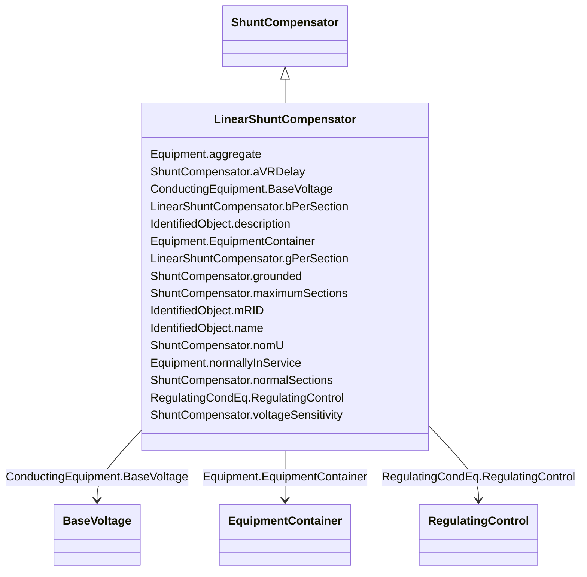

# LinearShuntCompensator

_A linear shunt compensator has banks or sections with equal admittance values._

**URI**: [cim:LinearShuntCompensator](http://iec.ch/TC57/CIM100#LinearShuntCompensator) 
**Type**: Class

## Inheritance
* [IdentifiedObject](IdentifiedObject.md)
    * [PowerSystemResource](PowerSystemResource.md)
        * [Equipment](Equipment.md)
            * [ConductingEquipment](ConductingEquipment.md)
                * [EnergyConnection](EnergyConnection.md)
                    * [RegulatingCondEq](RegulatingCondEq.md)
                        * [ShuntCompensator](ShuntCompensator.md)
                            * **LinearShuntCompensator**

## Attributes

| Name | URI | Cardinality and Range | Description | Inheritance |
| ---  | --- | --- | --- | --- |
| bPerSection | [cim:LinearShuntCompensator.bPerSection](http://iec.ch/TC57/CIM100#LinearShuntCompensator.bPerSection) | 1    [Susceptance](Susceptance.md)  | Positive sequence shunt (charging) susceptance per section | direct |
| gPerSection | [cim:LinearShuntCompensator.gPerSection](http://iec.ch/TC57/CIM100#LinearShuntCompensator.gPerSection) | 1    [Conductance](Conductance.md)  | Positive sequence shunt (charging) conductance per section | direct |
| aVRDelay | [cim:ShuntCompensator.aVRDelay](http://iec.ch/TC57/CIM100#ShuntCompensator.aVRDelay) | 0..1    [Seconds](Seconds.md)  | An automatic voltage regulation delay (AVRDelay) which is the time delay from... | [ShuntCompensator](ShuntCompensator.md) |
| grounded | [cim:ShuntCompensator.grounded](http://iec.ch/TC57/CIM100#ShuntCompensator.grounded) | 0..1    boolean  | Used for Yn and Zn connections | [ShuntCompensator](ShuntCompensator.md) |
| maximumSections | [cim:ShuntCompensator.maximumSections](http://iec.ch/TC57/CIM100#ShuntCompensator.maximumSections) | 1    integer  | The maximum number of sections that may be switched in | [ShuntCompensator](ShuntCompensator.md) |
| nomU | [cim:ShuntCompensator.nomU](http://iec.ch/TC57/CIM100#ShuntCompensator.nomU) | 1    [Voltage](Voltage.md)  | The voltage at which the nominal reactive power may be calculated | [ShuntCompensator](ShuntCompensator.md) |
| normalSections | [cim:ShuntCompensator.normalSections](http://iec.ch/TC57/CIM100#ShuntCompensator.normalSections) | 1    integer  | The normal number of sections switched in | [ShuntCompensator](ShuntCompensator.md) |
| voltageSensitivity | [cim:ShuntCompensator.voltageSensitivity](http://iec.ch/TC57/CIM100#ShuntCompensator.voltageSensitivity) | 0..1    [VoltagePerReactivePower](VoltagePerReactivePower.md)  | Voltage sensitivity required for the device to regulate the bus voltage, in v... | [ShuntCompensator](ShuntCompensator.md) |
| RegulatingControl | [cim:RegulatingCondEq.RegulatingControl](http://iec.ch/TC57/CIM100#RegulatingCondEq.RegulatingControl) | 0..1    [RegulatingControl](RegulatingControl.md)  | The regulating control scheme in which this equipment participates | [RegulatingCondEq](RegulatingCondEq.md) |
| BaseVoltage | [cim:ConductingEquipment.BaseVoltage](http://iec.ch/TC57/CIM100#ConductingEquipment.BaseVoltage) | 0..1    [BaseVoltage](BaseVoltage.md)  | Base voltage of this conducting equipment | [ConductingEquipment](ConductingEquipment.md) |
| aggregate | [cim:Equipment.aggregate](http://iec.ch/TC57/CIM100#Equipment.aggregate) | 0..1    boolean  | The aggregate flag provides an alternative way of representing an aggregated ... | [Equipment](Equipment.md) |
| normallyInService | [cim:Equipment.normallyInService](http://iec.ch/TC57/CIM100#Equipment.normallyInService) | 0..1    boolean  | Specifies the availability of the equipment under normal operating conditions | [Equipment](Equipment.md) |
| EquipmentContainer | [cim:Equipment.EquipmentContainer](http://iec.ch/TC57/CIM100#Equipment.EquipmentContainer) | 0..1    [EquipmentContainer](EquipmentContainer.md)  | Container of this equipment | [Equipment](Equipment.md) |
| mRID | [cim:IdentifiedObject.mRID](http://iec.ch/TC57/CIM100#IdentifiedObject.mRID) | 1    string  | Master resource identifier issued by a model authority | [IdentifiedObject](IdentifiedObject.md) |
| description | [cim:IdentifiedObject.description](http://iec.ch/TC57/CIM100#IdentifiedObject.description) | 0..1    string  | The description is a free human readable text describing or naming the object | [IdentifiedObject](IdentifiedObject.md) |
| name | [cim:IdentifiedObject.name](http://iec.ch/TC57/CIM100#IdentifiedObject.name) | 1    string  | The name is any free human readable and possibly non unique text naming the o... | [IdentifiedObject](IdentifiedObject.md) |

## Identifier and Mapping Information

### Schema Source

* from schema: http://iec.ch/TC57/2020/CPSM-CoreEquipment#

## Mappings

| Mapping Type | Mapped Value |
| ---  | ---  |
| self | cim:LinearShuntCompensator |
| native | this:LinearShuntCompensator |

