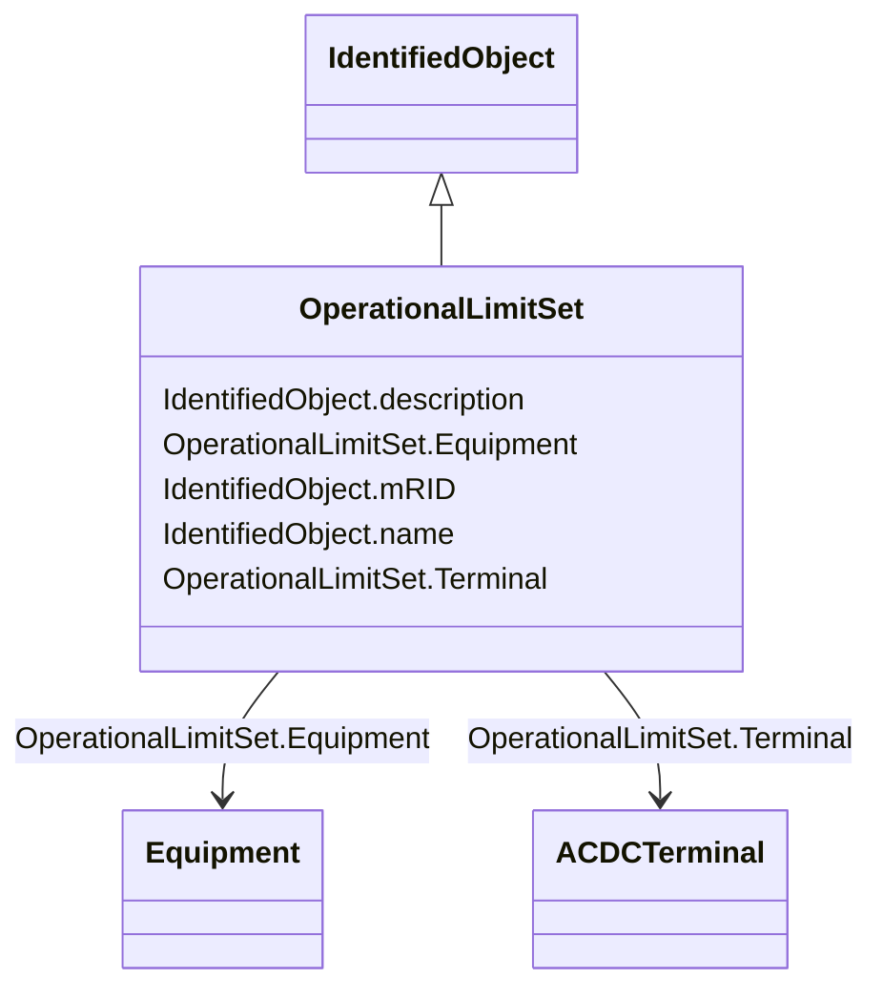

# OperationalLimitSet

_A set of limits associated with equipment.  Sets of limits might apply to a specific temperature, or season for example. A set of limits may contain different severities of limit levels that would apply to the same equipment. The set may contain limits of different types such as apparent power and current limits or high and low voltage limits  that are logically applied together as a set._

**URI**: [cim:OperationalLimitSet](http://iec.ch/TC57/CIM100#OperationalLimitSet) 
**Type**: Class

## Inheritance
* [IdentifiedObject](IdentifiedObject.md)
    * **OperationalLimitSet**

## Attributes

| Name | URI | Cardinality and Range | Description | Inheritance |
| ---  | --- | --- | --- | --- |
| Equipment | [cim:OperationalLimitSet.Equipment](http://iec.ch/TC57/CIM100#OperationalLimitSet.Equipment) | 1    [Equipment](Equipment.md)  | The equipment to which the limit set applies | direct |
| Terminal | [cim:OperationalLimitSet.Terminal](http://iec.ch/TC57/CIM100#OperationalLimitSet.Terminal) | 1    [ACDCTerminal](ACDCTerminal.md)  | The terminal where the operational limit set apply | direct |
| mRID | [cim:IdentifiedObject.mRID](http://iec.ch/TC57/CIM100#IdentifiedObject.mRID) | 1    string  | Master resource identifier issued by a model authority | [IdentifiedObject](IdentifiedObject.md) |
| description | [cim:IdentifiedObject.description](http://iec.ch/TC57/CIM100#IdentifiedObject.description) | 0..1    string  | The description is a free human readable text describing or naming the object | [IdentifiedObject](IdentifiedObject.md) |
| name | [cim:IdentifiedObject.name](http://iec.ch/TC57/CIM100#IdentifiedObject.name) | 1    string  | The name is any free human readable and possibly non unique text naming the o... | [IdentifiedObject](IdentifiedObject.md) |

## Usages

| used by | used in | type | used |
| ---  | --- | --- | --- |
| [ActivePowerLimit](ActivePowerLimit.md) | OperationalLimitSet | range | [OperationalLimitSet](OperationalLimitSet.md) |
| [ApparentPowerLimit](ApparentPowerLimit.md) | OperationalLimitSet | range | [OperationalLimitSet](OperationalLimitSet.md) |
| [CurrentLimit](CurrentLimit.md) | OperationalLimitSet | range | [OperationalLimitSet](OperationalLimitSet.md) |
| [OperationalLimit](OperationalLimit.md) | OperationalLimitSet | range | [OperationalLimitSet](OperationalLimitSet.md) |
| [VoltageLimit](VoltageLimit.md) | OperationalLimitSet | range | [OperationalLimitSet](OperationalLimitSet.md) |

## Identifier and Mapping Information

### Schema Source

* from schema: http://iec.ch/TC57/2020/CPSM-CoreEquipment#

## Mappings

| Mapping Type | Mapped Value |
| ---  | ---  |
| self | cim:OperationalLimitSet |
| native | this:OperationalLimitSet |

