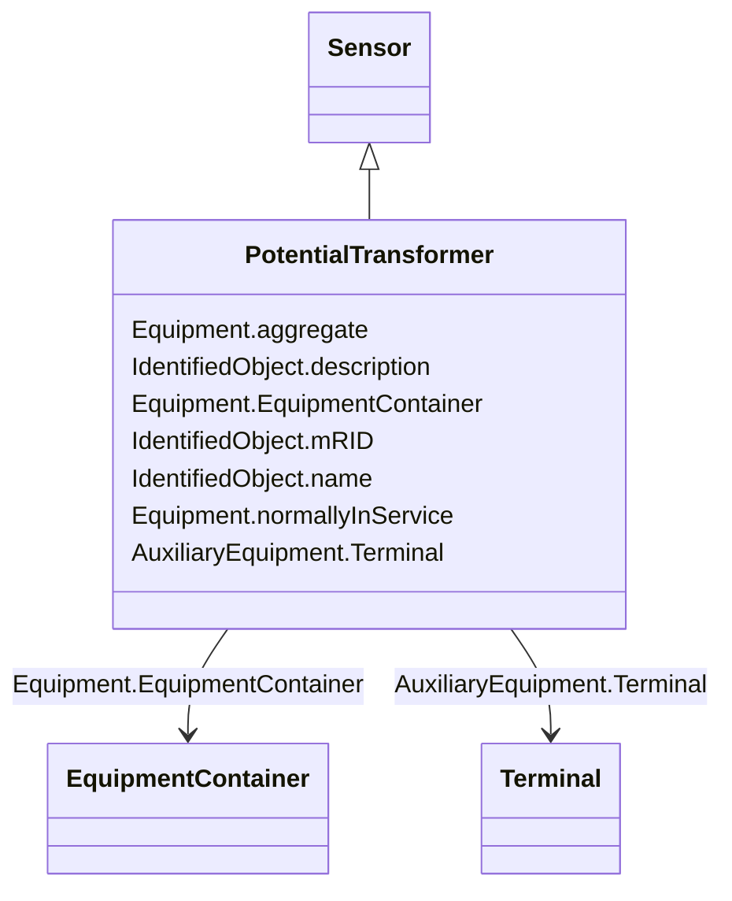

# PotentialTransformer

_Instrument transformer (also known as Voltage Transformer) used to measure electrical qualities of the circuit that is being protected and/or monitored. Typically used as voltage transducer for the purpose of metering, protection, or sometimes auxiliary substation supply. A typical secondary voltage rating would be 120V._

**URI**: [cim:PotentialTransformer](http://iec.ch/TC57/CIM100#PotentialTransformer) 
**Type**: Class

## Inheritance
* [IdentifiedObject](IdentifiedObject.md)
    * [PowerSystemResource](PowerSystemResource.md)
        * [Equipment](Equipment.md)
            * [AuxiliaryEquipment](AuxiliaryEquipment.md)
                * [Sensor](Sensor.md)
                    * **PotentialTransformer**

## Attributes

| Name | URI | Cardinality and Range | Description | Inheritance |
| ---  | --- | --- | --- | --- |
| Terminal | [cim:AuxiliaryEquipment.Terminal](http://iec.ch/TC57/CIM100#AuxiliaryEquipment.Terminal) | 1    [Terminal](Terminal.md)  | The Terminal at the equipment where the AuxiliaryEquipment is attached | [AuxiliaryEquipment](AuxiliaryEquipment.md) |
| aggregate | [cim:Equipment.aggregate](http://iec.ch/TC57/CIM100#Equipment.aggregate) | 0..1    boolean  | The aggregate flag provides an alternative way of representing an aggregated ... | [Equipment](Equipment.md) |
| normallyInService | [cim:Equipment.normallyInService](http://iec.ch/TC57/CIM100#Equipment.normallyInService) | 0..1    boolean  | Specifies the availability of the equipment under normal operating conditions | [Equipment](Equipment.md) |
| EquipmentContainer | [cim:Equipment.EquipmentContainer](http://iec.ch/TC57/CIM100#Equipment.EquipmentContainer) | 0..1    [EquipmentContainer](EquipmentContainer.md)  | Container of this equipment | [Equipment](Equipment.md) |
| mRID | [cim:IdentifiedObject.mRID](http://iec.ch/TC57/CIM100#IdentifiedObject.mRID) | 1    string  | Master resource identifier issued by a model authority | [IdentifiedObject](IdentifiedObject.md) |
| description | [cim:IdentifiedObject.description](http://iec.ch/TC57/CIM100#IdentifiedObject.description) | 0..1    string  | The description is a free human readable text describing or naming the object | [IdentifiedObject](IdentifiedObject.md) |
| name | [cim:IdentifiedObject.name](http://iec.ch/TC57/CIM100#IdentifiedObject.name) | 1    string  | The name is any free human readable and possibly non unique text naming the o... | [IdentifiedObject](IdentifiedObject.md) |

## Identifier and Mapping Information

### Schema Source

* from schema: http://iec.ch/TC57/2020/CPSM-CoreEquipment#

## Mappings

| Mapping Type | Mapped Value |
| ---  | ---  |
| self | cim:PotentialTransformer |
| native | this:PotentialTransformer |

