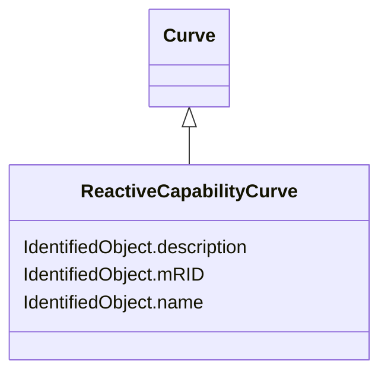

# ReactiveCapabilityCurve

_Reactive power rating envelope versus the synchronous machine's active power, in both the generating and motoring modes. For each active power value there is a corresponding high and low reactive power limit  value. Typically there will be a separate curve for each coolant condition, such as hydrogen pressure.  The Y1 axis values represent reactive minimum and the Y2 axis values represent reactive maximum._

**URI**: [cim:ReactiveCapabilityCurve](http://iec.ch/TC57/CIM100#ReactiveCapabilityCurve) 
**Type**: Class

## Inheritance
* [IdentifiedObject](IdentifiedObject.md)
    * [Curve](Curve.md)
        * **ReactiveCapabilityCurve**

## Attributes

| Name | URI | Cardinality and Range | Description | Inheritance |
| ---  | --- | --- | --- | --- |
| mRID | [cim:IdentifiedObject.mRID](http://iec.ch/TC57/CIM100#IdentifiedObject.mRID) | 1    string  | Master resource identifier issued by a model authority | [IdentifiedObject](IdentifiedObject.md) |
| description | [cim:IdentifiedObject.description](http://iec.ch/TC57/CIM100#IdentifiedObject.description) | 0..1    string  | The description is a free human readable text describing or naming the object | [IdentifiedObject](IdentifiedObject.md) |
| name | [cim:IdentifiedObject.name](http://iec.ch/TC57/CIM100#IdentifiedObject.name) | 1    string  | The name is any free human readable and possibly non unique text naming the o... | [IdentifiedObject](IdentifiedObject.md) |

## Usages

| used by | used in | type | used |
| ---  | --- | --- | --- |
| [EquivalentInjection](EquivalentInjection.md) | ReactiveCapabilityCurve | range | [ReactiveCapabilityCurve](ReactiveCapabilityCurve.md) |
| [SynchronousMachine](SynchronousMachine.md) | InitialReactiveCapabilityCurve | range | [ReactiveCapabilityCurve](ReactiveCapabilityCurve.md) |

## Comments

* -  ReactiveCapabilityCurves are not required if the reactive power limits of the SynchronousMachine do not vary with real power output.-  By convention, the Y1 axis values represent reactive minimum and the Y2 axis values represent reactive maximum.-  Because the x value will always be specified in MW and the y values will always be specified in MVAr, the xMultiplier, y1Multiplier, and y2Multiplier attributes do not need to be supplied.

## Identifier and Mapping Information

### Schema Source

* from schema: http://iec.ch/TC57/2020/CPSM-CoreEquipment#

## Mappings

| Mapping Type | Mapped Value |
| ---  | ---  |
| self | cim:ReactiveCapabilityCurve |
| native | this:ReactiveCapabilityCurve |

