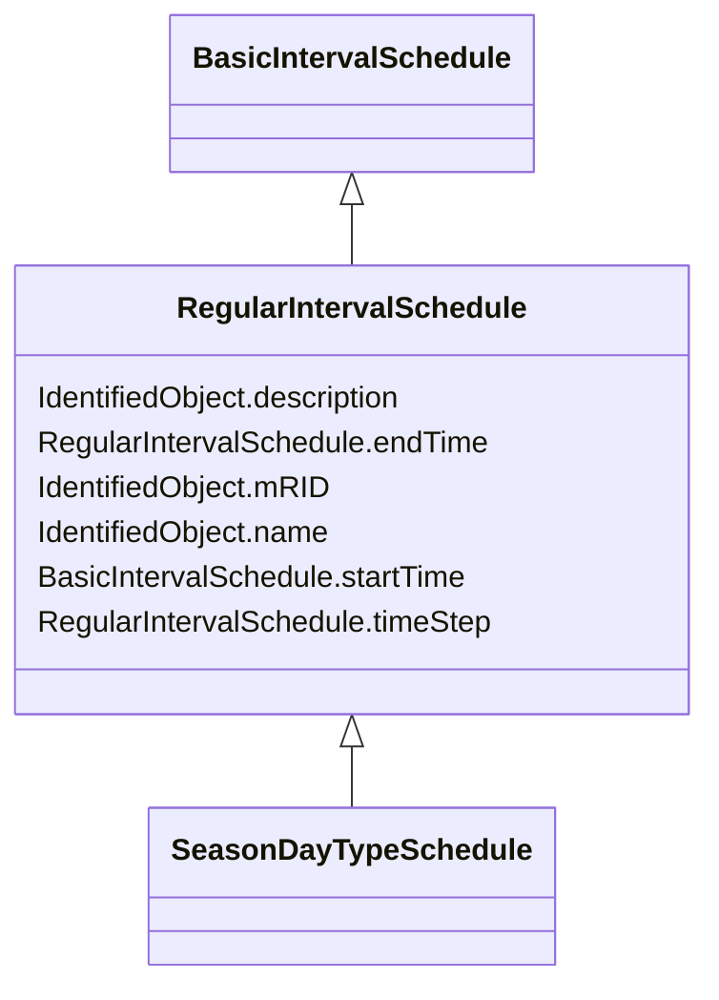

# RegularIntervalSchedule

_The schedule has time points where the time between them is constant._

* __NOTE__: this is an abstract class and should not be instantiated directly

**URI**: [cim:RegularIntervalSchedule](http://iec.ch/TC57/CIM100#RegularIntervalSchedule) 
**Type**: Class

## Inheritance
* [IdentifiedObject](IdentifiedObject.md)
    * [BasicIntervalSchedule](BasicIntervalSchedule.md)
        * **RegularIntervalSchedule**
            * [SeasonDayTypeSchedule](SeasonDayTypeSchedule.md)

## Attributes

| Name | URI | Cardinality and Range | Description | Inheritance |
| ---  | --- | --- | --- | --- |
| endTime | [cim:RegularIntervalSchedule.endTime](http://iec.ch/TC57/CIM100#RegularIntervalSchedule.endTime) | 1    datetime  | The time for the last time point | direct |
| timeStep | [cim:RegularIntervalSchedule.timeStep](http://iec.ch/TC57/CIM100#RegularIntervalSchedule.timeStep) | 1    [Seconds](Seconds.md)  | The time between each pair of subsequent regular time points in sequence orde... | direct |
| startTime | [cim:BasicIntervalSchedule.startTime](http://iec.ch/TC57/CIM100#BasicIntervalSchedule.startTime) | 1    datetime  | The time for the first time point | [BasicIntervalSchedule](BasicIntervalSchedule.md) |
| mRID | [cim:IdentifiedObject.mRID](http://iec.ch/TC57/CIM100#IdentifiedObject.mRID) | 1    string  | Master resource identifier issued by a model authority | [IdentifiedObject](IdentifiedObject.md) |
| description | [cim:IdentifiedObject.description](http://iec.ch/TC57/CIM100#IdentifiedObject.description) | 0..1    string  | The description is a free human readable text describing or naming the object | [IdentifiedObject](IdentifiedObject.md) |
| name | [cim:IdentifiedObject.name](http://iec.ch/TC57/CIM100#IdentifiedObject.name) | 1    string  | The name is any free human readable and possibly non unique text naming the o... | [IdentifiedObject](IdentifiedObject.md) |

## Usages

| used by | used in | type | used |
| ---  | --- | --- | --- |
| [RegularTimePoint](RegularTimePoint.md) | IntervalSchedule | range | [RegularIntervalSchedule](RegularIntervalSchedule.md) |

## Identifier and Mapping Information

### Schema Source

* from schema: http://iec.ch/TC57/2020/CPSM-CoreEquipment#

## Mappings

| Mapping Type | Mapped Value |
| ---  | ---  |
| self | cim:RegularIntervalSchedule |
| native | this:RegularIntervalSchedule |

