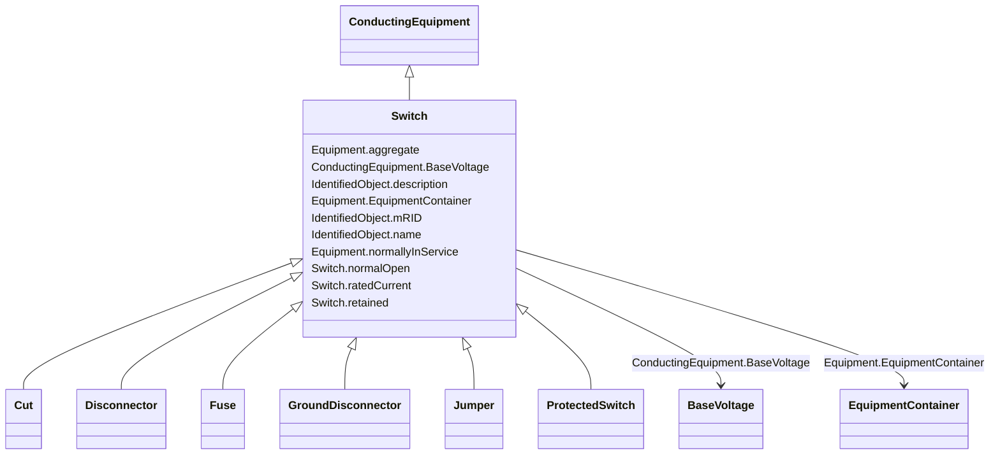

# Switch

_A generic device designed to close, or open, or both, one or more electric circuits.  All switches are two terminal devices including grounding switches. The ACDCTerminal.connected at the two sides of the switch shall not be considered for assessing switch connectivity, i.e. only Switch.open, .normalOpen and .locked are relevant._

**URI**: [cim:Switch](http://iec.ch/TC57/CIM100#Switch) 
**Type**: Class

## Inheritance
* [IdentifiedObject](IdentifiedObject.md)
    * [PowerSystemResource](PowerSystemResource.md)
        * [Equipment](Equipment.md)
            * [ConductingEquipment](ConductingEquipment.md)
                * **Switch**
                    * [Cut](Cut.md)
                    * [Disconnector](Disconnector.md)
                    * [Fuse](Fuse.md)
                    * [GroundDisconnector](GroundDisconnector.md)
                    * [Jumper](Jumper.md)
                    * [ProtectedSwitch](ProtectedSwitch.md)

## Attributes

| Name | URI | Cardinality and Range | Description | Inheritance |
| ---  | --- | --- | --- | --- |
| normalOpen | [cim:Switch.normalOpen](http://iec.ch/TC57/CIM100#Switch.normalOpen) | 1    boolean  | The attribute is used in cases when no Measurement for the status value is pr... | direct |
| ratedCurrent | [cim:Switch.ratedCurrent](http://iec.ch/TC57/CIM100#Switch.ratedCurrent) | 0..1    [CurrentFlow](CurrentFlow.md)  | The maximum continuous current carrying capacity in amps governed by the devi... | direct |
| retained | [cim:Switch.retained](http://iec.ch/TC57/CIM100#Switch.retained) | 1    boolean  | Branch is retained in the topological solution | direct |
| BaseVoltage | [cim:ConductingEquipment.BaseVoltage](http://iec.ch/TC57/CIM100#ConductingEquipment.BaseVoltage) | 0..1    [BaseVoltage](BaseVoltage.md)  | Base voltage of this conducting equipment | [ConductingEquipment](ConductingEquipment.md) |
| aggregate | [cim:Equipment.aggregate](http://iec.ch/TC57/CIM100#Equipment.aggregate) | 0..1    boolean  | The aggregate flag provides an alternative way of representing an aggregated ... | [Equipment](Equipment.md) |
| normallyInService | [cim:Equipment.normallyInService](http://iec.ch/TC57/CIM100#Equipment.normallyInService) | 0..1    boolean  | Specifies the availability of the equipment under normal operating conditions | [Equipment](Equipment.md) |
| EquipmentContainer | [cim:Equipment.EquipmentContainer](http://iec.ch/TC57/CIM100#Equipment.EquipmentContainer) | 0..1    [EquipmentContainer](EquipmentContainer.md)  | Container of this equipment | [Equipment](Equipment.md) |
| mRID | [cim:IdentifiedObject.mRID](http://iec.ch/TC57/CIM100#IdentifiedObject.mRID) | 1    string  | Master resource identifier issued by a model authority | [IdentifiedObject](IdentifiedObject.md) |
| description | [cim:IdentifiedObject.description](http://iec.ch/TC57/CIM100#IdentifiedObject.description) | 0..1    string  | The description is a free human readable text describing or naming the object | [IdentifiedObject](IdentifiedObject.md) |
| name | [cim:IdentifiedObject.name](http://iec.ch/TC57/CIM100#IdentifiedObject.name) | 1    string  | The name is any free human readable and possibly non unique text naming the o... | [IdentifiedObject](IdentifiedObject.md) |

## Usages

| used by | used in | type | used |
| ---  | --- | --- | --- |
| [SwitchSchedule](SwitchSchedule.md) | Switch | range | [Switch](Switch.md) |

## Identifier and Mapping Information

### Schema Source

* from schema: http://iec.ch/TC57/2020/CPSM-CoreEquipment#

## Mappings

| Mapping Type | Mapped Value |
| ---  | ---  |
| self | cim:Switch |
| native | this:Switch |

