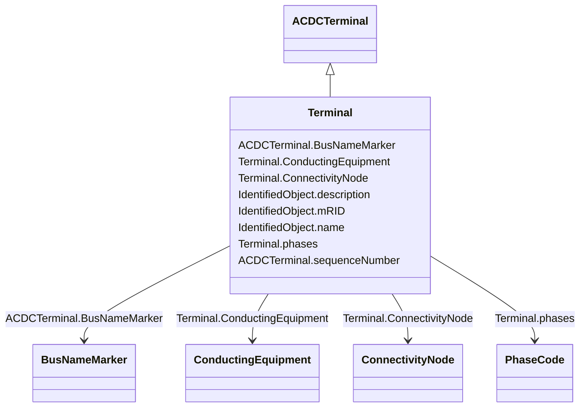

# Terminal

_An AC electrical connection point to a piece of conducting equipment. Terminals are connected at physical connection points called connectivity nodes._

**URI**: [cim:Terminal](http://iec.ch/TC57/CIM100#Terminal) 
**Type**: Class

## Inheritance
* [IdentifiedObject](IdentifiedObject.md)
    * [ACDCTerminal](ACDCTerminal.md)
        * **Terminal**

## Attributes

| Name | URI | Cardinality and Range | Description | Inheritance |
| ---  | --- | --- | --- | --- |
| phases | [cim:Terminal.phases](http://iec.ch/TC57/CIM100#Terminal.phases) | 0..1    [PhaseCode](PhaseCode.md)  | Represents the normal network phasing condition | direct |
| ConductingEquipment | [cim:Terminal.ConductingEquipment](http://iec.ch/TC57/CIM100#Terminal.ConductingEquipment) | 1    [ConductingEquipment](ConductingEquipment.md)  | The conducting equipment of the terminal | direct |
| ConnectivityNode | [cim:Terminal.ConnectivityNode](http://iec.ch/TC57/CIM100#Terminal.ConnectivityNode) | 0..1    [ConnectivityNode](ConnectivityNode.md)  | The connectivity node to which this terminal connects with zero impedance | direct |
| sequenceNumber | [cim:ACDCTerminal.sequenceNumber](http://iec.ch/TC57/CIM100#ACDCTerminal.sequenceNumber) | 1    integer  | The orientation of the terminal connections for a multiple terminal conductin... | [ACDCTerminal](ACDCTerminal.md) |
| BusNameMarker | [cim:ACDCTerminal.BusNameMarker](http://iec.ch/TC57/CIM100#ACDCTerminal.BusNameMarker) | 0..1    [BusNameMarker](BusNameMarker.md)  | The bus name marker used to name the bus (topological node) | [ACDCTerminal](ACDCTerminal.md) |
| mRID | [cim:IdentifiedObject.mRID](http://iec.ch/TC57/CIM100#IdentifiedObject.mRID) | 1    string  | Master resource identifier issued by a model authority | [IdentifiedObject](IdentifiedObject.md) |
| description | [cim:IdentifiedObject.description](http://iec.ch/TC57/CIM100#IdentifiedObject.description) | 0..1    string  | The description is a free human readable text describing or naming the object | [IdentifiedObject](IdentifiedObject.md) |
| name | [cim:IdentifiedObject.name](http://iec.ch/TC57/CIM100#IdentifiedObject.name) | 1    string  | The name is any free human readable and possibly non unique text naming the o... | [IdentifiedObject](IdentifiedObject.md) |

## Usages

| used by | used in | type | used |
| ---  | --- | --- | --- |
| [ACDCConverter](ACDCConverter.md) | PccTerminal | range | [Terminal](Terminal.md) |
| [AuxiliaryEquipment](AuxiliaryEquipment.md) | Terminal | range | [Terminal](Terminal.md) |
| [CsConverter](CsConverter.md) | PccTerminal | range | [Terminal](Terminal.md) |
| [CurrentTransformer](CurrentTransformer.md) | Terminal | range | [Terminal](Terminal.md) |
| [FaultIndicator](FaultIndicator.md) | Terminal | range | [Terminal](Terminal.md) |
| [PostLineSensor](PostLineSensor.md) | Terminal | range | [Terminal](Terminal.md) |
| [PotentialTransformer](PotentialTransformer.md) | Terminal | range | [Terminal](Terminal.md) |
| [PowerTransformerEnd](PowerTransformerEnd.md) | Terminal | range | [Terminal](Terminal.md) |
| [RegulatingControl](RegulatingControl.md) | Terminal | range | [Terminal](Terminal.md) |
| [Sensor](Sensor.md) | Terminal | range | [Terminal](Terminal.md) |
| [SurgeArrester](SurgeArrester.md) | Terminal | range | [Terminal](Terminal.md) |
| [TapChangerControl](TapChangerControl.md) | Terminal | range | [Terminal](Terminal.md) |
| [TieFlow](TieFlow.md) | Terminal | range | [Terminal](Terminal.md) |
| [TransformerEnd](TransformerEnd.md) | Terminal | range | [Terminal](Terminal.md) |
| [VsConverter](VsConverter.md) | PccTerminal | range | [Terminal](Terminal.md) |
| [WaveTrap](WaveTrap.md) | Terminal | range | [Terminal](Terminal.md) |

## Comments

* The attribute Terminal.phases is not specified the Terminal will be understood to be three phase (ABC or ABCN).  Except for terminals of grounding classes (specilizations of EarthFaultCompensator, GroundDisconnector, GroundSwitch, and Ground) which will be assumed to be N.

## Identifier and Mapping Information

### Schema Source

* from schema: http://iec.ch/TC57/2020/CPSM-CoreEquipment#

## Mappings

| Mapping Type | Mapped Value |
| ---  | ---  |
| self | cim:Terminal |
| native | this:Terminal |

