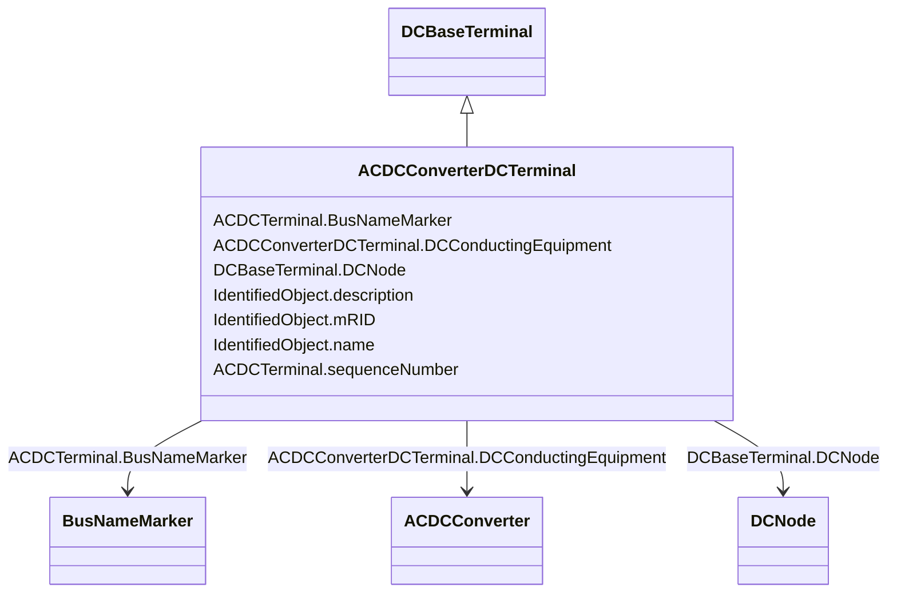

# ACDCConverterDCTerminal

_A DC electrical connection point at the AC/DC converter. The AC/DC converter is electrically connected also to the AC side. The AC connection is inherited from the AC conducting equipment in the same way as any other AC equipment. The AC/DC converter DC terminal is separate from generic DC terminal to restrict the connection with the AC side to AC/DC converter and so that no other DC conducting equipment can be connected to the AC side._

**URI**: [cim:ACDCConverterDCTerminal](http://iec.ch/TC57/CIM100#ACDCConverterDCTerminal) 
**Type**: Class

## Inheritance
* [IdentifiedObject](IdentifiedObject.md)
    * [ACDCTerminal](ACDCTerminal.md)
        * [DCBaseTerminal](DCBaseTerminal.md)
            * **ACDCConverterDCTerminal**

## Attributes

| Name | URI | Cardinality and Range | Description | Inheritance |
| ---  | --- | --- | --- | --- |
| DCConductingEquipment | [cim:ACDCConverterDCTerminal.DCConductingEquipment](http://iec.ch/TC57/CIM100#ACDCConverterDCTerminal.DCConductingEquipment) | 1    [ACDCConverter](ACDCConverter.md)  | A DC converter terminal belong to an DC converter | direct |
| DCNode | [cim:DCBaseTerminal.DCNode](http://iec.ch/TC57/CIM100#DCBaseTerminal.DCNode) | 0..1    [DCNode](DCNode.md)  | The DC connectivity node to which this DC base terminal connects with zero im... | [DCBaseTerminal](DCBaseTerminal.md) |
| sequenceNumber | [cim:ACDCTerminal.sequenceNumber](http://iec.ch/TC57/CIM100#ACDCTerminal.sequenceNumber) | 1    integer  | The orientation of the terminal connections for a multiple terminal conductin... | [ACDCTerminal](ACDCTerminal.md) |
| BusNameMarker | [cim:ACDCTerminal.BusNameMarker](http://iec.ch/TC57/CIM100#ACDCTerminal.BusNameMarker) | 0..1    [BusNameMarker](BusNameMarker.md)  | The bus name marker used to name the bus (topological node) | [ACDCTerminal](ACDCTerminal.md) |
| mRID | [cim:IdentifiedObject.mRID](http://iec.ch/TC57/CIM100#IdentifiedObject.mRID) | 1    string  | Master resource identifier issued by a model authority | [IdentifiedObject](IdentifiedObject.md) |
| description | [cim:IdentifiedObject.description](http://iec.ch/TC57/CIM100#IdentifiedObject.description) | 0..1    string  | The description is a free human readable text describing or naming the object | [IdentifiedObject](IdentifiedObject.md) |
| name | [cim:IdentifiedObject.name](http://iec.ch/TC57/CIM100#IdentifiedObject.name) | 1    string  | The name is any free human readable and possibly non unique text naming the o... | [IdentifiedObject](IdentifiedObject.md) |

## Identifier and Mapping Information

### Schema Source

* from schema: http://iec.ch/TC57/2020/CPSM-CoreEquipment#

## Mappings

| Mapping Type | Mapped Value |
| ---  | ---  |
| self | cim:ACDCConverterDCTerminal |
| native | this:ACDCConverterDCTerminal |

