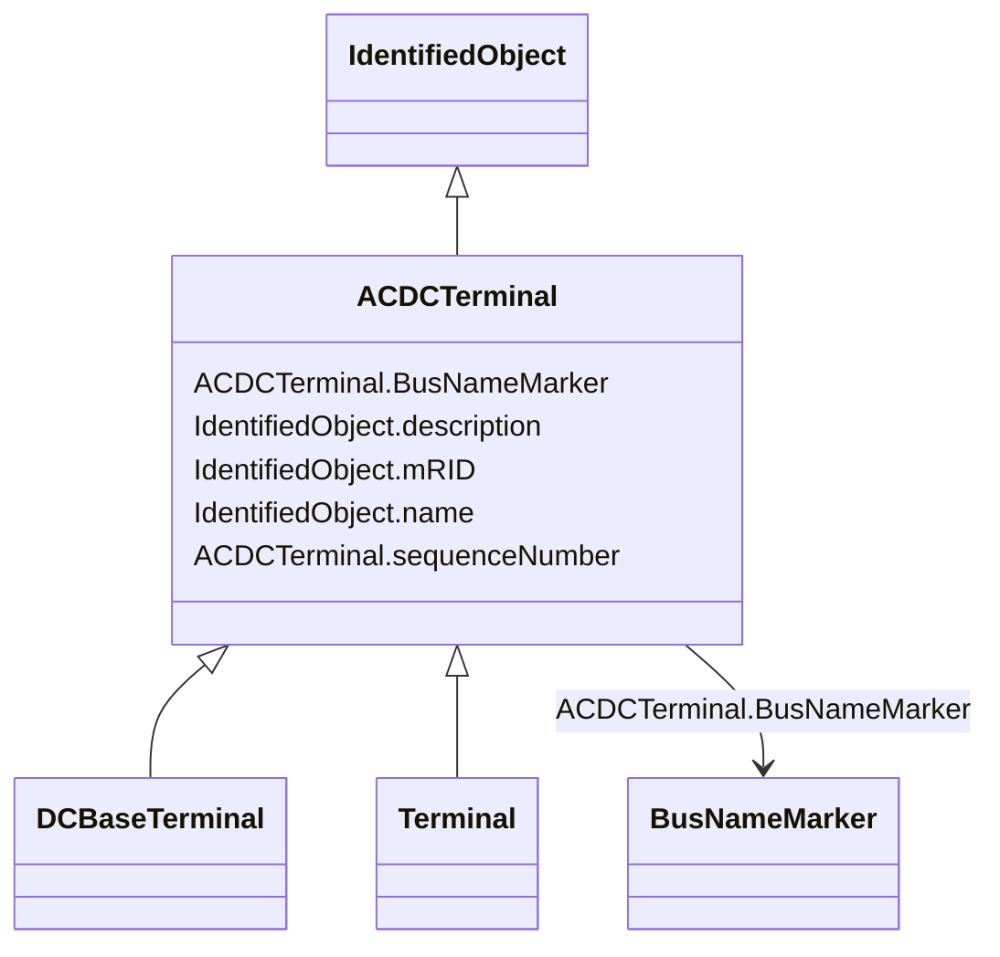

# ACDCTerminal

_An electrical connection point (AC or DC) to a piece of conducting equipment. Terminals are connected at physical connection points called connectivity nodes._

* __NOTE__: this is an abstract class and should not be instantiated directly

**URI**: [cim:ACDCTerminal](http://iec.ch/TC57/CIM100#ACDCTerminal) 
**Type**: Class

## Inheritance
* [IdentifiedObject](IdentifiedObject.md)
    * **ACDCTerminal**
        * [DCBaseTerminal](DCBaseTerminal.md)
        * [Terminal](Terminal.md)

## Attributes

| Name | URI | Cardinality and Range | Description | Inheritance |
| ---  | --- | --- | --- | --- |
| sequenceNumber | [cim:ACDCTerminal.sequenceNumber](http://iec.ch/TC57/CIM100#ACDCTerminal.sequenceNumber) | 1    integer  | The orientation of the terminal connections for a multiple terminal conductin... | direct |
| BusNameMarker | [cim:ACDCTerminal.BusNameMarker](http://iec.ch/TC57/CIM100#ACDCTerminal.BusNameMarker) | 0..1    [BusNameMarker](BusNameMarker.md)  | The bus name marker used to name the bus (topological node) | direct |
| mRID | [cim:IdentifiedObject.mRID](http://iec.ch/TC57/CIM100#IdentifiedObject.mRID) | 1    string  | Master resource identifier issued by a model authority | [IdentifiedObject](IdentifiedObject.md) |
| description | [cim:IdentifiedObject.description](http://iec.ch/TC57/CIM100#IdentifiedObject.description) | 0..1    string  | The description is a free human readable text describing or naming the object | [IdentifiedObject](IdentifiedObject.md) |
| name | [cim:IdentifiedObject.name](http://iec.ch/TC57/CIM100#IdentifiedObject.name) | 1    string  | The name is any free human readable and possibly non unique text naming the o... | [IdentifiedObject](IdentifiedObject.md) |

## Usages

| used by | used in | type | used |
| ---  | --- | --- | --- |
| [OperationalLimitSet](OperationalLimitSet.md) | Terminal | range | [ACDCTerminal](ACDCTerminal.md) |

## Identifier and Mapping Information

### Schema Source

* from schema: http://iec.ch/TC57/2020/CPSM-CoreEquipment#

## Mappings

| Mapping Type | Mapped Value |
| ---  | ---  |
| self | cim:ACDCTerminal |
| native | this:ACDCTerminal |

