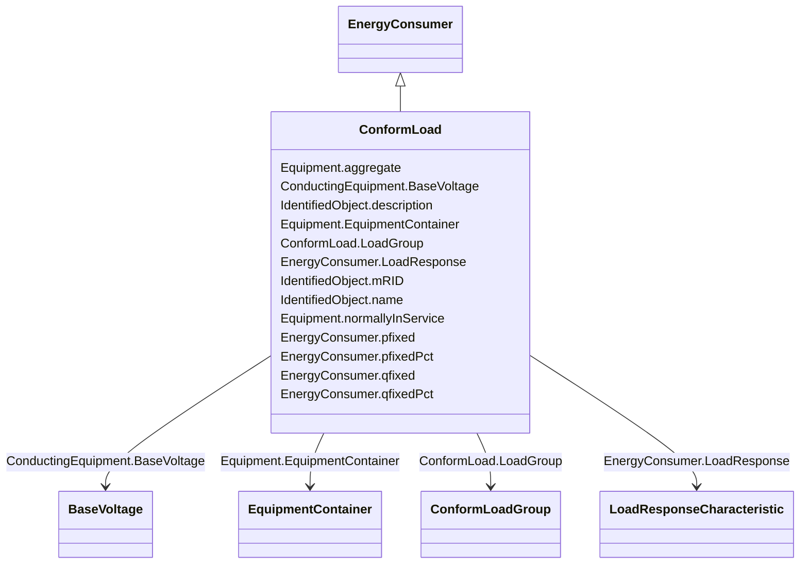

# ConformLoad

_ConformLoad represent loads that follow a daily load change pattern where the pattern can be used to scale the load with a system load._

**URI**: [cim:ConformLoad](http://iec.ch/TC57/CIM100#ConformLoad) 
**Type**: Class

## Inheritance
* [IdentifiedObject](IdentifiedObject.md)
    * [PowerSystemResource](PowerSystemResource.md)
        * [Equipment](Equipment.md)
            * [ConductingEquipment](ConductingEquipment.md)
                * [EnergyConnection](EnergyConnection.md)
                    * [EnergyConsumer](EnergyConsumer.md)
                        * **ConformLoad**

## Attributes

| Name | URI | Cardinality and Range | Description | Inheritance |
| ---  | --- | --- | --- | --- |
| LoadGroup | [cim:ConformLoad.LoadGroup](http://iec.ch/TC57/CIM100#ConformLoad.LoadGroup) | 1    [ConformLoadGroup](ConformLoadGroup.md)  | Group of this ConformLoad | direct |
| pfixed | [cim:EnergyConsumer.pfixed](http://iec.ch/TC57/CIM100#EnergyConsumer.pfixed) | 0..1    [ActivePower](ActivePower.md)  | Active power of the load that is a fixed quantity and does not vary as load g... | [EnergyConsumer](EnergyConsumer.md) |
| pfixedPct | [cim:EnergyConsumer.pfixedPct](http://iec.ch/TC57/CIM100#EnergyConsumer.pfixedPct) | 0..1    [PerCent](PerCent.md)  | Fixed active power as a percentage of load group fixed active power | [EnergyConsumer](EnergyConsumer.md) |
| qfixed | [cim:EnergyConsumer.qfixed](http://iec.ch/TC57/CIM100#EnergyConsumer.qfixed) | 0..1    [ReactivePower](ReactivePower.md)  | Reactive power of the load that is a fixed quantity and does not vary as load... | [EnergyConsumer](EnergyConsumer.md) |
| qfixedPct | [cim:EnergyConsumer.qfixedPct](http://iec.ch/TC57/CIM100#EnergyConsumer.qfixedPct) | 0..1    [PerCent](PerCent.md)  | Fixed reactive power as a percentage of load group fixed reactive power | [EnergyConsumer](EnergyConsumer.md) |
| LoadResponse | [cim:EnergyConsumer.LoadResponse](http://iec.ch/TC57/CIM100#EnergyConsumer.LoadResponse) | 0..1    [LoadResponseCharacteristic](LoadResponseCharacteristic.md)  | The load response characteristic of this load | [EnergyConsumer](EnergyConsumer.md) |
| BaseVoltage | [cim:ConductingEquipment.BaseVoltage](http://iec.ch/TC57/CIM100#ConductingEquipment.BaseVoltage) | 0..1    [BaseVoltage](BaseVoltage.md)  | Base voltage of this conducting equipment | [ConductingEquipment](ConductingEquipment.md) |
| aggregate | [cim:Equipment.aggregate](http://iec.ch/TC57/CIM100#Equipment.aggregate) | 0..1    boolean  | The aggregate flag provides an alternative way of representing an aggregated ... | [Equipment](Equipment.md) |
| normallyInService | [cim:Equipment.normallyInService](http://iec.ch/TC57/CIM100#Equipment.normallyInService) | 0..1    boolean  | Specifies the availability of the equipment under normal operating conditions | [Equipment](Equipment.md) |
| EquipmentContainer | [cim:Equipment.EquipmentContainer](http://iec.ch/TC57/CIM100#Equipment.EquipmentContainer) | 0..1    [EquipmentContainer](EquipmentContainer.md)  | Container of this equipment | [Equipment](Equipment.md) |
| mRID | [cim:IdentifiedObject.mRID](http://iec.ch/TC57/CIM100#IdentifiedObject.mRID) | 1    string  | Master resource identifier issued by a model authority | [IdentifiedObject](IdentifiedObject.md) |
| description | [cim:IdentifiedObject.description](http://iec.ch/TC57/CIM100#IdentifiedObject.description) | 0..1    string  | The description is a free human readable text describing or naming the object | [IdentifiedObject](IdentifiedObject.md) |
| name | [cim:IdentifiedObject.name](http://iec.ch/TC57/CIM100#IdentifiedObject.name) | 1    string  | The name is any free human readable and possibly non unique text naming the o... | [IdentifiedObject](IdentifiedObject.md) |

## Comments

* -  The definition of the real and reactive power injections for an EnergyConsumer can be done using different sets of attributes.  In the simplest case, the injections can be defined directly using only the attributes pfixed and qfixed.-  The injections for a ConformLoad can be defined as a percentage of the ConformLoadGroup with the attributes pfixedPct and qfixedPct.  In this case, the associated ConformLoadGroup would have to have an associated ConformLoadSchedule.-  See EnergyConsumer for specific notes about inherited attributes.

## Identifier and Mapping Information

### Schema Source

* from schema: http://iec.ch/TC57/2020/CPSM-CoreEquipment#

## Mappings

| Mapping Type | Mapped Value |
| ---  | ---  |
| self | cim:ConformLoad |
| native | this:ConformLoad |

