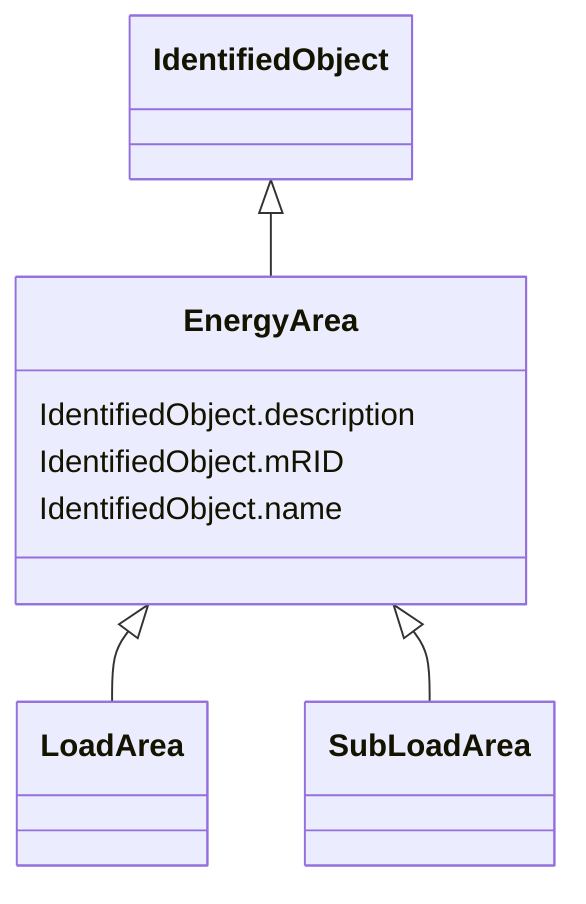

# EnergyArea

_Describes an area having energy production or consumption.  Specializations are intended to support the load allocation function as typically required in energy management systems or planning studies to allocate hypothesized load levels to individual load points for power flow analysis.  Often the energy area can be linked to both measured and forecast load levels._

* __NOTE__: this is an abstract class and should not be instantiated directly

**URI**: [cim:EnergyArea](http://iec.ch/TC57/CIM100#EnergyArea) 
**Type**: Class

## Inheritance
* [IdentifiedObject](IdentifiedObject.md)
    * **EnergyArea**
        * [LoadArea](LoadArea.md)
        * [SubLoadArea](SubLoadArea.md)

## Attributes

| Name | URI | Cardinality and Range | Description | Inheritance |
| ---  | --- | --- | --- | --- |
| mRID | [cim:IdentifiedObject.mRID](http://iec.ch/TC57/CIM100#IdentifiedObject.mRID) | 1    string  | Master resource identifier issued by a model authority | [IdentifiedObject](IdentifiedObject.md) |
| description | [cim:IdentifiedObject.description](http://iec.ch/TC57/CIM100#IdentifiedObject.description) | 0..1    string  | The description is a free human readable text describing or naming the object | [IdentifiedObject](IdentifiedObject.md) |
| name | [cim:IdentifiedObject.name](http://iec.ch/TC57/CIM100#IdentifiedObject.name) | 1    string  | The name is any free human readable and possibly non unique text naming the o... | [IdentifiedObject](IdentifiedObject.md) |

## Usages

| used by | used in | type | used |
| ---  | --- | --- | --- |
| [ControlArea](ControlArea.md) | EnergyArea | range | [EnergyArea](EnergyArea.md) |

## Identifier and Mapping Information

### Schema Source

* from schema: http://iec.ch/TC57/2020/CPSM-CoreEquipment#

## Mappings

| Mapping Type | Mapped Value |
| ---  | ---  |
| self | cim:EnergyArea |
| native | this:EnergyArea |

