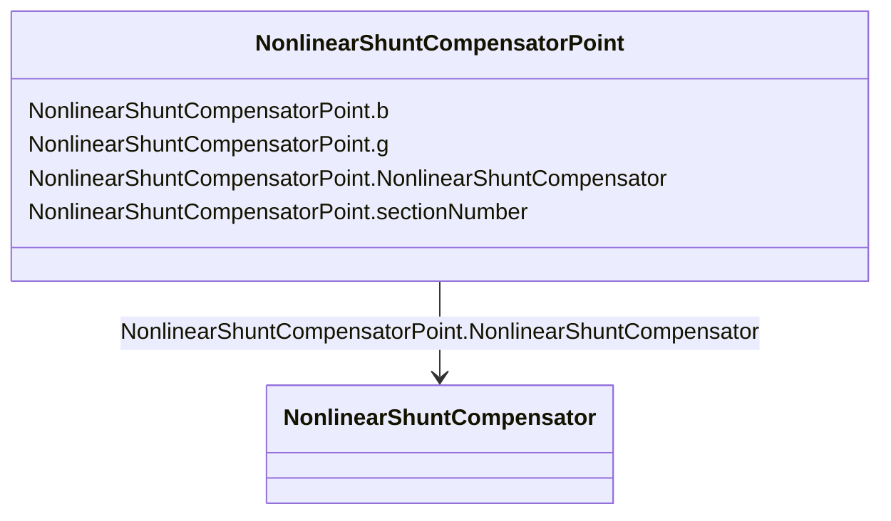

# NonlinearShuntCompensatorPoint

_A non linear shunt compensator bank or section admittance value. The number of NonlinearShuntCompenstorPoint instances associated with a NonlinearShuntCompensator shall be equal to ShuntCompensator.maximumSections. ShuntCompensator.sections shall only be set to one of the NonlinearShuntCompenstorPoint.sectionNumber. There is no interpolation between NonlinearShuntCompenstorPoint-s._

**URI**: [cim:NonlinearShuntCompensatorPoint](http://iec.ch/TC57/CIM100#NonlinearShuntCompensatorPoint) 
**Type**: Class

<!-- no inheritance hierarchy -->

## Attributes

| Name | URI | Cardinality and Range | Description | Inheritance |
| ---  | --- | --- | --- | --- |
| b | [cim:NonlinearShuntCompensatorPoint.b](http://iec.ch/TC57/CIM100#NonlinearShuntCompensatorPoint.b) | 1    [Susceptance](Susceptance.md)  | Positive sequence shunt (charging) susceptance per section | direct |
| g | [cim:NonlinearShuntCompensatorPoint.g](http://iec.ch/TC57/CIM100#NonlinearShuntCompensatorPoint.g) | 1    [Conductance](Conductance.md)  | Positive sequence shunt (charging) conductance per section | direct |
| sectionNumber | [cim:NonlinearShuntCompensatorPoint.sectionNumber](http://iec.ch/TC57/CIM100#NonlinearShuntCompensatorPoint.sectionNumber) | 1    integer  | The number of the section | direct |
| NonlinearShuntCompensator | [cim:NonlinearShuntCompensatorPoint.NonlinearShuntCompensator](http://iec.ch/TC57/CIM100#NonlinearShuntCompensatorPoint.NonlinearShuntCompensator) | 1    [NonlinearShuntCompensator](NonlinearShuntCompensator.md)  | Non-linear shunt compensator owning this point | direct |

## Identifier and Mapping Information

### Schema Source

* from schema: http://iec.ch/TC57/2020/CPSM-CoreEquipment#

## Mappings

| Mapping Type | Mapped Value |
| ---  | ---  |
| self | cim:NonlinearShuntCompensatorPoint |
| native | this:NonlinearShuntCompensatorPoint |

