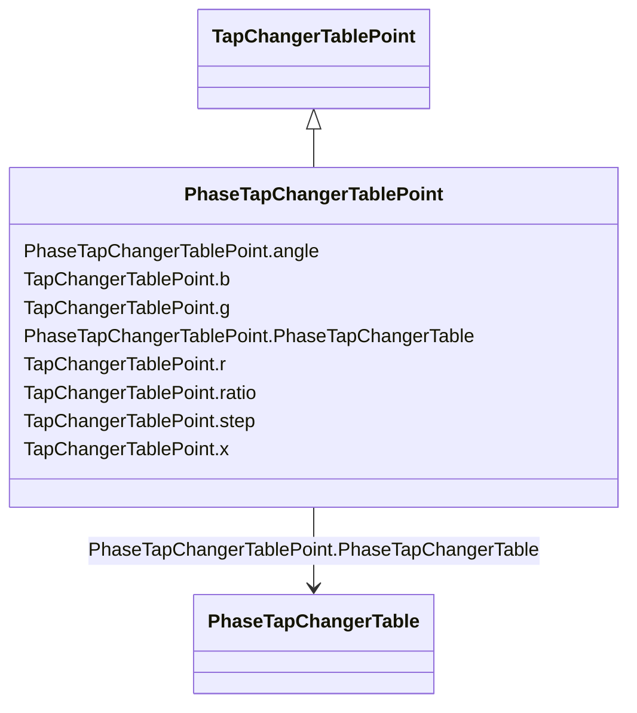

# PhaseTapChangerTablePoint

_Describes each tap step in the phase tap changer tabular curve._

**URI**: [cim:PhaseTapChangerTablePoint](http://iec.ch/TC57/CIM100#PhaseTapChangerTablePoint) 
**Type**: Class

## Inheritance
* [TapChangerTablePoint](TapChangerTablePoint.md)
    * **PhaseTapChangerTablePoint**

## Attributes

| Name | URI | Cardinality and Range | Description | Inheritance |
| ---  | --- | --- | --- | --- |
| angle | [cim:PhaseTapChangerTablePoint.angle](http://iec.ch/TC57/CIM100#PhaseTapChangerTablePoint.angle) | 1    [AngleDegrees](AngleDegrees.md)  | The angle difference in degrees | direct |
| PhaseTapChangerTable | [cim:PhaseTapChangerTablePoint.PhaseTapChangerTable](http://iec.ch/TC57/CIM100#PhaseTapChangerTablePoint.PhaseTapChangerTable) | 1    [PhaseTapChangerTable](PhaseTapChangerTable.md)  | The table of this point | direct |
| b | [cim:TapChangerTablePoint.b](http://iec.ch/TC57/CIM100#TapChangerTablePoint.b) | 0..1    [PerCent](PerCent.md)  | The magnetizing branch susceptance deviation as a percentage of nominal value | [TapChangerTablePoint](TapChangerTablePoint.md) |
| g | [cim:TapChangerTablePoint.g](http://iec.ch/TC57/CIM100#TapChangerTablePoint.g) | 0..1    [PerCent](PerCent.md)  | The magnetizing branch conductance deviation as a percentage of nominal value | [TapChangerTablePoint](TapChangerTablePoint.md) |
| r | [cim:TapChangerTablePoint.r](http://iec.ch/TC57/CIM100#TapChangerTablePoint.r) | 0..1    [PerCent](PerCent.md)  | The resistance deviation as a percentage of nominal value | [TapChangerTablePoint](TapChangerTablePoint.md) |
| ratio | [cim:TapChangerTablePoint.ratio](http://iec.ch/TC57/CIM100#TapChangerTablePoint.ratio) | 0..1    float  | The voltage at the tap step divided by rated voltage of the transformer end h... | [TapChangerTablePoint](TapChangerTablePoint.md) |
| step | [cim:TapChangerTablePoint.step](http://iec.ch/TC57/CIM100#TapChangerTablePoint.step) | 1    integer  | The tap step | [TapChangerTablePoint](TapChangerTablePoint.md) |
| x | [cim:TapChangerTablePoint.x](http://iec.ch/TC57/CIM100#TapChangerTablePoint.x) | 0..1    [PerCent](PerCent.md)  | The series reactance deviation as a percentage of nominal value | [TapChangerTablePoint](TapChangerTablePoint.md) |

## Identifier and Mapping Information

### Schema Source

* from schema: http://iec.ch/TC57/2020/CPSM-CoreEquipment#

## Mappings

| Mapping Type | Mapped Value |
| ---  | ---  |
| self | cim:PhaseTapChangerTablePoint |
| native | this:PhaseTapChangerTablePoint |

