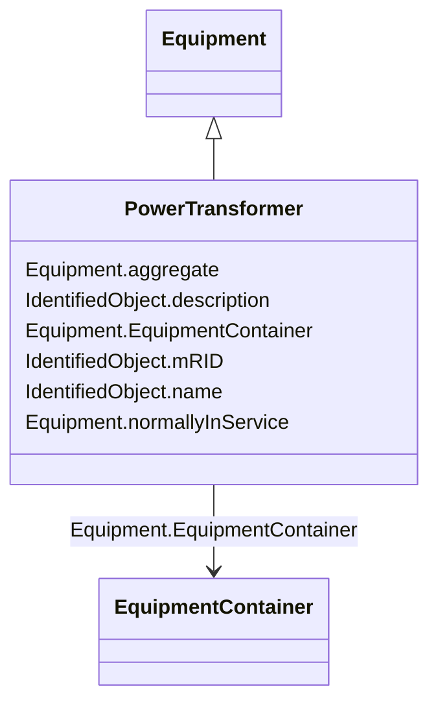

# PowerTransformer

_An electrical device consisting of  two or more coupled windings, with or without a magnetic core, for introducing mutual coupling between electric circuits. Transformers can be used to control voltage and phase shift (active power flow).A power transformer may be composed of separate transformer tanks that need not be identical.A power transformer can be modelled with or without tanks and is intended for use in both balanced and unbalanced representations.   A power transformer typically has two terminals, but may have one (grounding), three or more terminals.The inherited association ConductingEquipment.BaseVoltage should not be used.  The association from TransformerEnd to BaseVoltage should be used instead._

**URI**: [cim:PowerTransformer](http://iec.ch/TC57/CIM100#PowerTransformer) 
**Type**: Class

## Inheritance
* [IdentifiedObject](IdentifiedObject.md)
    * [PowerSystemResource](PowerSystemResource.md)
        * [Equipment](Equipment.md)
            * **PowerTransformer**

## Attributes

| Name | URI | Cardinality and Range | Description | Inheritance |
| ---  | --- | --- | --- | --- |
| aggregate | [cim:Equipment.aggregate](http://iec.ch/TC57/CIM100#Equipment.aggregate) | 0..1    boolean  | The aggregate flag provides an alternative way of representing an aggregated ... | [Equipment](Equipment.md) |
| normallyInService | [cim:Equipment.normallyInService](http://iec.ch/TC57/CIM100#Equipment.normallyInService) | 0..1    boolean  | Specifies the availability of the equipment under normal operating conditions | [Equipment](Equipment.md) |
| EquipmentContainer | [cim:Equipment.EquipmentContainer](http://iec.ch/TC57/CIM100#Equipment.EquipmentContainer) | 0..1    [EquipmentContainer](EquipmentContainer.md)  | Container of this equipment | [Equipment](Equipment.md) |
| mRID | [cim:IdentifiedObject.mRID](http://iec.ch/TC57/CIM100#IdentifiedObject.mRID) | 1    string  | Master resource identifier issued by a model authority | [IdentifiedObject](IdentifiedObject.md) |
| description | [cim:IdentifiedObject.description](http://iec.ch/TC57/CIM100#IdentifiedObject.description) | 0..1    string  | The description is a free human readable text describing or naming the object | [IdentifiedObject](IdentifiedObject.md) |
| name | [cim:IdentifiedObject.name](http://iec.ch/TC57/CIM100#IdentifiedObject.name) | 1    string  | The name is any free human readable and possibly non unique text naming the o... | [IdentifiedObject](IdentifiedObject.md) |

## Usages

| used by | used in | type | used |
| ---  | --- | --- | --- |
| [PowerTransformerEnd](PowerTransformerEnd.md) | PowerTransformer | range | [PowerTransformer](PowerTransformer.md) |

## Comments

* A PowerTransformer can be either two winding or three winding.-  A two winding transformer has two PowerTransformerEnds and two associated Terminals.-  A three winding transformer has three PowerTransformerEnds and three associated Terminals.

## Identifier and Mapping Information

### Schema Source

* from schema: http://iec.ch/TC57/2020/CPSM-CoreEquipment#

## Mappings

| Mapping Type | Mapped Value |
| ---  | ---  |
| self | cim:PowerTransformer |
| native | this:PowerTransformer |

