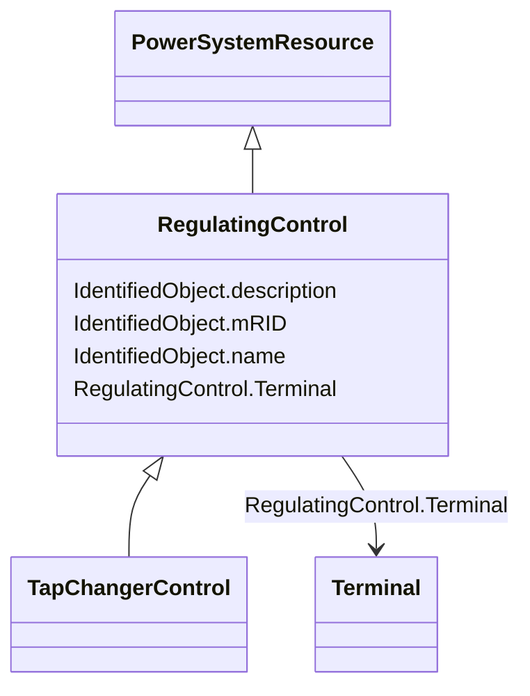

# RegulatingControl

_Specifies a set of equipment that works together to control a power system quantity such as voltage or flow.Remote bus voltage control is possible by specifying the controlled terminal located at some place remote from the controlling equipment.The specified terminal shall be associated with the connectivity node of the controlled point.  The most specific subtype of RegulatingControl shall be used in case such equipment participate in the control, e.g. TapChangerControl for tap changers.For flow control, load sign convention is used, i.e. positive sign means flow out from a TopologicalNode (bus) into the conducting equipment.The attribute minAllowedTargetValue and maxAllowedTargetValue are required in the following cases:- For a power generating module operated in power factor control mode to specify maximum and minimum power factor values;- Whenever it is necessary to have an off center target voltage for the tap changer regulator. For instance, due to long cables to off shore wind farms and the need to have a simpler setup at the off shore transformer platform, the voltage is controlled from the land at the connection point for the off shore wind farm. Since there usually is a voltage rise along the cable, there is typical and overvoltage of up 3-4 kV compared to the on shore station. Thus in normal operation the tap changer on the on shore station is operated with a target set point, which is in the lower parts of the dead band.The attributes minAllowedTargetValue and maxAllowedTargetValue are not related to the attribute targetDeadband and thus they are not treated as an alternative of the targetDeadband. They are needed due to limitations in the local substation controller. The attribute targetDeadband is used to prevent the power flow from move the tap position in circles (hunting) that is to be used regardless of the attributes minAllowedTargetValue and maxAllowedTargetValue._

**URI**: [cim:RegulatingControl](http://iec.ch/TC57/CIM100#RegulatingControl) 
**Type**: Class

## Inheritance
* [IdentifiedObject](IdentifiedObject.md)
    * [PowerSystemResource](PowerSystemResource.md)
        * **RegulatingControl**
            * [TapChangerControl](TapChangerControl.md)

## Attributes

| Name | URI | Cardinality and Range | Description | Inheritance |
| ---  | --- | --- | --- | --- |
| Terminal | [cim:RegulatingControl.Terminal](http://iec.ch/TC57/CIM100#RegulatingControl.Terminal) | 1    [Terminal](Terminal.md)  | The terminal associated with this regulating control | direct |
| mRID | [cim:IdentifiedObject.mRID](http://iec.ch/TC57/CIM100#IdentifiedObject.mRID) | 1    string  | Master resource identifier issued by a model authority | [IdentifiedObject](IdentifiedObject.md) |
| description | [cim:IdentifiedObject.description](http://iec.ch/TC57/CIM100#IdentifiedObject.description) | 0..1    string  | The description is a free human readable text describing or naming the object | [IdentifiedObject](IdentifiedObject.md) |
| name | [cim:IdentifiedObject.name](http://iec.ch/TC57/CIM100#IdentifiedObject.name) | 1    string  | The name is any free human readable and possibly non unique text naming the o... | [IdentifiedObject](IdentifiedObject.md) |

## Usages

| used by | used in | type | used |
| ---  | --- | --- | --- |
| [AsynchronousMachine](AsynchronousMachine.md) | RegulatingControl | range | [RegulatingControl](RegulatingControl.md) |
| [ExternalNetworkInjection](ExternalNetworkInjection.md) | RegulatingControl | range | [RegulatingControl](RegulatingControl.md) |
| [LinearShuntCompensator](LinearShuntCompensator.md) | RegulatingControl | range | [RegulatingControl](RegulatingControl.md) |
| [NonlinearShuntCompensator](NonlinearShuntCompensator.md) | RegulatingControl | range | [RegulatingControl](RegulatingControl.md) |
| [PowerElectronicsConnection](PowerElectronicsConnection.md) | RegulatingControl | range | [RegulatingControl](RegulatingControl.md) |
| [RegulatingCondEq](RegulatingCondEq.md) | RegulatingControl | range | [RegulatingControl](RegulatingControl.md) |
| [RegulationSchedule](RegulationSchedule.md) | RegulatingControl | range | [RegulatingControl](RegulatingControl.md) |
| [RotatingMachine](RotatingMachine.md) | RegulatingControl | range | [RegulatingControl](RegulatingControl.md) |
| [ShuntCompensator](ShuntCompensator.md) | RegulatingControl | range | [RegulatingControl](RegulatingControl.md) |
| [StaticVarCompensator](StaticVarCompensator.md) | RegulatingControl | range | [RegulatingControl](RegulatingControl.md) |
| [SynchronousMachine](SynchronousMachine.md) | RegulatingControl | range | [RegulatingControl](RegulatingControl.md) |

## Identifier and Mapping Information

### Schema Source

* from schema: http://iec.ch/TC57/2020/CPSM-CoreEquipment#

## Mappings

| Mapping Type | Mapped Value |
| ---  | ---  |
| self | cim:RegulatingControl |
| native | this:RegulatingControl |

