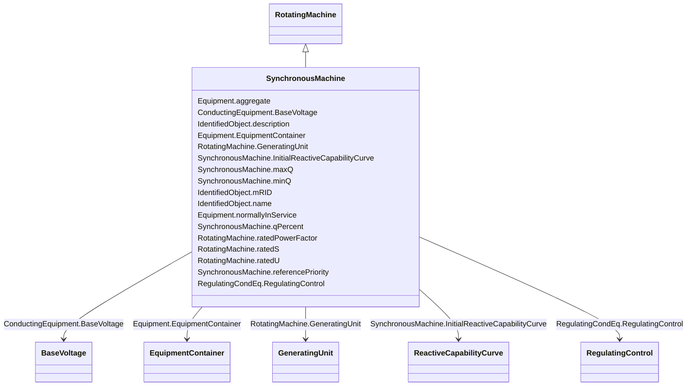

# SynchronousMachine

_An electromechanical device that operates with shaft rotating synchronously with the network. It is a single machine operating either as a generator or synchronous condenser or pump._

**URI**: [cim:SynchronousMachine](http://iec.ch/TC57/CIM100#SynchronousMachine) 
**Type**: Class

## Inheritance
* [IdentifiedObject](IdentifiedObject.md)
    * [PowerSystemResource](PowerSystemResource.md)
        * [Equipment](Equipment.md)
            * [ConductingEquipment](ConductingEquipment.md)
                * [EnergyConnection](EnergyConnection.md)
                    * [RegulatingCondEq](RegulatingCondEq.md)
                        * [RotatingMachine](RotatingMachine.md)
                            * **SynchronousMachine**

## Attributes

| Name | URI | Cardinality and Range | Description | Inheritance |
| ---  | --- | --- | --- | --- |
| maxQ | [cim:SynchronousMachine.maxQ](http://iec.ch/TC57/CIM100#SynchronousMachine.maxQ) | 0..1    [ReactivePower](ReactivePower.md)  | Maximum reactive power limit | direct |
| minQ | [cim:SynchronousMachine.minQ](http://iec.ch/TC57/CIM100#SynchronousMachine.minQ) | 0..1    [ReactivePower](ReactivePower.md)  | Minimum reactive power limit for the unit | direct |
| qPercent | [cim:SynchronousMachine.qPercent](http://iec.ch/TC57/CIM100#SynchronousMachine.qPercent) | 0..1    [PerCent](PerCent.md)  | Part of the coordinated reactive control that comes from this machine | direct |
| referencePriority | [cim:SynchronousMachine.referencePriority](http://iec.ch/TC57/CIM100#SynchronousMachine.referencePriority) | 0..1    integer  | Priority of unit for use as powerflow voltage phase angle reference bus selec... | direct |
| InitialReactiveCapabilityCurve | [cim:SynchronousMachine.InitialReactiveCapabilityCurve](http://iec.ch/TC57/CIM100#SynchronousMachine.InitialReactiveCapabilityCurve) | 0..1    [ReactiveCapabilityCurve](ReactiveCapabilityCurve.md)  | The default reactive capability curve for use by a synchronous machine | direct |
| ratedPowerFactor | [cim:RotatingMachine.ratedPowerFactor](http://iec.ch/TC57/CIM100#RotatingMachine.ratedPowerFactor) | 0..1    float  | Power factor (nameplate data) | [RotatingMachine](RotatingMachine.md) |
| ratedS | [cim:RotatingMachine.ratedS](http://iec.ch/TC57/CIM100#RotatingMachine.ratedS) | 0..1    [ApparentPower](ApparentPower.md)  | Nameplate apparent power rating for the unit | [RotatingMachine](RotatingMachine.md) |
| ratedU | [cim:RotatingMachine.ratedU](http://iec.ch/TC57/CIM100#RotatingMachine.ratedU) | 0..1    [Voltage](Voltage.md)  | Rated voltage (nameplate data, Ur in IEC 60909-0) | [RotatingMachine](RotatingMachine.md) |
| GeneratingUnit | [cim:RotatingMachine.GeneratingUnit](http://iec.ch/TC57/CIM100#RotatingMachine.GeneratingUnit) | 0..1    [GeneratingUnit](GeneratingUnit.md)  | A synchronous machine may operate as a generator and as such becomes a member... | [RotatingMachine](RotatingMachine.md) |
| RegulatingControl | [cim:RegulatingCondEq.RegulatingControl](http://iec.ch/TC57/CIM100#RegulatingCondEq.RegulatingControl) | 0..1    [RegulatingControl](RegulatingControl.md)  | The regulating control scheme in which this equipment participates | [RegulatingCondEq](RegulatingCondEq.md) |
| BaseVoltage | [cim:ConductingEquipment.BaseVoltage](http://iec.ch/TC57/CIM100#ConductingEquipment.BaseVoltage) | 0..1    [BaseVoltage](BaseVoltage.md)  | Base voltage of this conducting equipment | [ConductingEquipment](ConductingEquipment.md) |
| aggregate | [cim:Equipment.aggregate](http://iec.ch/TC57/CIM100#Equipment.aggregate) | 0..1    boolean  | The aggregate flag provides an alternative way of representing an aggregated ... | [Equipment](Equipment.md) |
| normallyInService | [cim:Equipment.normallyInService](http://iec.ch/TC57/CIM100#Equipment.normallyInService) | 0..1    boolean  | Specifies the availability of the equipment under normal operating conditions | [Equipment](Equipment.md) |
| EquipmentContainer | [cim:Equipment.EquipmentContainer](http://iec.ch/TC57/CIM100#Equipment.EquipmentContainer) | 0..1    [EquipmentContainer](EquipmentContainer.md)  | Container of this equipment | [Equipment](Equipment.md) |
| mRID | [cim:IdentifiedObject.mRID](http://iec.ch/TC57/CIM100#IdentifiedObject.mRID) | 1    string  | Master resource identifier issued by a model authority | [IdentifiedObject](IdentifiedObject.md) |
| description | [cim:IdentifiedObject.description](http://iec.ch/TC57/CIM100#IdentifiedObject.description) | 0..1    string  | The description is a free human readable text describing or naming the object | [IdentifiedObject](IdentifiedObject.md) |
| name | [cim:IdentifiedObject.name](http://iec.ch/TC57/CIM100#IdentifiedObject.name) | 1    string  | The name is any free human readable and possibly non unique text naming the o... | [IdentifiedObject](IdentifiedObject.md) |

## Comments

* -  If a SynchronousMachine is not associated with a ReactiveCapabilityCurve, then the minQ and maxQ attributes will be used.-  If a ReactiveCapabilityCurve is supplied, then the minQ and maxQ attributes are not required.-  If a synchronous condenser is being modeled so that there is no capability for real power output, the SynchronousMachine is not required to be associated with a GeneratingUnit.  In this case, the type and operatingMode attributes must both be set to condenser.

## Identifier and Mapping Information

### Schema Source

* from schema: http://iec.ch/TC57/2020/CPSM-CoreEquipment#

## Mappings

| Mapping Type | Mapped Value |
| ---  | ---  |
| self | cim:SynchronousMachine |
| native | this:SynchronousMachine |

