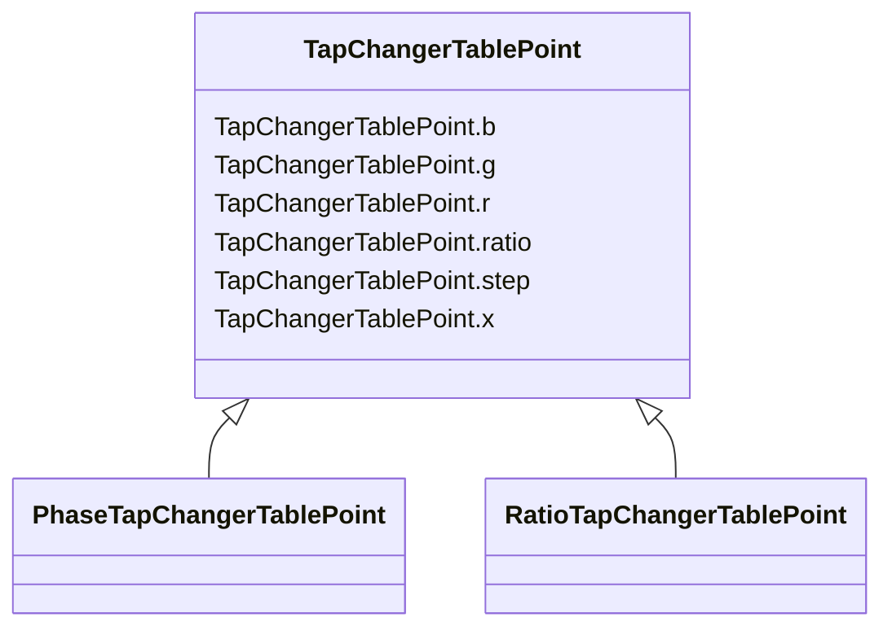

# TapChangerTablePoint

_Describes each tap step in the tabular curve._

* __NOTE__: this is an abstract class and should not be instantiated directly

**URI**: [cim:TapChangerTablePoint](http://iec.ch/TC57/CIM100#TapChangerTablePoint) 
**Type**: Class

## Inheritance
* **TapChangerTablePoint**
    * [PhaseTapChangerTablePoint](PhaseTapChangerTablePoint.md)
    * [RatioTapChangerTablePoint](RatioTapChangerTablePoint.md)

## Attributes

| Name | URI | Cardinality and Range | Description | Inheritance |
| ---  | --- | --- | --- | --- |
| b | [cim:TapChangerTablePoint.b](http://iec.ch/TC57/CIM100#TapChangerTablePoint.b) | 0..1    [PerCent](PerCent.md)  | The magnetizing branch susceptance deviation as a percentage of nominal value | direct |
| g | [cim:TapChangerTablePoint.g](http://iec.ch/TC57/CIM100#TapChangerTablePoint.g) | 0..1    [PerCent](PerCent.md)  | The magnetizing branch conductance deviation as a percentage of nominal value | direct |
| r | [cim:TapChangerTablePoint.r](http://iec.ch/TC57/CIM100#TapChangerTablePoint.r) | 0..1    [PerCent](PerCent.md)  | The resistance deviation as a percentage of nominal value | direct |
| ratio | [cim:TapChangerTablePoint.ratio](http://iec.ch/TC57/CIM100#TapChangerTablePoint.ratio) | 0..1    float  | The voltage at the tap step divided by rated voltage of the transformer end h... | direct |
| step | [cim:TapChangerTablePoint.step](http://iec.ch/TC57/CIM100#TapChangerTablePoint.step) | 1    integer  | The tap step | direct |
| x | [cim:TapChangerTablePoint.x](http://iec.ch/TC57/CIM100#TapChangerTablePoint.x) | 0..1    [PerCent](PerCent.md)  | The series reactance deviation as a percentage of nominal value | direct |

## Identifier and Mapping Information

### Schema Source

* from schema: http://iec.ch/TC57/2020/CPSM-CoreEquipment#

## Mappings

| Mapping Type | Mapped Value |
| ---  | ---  |
| self | cim:TapChangerTablePoint |
| native | this:TapChangerTablePoint |

