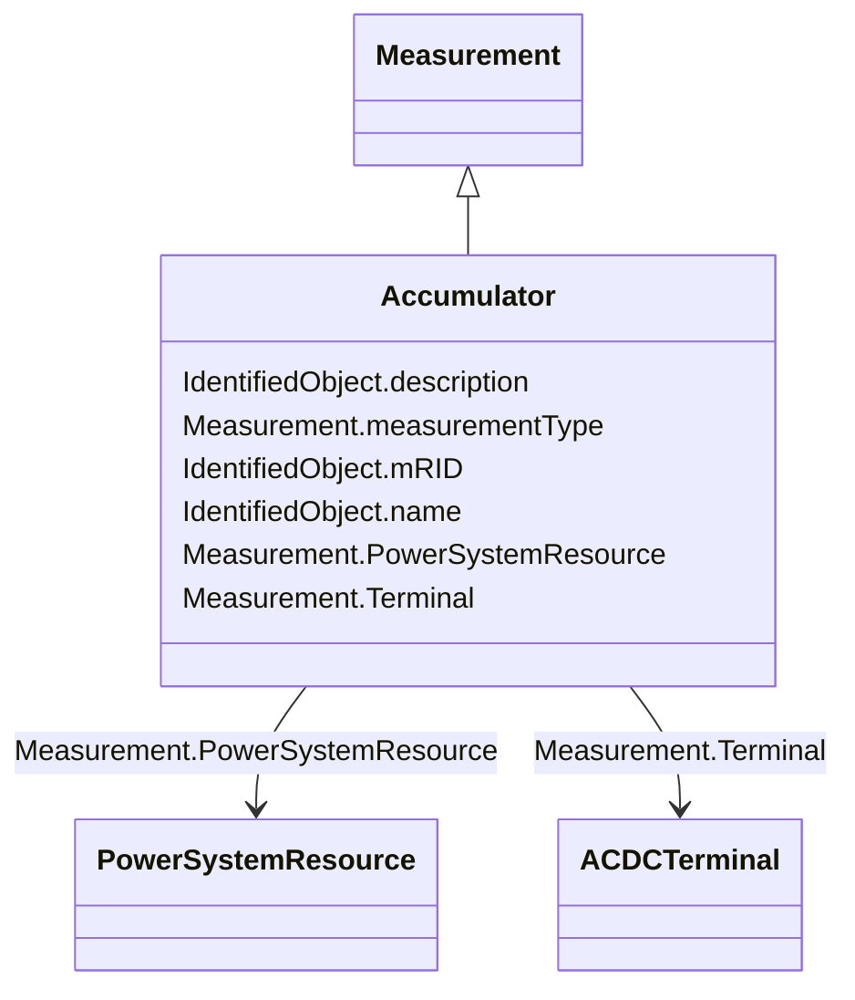

# Accumulator

_Accumulator represents an accumulated (counted) Measurement, e.g. an energy value._

**URI**: [cim:Accumulator](http://iec.ch/TC57/CIM100#Accumulator) 
**Type**: Class

## Inheritance
* [IdentifiedObject](IdentifiedObject.md)
    * [Measurement](Measurement.md)
        * **Accumulator**

## Attributes

| Name | URI | Cardinality and Range | Description | Inheritance |
| ---  | --- | --- | --- | --- |
| measurementType | [cim:Measurement.measurementType](http://iec.ch/TC57/CIM100#Measurement.measurementType) | 1    string  | Specifies the type of measurement | [Measurement](Measurement.md) |
| PowerSystemResource | [cim:Measurement.PowerSystemResource](http://iec.ch/TC57/CIM100#Measurement.PowerSystemResource) | 1    [PowerSystemResource](PowerSystemResource.md)  | The power system resource that contains the measurement | [Measurement](Measurement.md) |
| Terminal | [cim:Measurement.Terminal](http://iec.ch/TC57/CIM100#Measurement.Terminal) | 0..1    [ACDCTerminal](ACDCTerminal.md)  | One or more measurements may be associated with a terminal in the network | [Measurement](Measurement.md) |
| mRID | [cim:IdentifiedObject.mRID](http://iec.ch/TC57/CIM100#IdentifiedObject.mRID) | 1    string  | Master resource identifier issued by a model authority | [IdentifiedObject](IdentifiedObject.md) |
| description | [cim:IdentifiedObject.description](http://iec.ch/TC57/CIM100#IdentifiedObject.description) | 0..1    string  | The description is a free human readable text describing or naming the object | [IdentifiedObject](IdentifiedObject.md) |
| name | [cim:IdentifiedObject.name](http://iec.ch/TC57/CIM100#IdentifiedObject.name) | 1    string  | The name is any free human readable and possibly non unique text naming the o... | [IdentifiedObject](IdentifiedObject.md) |

## Usages

| used by | used in | type | used |
| ---  | --- | --- | --- |
| [AccumulatorLimitSet](AccumulatorLimitSet.md) | Measurements | range | [Accumulator](Accumulator.md) |
| [AccumulatorValue](AccumulatorValue.md) | Accumulator | range | [Accumulator](Accumulator.md) |

## Comments

* –  The association to Terminal may not be required depending on how the Measurement is being used. See section Use of Measurement Class for details.–  The measurementType attribute is used to define the quantity being measured (Voltage, ThreePhaseActivePower, etc.) by a Measurement. The valid values for measurementType are defined in Normative String Tables.

## Identifier and Mapping Information

### Schema Source

* from schema: http://iec.ch/TC57/2020/CPSM-Operation#

## Mappings

| Mapping Type | Mapped Value |
| ---  | ---  |
| self | cim:Accumulator |
| native | this:Accumulator |

