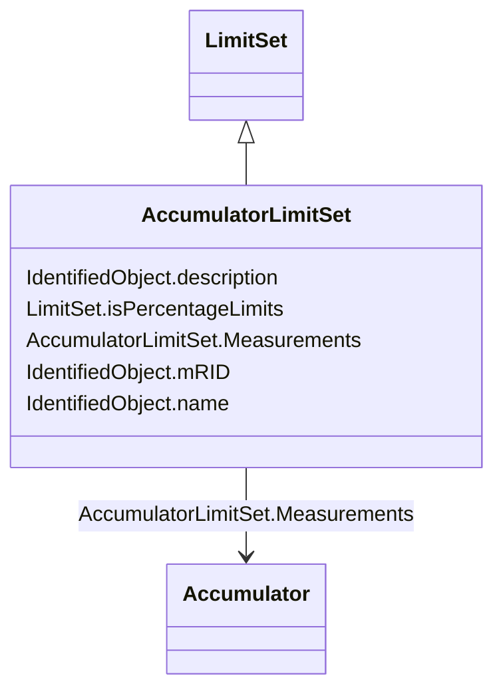

# AccumulatorLimitSet

_An AccumulatorLimitSet specifies a set of Limits that are associated with an Accumulator measurement._

**URI**: [cim:AccumulatorLimitSet](http://iec.ch/TC57/CIM100#AccumulatorLimitSet) 
**Type**: Class

## Inheritance
* [IdentifiedObject](IdentifiedObject.md)
    * [LimitSet](LimitSet.md)
        * **AccumulatorLimitSet**

## Attributes

| Name | URI | Cardinality and Range | Description | Inheritance |
| ---  | --- | --- | --- | --- |
| Measurements | [cim:AccumulatorLimitSet.Measurements](http://iec.ch/TC57/CIM100#AccumulatorLimitSet.Measurements) | 1..*    [Accumulator](Accumulator.md)  | The Measurements using the LimitSet | direct |
| isPercentageLimits | [cim:LimitSet.isPercentageLimits](http://iec.ch/TC57/CIM100#LimitSet.isPercentageLimits) | 0..1    boolean  | Tells if the limit values are in percentage of normalValue or the specified U... | [LimitSet](LimitSet.md) |
| mRID | [cim:IdentifiedObject.mRID](http://iec.ch/TC57/CIM100#IdentifiedObject.mRID) | 1    string  | Master resource identifier issued by a model authority | [IdentifiedObject](IdentifiedObject.md) |
| description | [cim:IdentifiedObject.description](http://iec.ch/TC57/CIM100#IdentifiedObject.description) | 0..1    string  | The description is a free human readable text describing or naming the object | [IdentifiedObject](IdentifiedObject.md) |
| name | [cim:IdentifiedObject.name](http://iec.ch/TC57/CIM100#IdentifiedObject.name) | 1    string  | The name is any free human readable and possibly non unique text naming the o... | [IdentifiedObject](IdentifiedObject.md) |

## Usages

| used by | used in | type | used |
| ---  | --- | --- | --- |
| [AccumulatorLimit](AccumulatorLimit.md) | LimitSet | range | [AccumulatorLimitSet](AccumulatorLimitSet.md) |

## Identifier and Mapping Information

### Schema Source

* from schema: http://iec.ch/TC57/2020/CPSM-Operation#

## Mappings

| Mapping Type | Mapped Value |
| ---  | ---  |
| self | cim:AccumulatorLimitSet |
| native | this:AccumulatorLimitSet |

