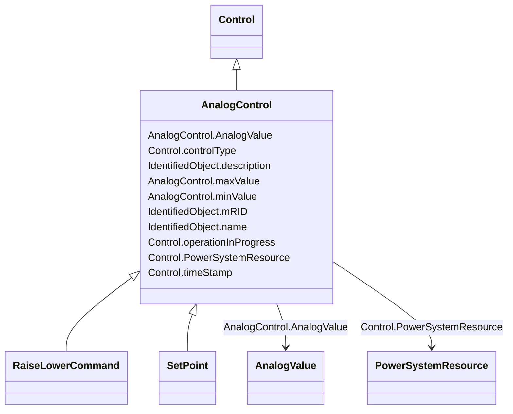

# AnalogControl

_An analog control used for supervisory control._

* __NOTE__: this is an abstract class and should not be instantiated directly

**URI**: [cim:AnalogControl](http://iec.ch/TC57/CIM100#AnalogControl) 
**Type**: Class

## Inheritance
* [IdentifiedObject](IdentifiedObject.md)
    * [IOPoint](IOPoint.md)
        * [Control](Control.md)
            * **AnalogControl**
                * [RaiseLowerCommand](RaiseLowerCommand.md)
                * [SetPoint](SetPoint.md)

## Attributes

| Name | URI | Cardinality and Range | Description | Inheritance |
| ---  | --- | --- | --- | --- |
| maxValue | [cim:AnalogControl.maxValue](http://iec.ch/TC57/CIM100#AnalogControl.maxValue) | 1    float  | Normal value range maximum for any of the Control | direct |
| minValue | [cim:AnalogControl.minValue](http://iec.ch/TC57/CIM100#AnalogControl.minValue) | 1    float  | Normal value range minimum for any of the Control | direct |
| AnalogValue | [cim:AnalogControl.AnalogValue](http://iec.ch/TC57/CIM100#AnalogControl.AnalogValue) | 1    [AnalogValue](AnalogValue.md)  | The MeasurementValue that is controlled | direct |
| controlType | [cim:Control.controlType](http://iec.ch/TC57/CIM100#Control.controlType) | 1    string  | Specifies the type of Control | [Control](Control.md) |
| operationInProgress | [cim:Control.operationInProgress](http://iec.ch/TC57/CIM100#Control.operationInProgress) | 0..1    boolean  | Indicates that a client is currently sending control commands that has not co... | [Control](Control.md) |
| timeStamp | [cim:Control.timeStamp](http://iec.ch/TC57/CIM100#Control.timeStamp) | 0..1    datetime  | The last time a control output was sent | [Control](Control.md) |
| PowerSystemResource | [cim:Control.PowerSystemResource](http://iec.ch/TC57/CIM100#Control.PowerSystemResource) | 0..1    [PowerSystemResource](PowerSystemResource.md)  | Regulating device governed by this control output | [Control](Control.md) |
| mRID | [cim:IdentifiedObject.mRID](http://iec.ch/TC57/CIM100#IdentifiedObject.mRID) | 1    string  | Master resource identifier issued by a model authority | [IdentifiedObject](IdentifiedObject.md) |
| description | [cim:IdentifiedObject.description](http://iec.ch/TC57/CIM100#IdentifiedObject.description) | 0..1    string  | The description is a free human readable text describing or naming the object | [IdentifiedObject](IdentifiedObject.md) |
| name | [cim:IdentifiedObject.name](http://iec.ch/TC57/CIM100#IdentifiedObject.name) | 1    string  | The name is any free human readable and possibly non unique text naming the o... | [IdentifiedObject](IdentifiedObject.md) |

## Identifier and Mapping Information

### Schema Source

* from schema: http://iec.ch/TC57/2020/CPSM-Operation#

## Mappings

| Mapping Type | Mapped Value |
| ---  | ---  |
| self | cim:AnalogControl |
| native | this:AnalogControl |

