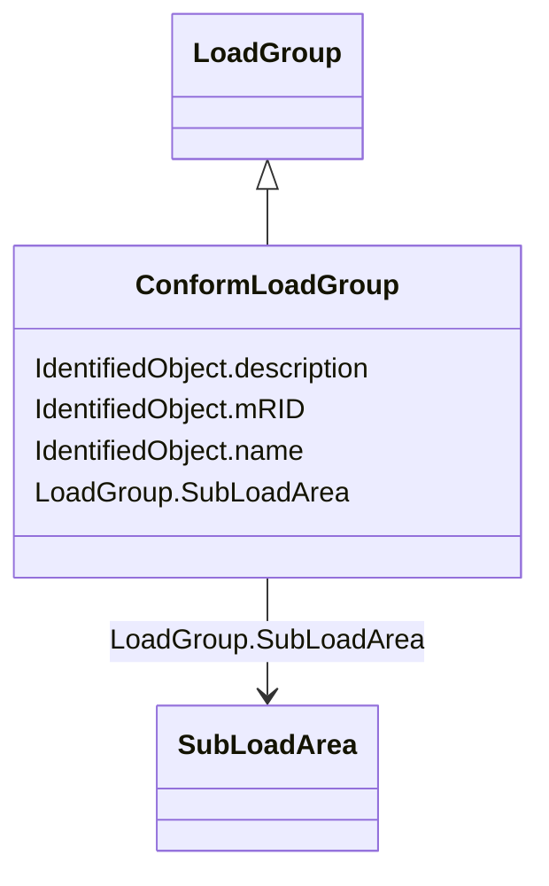

# ConformLoadGroup

_A group of loads conforming to an allocation pattern._

**URI**: [cim:ConformLoadGroup](http://iec.ch/TC57/2013/CIM-schema-cim16#ConformLoadGroup) 
**Type**: Class

## Inheritance
* [IdentifiedObject](IdentifiedObject.md)
    * [LoadGroup](LoadGroup.md)
        * **ConformLoadGroup**

## Attributes

| Name | URI | Cardinality and Range | Description | Inheritance |
| ---  | --- | --- | --- | --- |
| SubLoadArea | [cim:LoadGroup.SubLoadArea](http://iec.ch/TC57/2013/CIM-schema-cim16#LoadGroup.SubLoadArea) | 1    [SubLoadArea](SubLoadArea.md)  | The SubLoadArea where the Loadgroup belongs | [LoadGroup](LoadGroup.md) |
| mRID | [cim:IdentifiedObject.mRID](http://iec.ch/TC57/2013/CIM-schema-cim16#IdentifiedObject.mRID) | 0..1    string  | Master resource identifier issued by a model authority | [IdentifiedObject](IdentifiedObject.md) |
| description | [cim:IdentifiedObject.description](http://iec.ch/TC57/2013/CIM-schema-cim16#IdentifiedObject.description) | 0..1    string  | The description is a free human readable text describing or naming the object | [IdentifiedObject](IdentifiedObject.md) |
| name | [cim:IdentifiedObject.name](http://iec.ch/TC57/2013/CIM-schema-cim16#IdentifiedObject.name) | 1    string  | The name is any free human readable and possibly non unique text naming the o... | [IdentifiedObject](IdentifiedObject.md) |

## Usages

| used by | used in | type | used |
| ---  | --- | --- | --- |
| [ConformLoadSchedule](ConformLoadSchedule.md) | ConformLoadGroup | range | [ConformLoadGroup](ConformLoadGroup.md) |

## Identifier and Mapping Information

### Schema Source

* from schema: http://iec.ch/TC57/2013/CPSM-Operation#

## Mappings

| Mapping Type | Mapped Value |
| ---  | ---  |
| self | cim:ConformLoadGroup |
| native | this:ConformLoadGroup |

