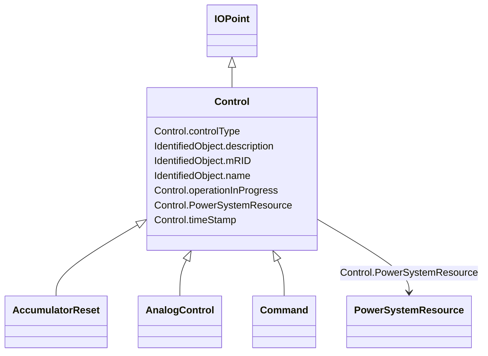

# Control

_Control is used for supervisory/device control. It represents control outputs that are used to change the state in a process, e.g. close or open breaker, a set point value or a raise lower command._

* __NOTE__: this is an abstract class and should not be instantiated directly

**URI**: [cim:Control](http://iec.ch/TC57/CIM100#Control) 
**Type**: Class

## Inheritance
* [IdentifiedObject](IdentifiedObject.md)
    * [IOPoint](IOPoint.md)
        * **Control**
            * [AccumulatorReset](AccumulatorReset.md)
            * [AnalogControl](AnalogControl.md)
            * [Command](Command.md)

## Attributes

| Name | URI | Cardinality and Range | Description | Inheritance |
| ---  | --- | --- | --- | --- |
| controlType | [cim:Control.controlType](http://iec.ch/TC57/CIM100#Control.controlType) | 1    string  | Specifies the type of Control | direct |
| operationInProgress | [cim:Control.operationInProgress](http://iec.ch/TC57/CIM100#Control.operationInProgress) | 0..1    boolean  | Indicates that a client is currently sending control commands that has not co... | direct |
| timeStamp | [cim:Control.timeStamp](http://iec.ch/TC57/CIM100#Control.timeStamp) | 0..1    datetime  | The last time a control output was sent | direct |
| PowerSystemResource | [cim:Control.PowerSystemResource](http://iec.ch/TC57/CIM100#Control.PowerSystemResource) | 0..1    [PowerSystemResource](PowerSystemResource.md)  | Regulating device governed by this control output | direct |
| mRID | [cim:IdentifiedObject.mRID](http://iec.ch/TC57/CIM100#IdentifiedObject.mRID) | 1    string  | Master resource identifier issued by a model authority | [IdentifiedObject](IdentifiedObject.md) |
| description | [cim:IdentifiedObject.description](http://iec.ch/TC57/CIM100#IdentifiedObject.description) | 0..1    string  | The description is a free human readable text describing or naming the object | [IdentifiedObject](IdentifiedObject.md) |
| name | [cim:IdentifiedObject.name](http://iec.ch/TC57/CIM100#IdentifiedObject.name) | 1    string  | The name is any free human readable and possibly non unique text naming the o... | [IdentifiedObject](IdentifiedObject.md) |

## Identifier and Mapping Information

### Schema Source

* from schema: http://iec.ch/TC57/2020/CPSM-Operation#

## Mappings

| Mapping Type | Mapped Value |
| ---  | ---  |
| self | cim:Control |
| native | this:Control |

