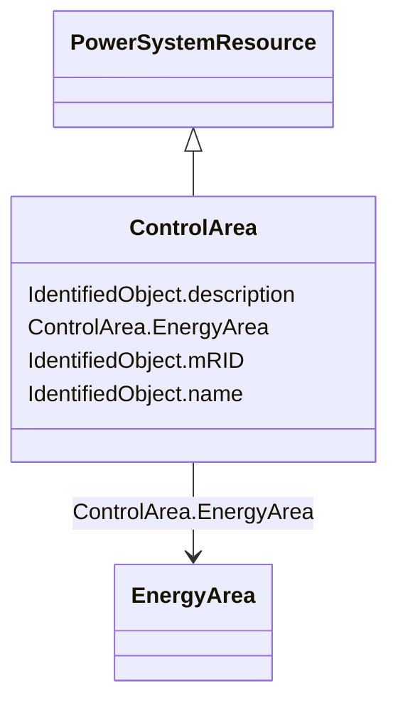

# ControlArea

_A control area<b> </b>is a grouping of generating units and/or loads and a cutset of tie lines (as terminals) which may be used for a variety of purposes including automatic generation control, powerflow solution area interchange control specification, and input to load forecasting.   Note that any number of overlapping control area specifications can be superimposed on the physical model._

**URI**: [cim:ControlArea](http://iec.ch/TC57/2013/CIM-schema-cim16#ControlArea) 
**Type**: Class

## Inheritance
* [IdentifiedObject](IdentifiedObject.md)
    * [PowerSystemResource](PowerSystemResource.md)
        * **ControlArea**

## Attributes

| Name | URI | Cardinality and Range | Description | Inheritance |
| ---  | --- | --- | --- | --- |
| EnergyArea | [cim:ControlArea.EnergyArea](http://iec.ch/TC57/2013/CIM-schema-cim16#ControlArea.EnergyArea) | 0..1    [EnergyArea](EnergyArea.md)  | The energy area that is forecast from this control area specification | direct |
| mRID | [cim:IdentifiedObject.mRID](http://iec.ch/TC57/2013/CIM-schema-cim16#IdentifiedObject.mRID) | 0..1    string  | Master resource identifier issued by a model authority | [IdentifiedObject](IdentifiedObject.md) |
| description | [cim:IdentifiedObject.description](http://iec.ch/TC57/2013/CIM-schema-cim16#IdentifiedObject.description) | 0..1    string  | The description is a free human readable text describing or naming the object | [IdentifiedObject](IdentifiedObject.md) |
| name | [cim:IdentifiedObject.name](http://iec.ch/TC57/2013/CIM-schema-cim16#IdentifiedObject.name) | 1    string  | The name is any free human readable and possibly non unique text naming the o... | [IdentifiedObject](IdentifiedObject.md) |

## Usages

| used by | used in | type | used |
| ---  | --- | --- | --- |
| [ControlAreaGeneratingUnit](ControlAreaGeneratingUnit.md) | ControlArea | range | [ControlArea](ControlArea.md) |
| [TieFlow](TieFlow.md) | ControlArea | range | [ControlArea](ControlArea.md) |

## Identifier and Mapping Information

### Schema Source

* from schema: http://iec.ch/TC57/2013/CPSM-Operation#

## Mappings

| Mapping Type | Mapped Value |
| ---  | ---  |
| self | cim:ControlArea |
| native | this:ControlArea |

