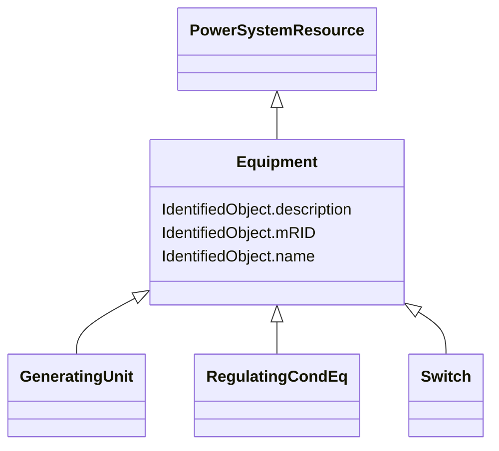

# Equipment

_The parts of a power system that are physical devices, electronic or mechanical._

* __NOTE__: this is an abstract class and should not be instantiated directly

**URI**: [cim:Equipment](http://iec.ch/TC57/2013/CIM-schema-cim16#Equipment) 
**Type**: Class

## Inheritance
* [IdentifiedObject](IdentifiedObject.md)
    * [PowerSystemResource](PowerSystemResource.md)
        * **Equipment**
            * [GeneratingUnit](GeneratingUnit.md)
            * [RegulatingCondEq](RegulatingCondEq.md)
            * [Switch](Switch.md)

## Attributes

| Name | URI | Cardinality and Range | Description | Inheritance |
| ---  | --- | --- | --- | --- |
| mRID | [cim:IdentifiedObject.mRID](http://iec.ch/TC57/2013/CIM-schema-cim16#IdentifiedObject.mRID) | 0..1    string  | Master resource identifier issued by a model authority | [IdentifiedObject](IdentifiedObject.md) |
| description | [cim:IdentifiedObject.description](http://iec.ch/TC57/2013/CIM-schema-cim16#IdentifiedObject.description) | 0..1    string  | The description is a free human readable text describing or naming the object | [IdentifiedObject](IdentifiedObject.md) |
| name | [cim:IdentifiedObject.name](http://iec.ch/TC57/2013/CIM-schema-cim16#IdentifiedObject.name) | 1    string  | The name is any free human readable and possibly non unique text naming the o... | [IdentifiedObject](IdentifiedObject.md) |

## Usages

| used by | used in | type | used |
| ---  | --- | --- | --- |
| [OperationalLimitSet](OperationalLimitSet.md) | Equipment | range | [Equipment](Equipment.md) |

## Identifier and Mapping Information

### Schema Source

* from schema: http://iec.ch/TC57/2013/CPSM-Operation#

## Mappings

| Mapping Type | Mapped Value |
| ---  | ---  |
| self | cim:Equipment |
| native | this:Equipment |

