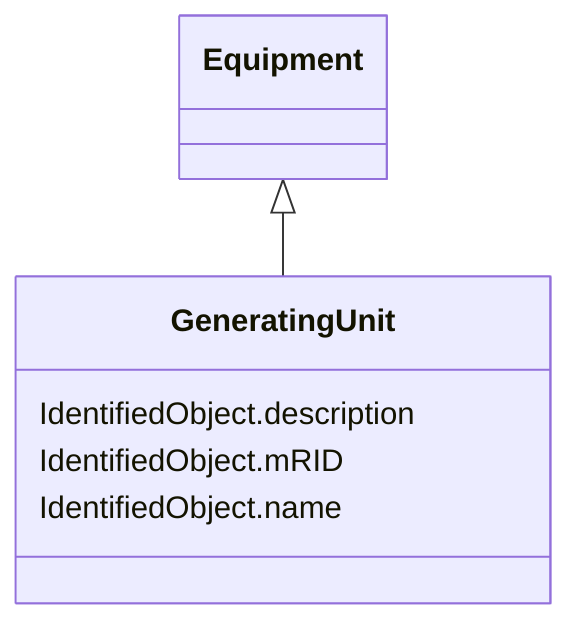

# GeneratingUnit

_A single or set of synchronous machines for converting mechanical power into alternating-current power. For example, individual machines within a set may be defined for scheduling purposes while a single control signal is derived for the set. In this case there would be a GeneratingUnit for each member of the set and an additional GeneratingUnit corresponding to the set._

**URI**: [cim:GeneratingUnit](http://iec.ch/TC57/2013/CIM-schema-cim16#GeneratingUnit) 
**Type**: Class

## Inheritance
* [IdentifiedObject](IdentifiedObject.md)
    * [PowerSystemResource](PowerSystemResource.md)
        * [Equipment](Equipment.md)
            * **GeneratingUnit**

## Attributes

| Name | URI | Cardinality and Range | Description | Inheritance |
| ---  | --- | --- | --- | --- |
| mRID | [cim:IdentifiedObject.mRID](http://iec.ch/TC57/2013/CIM-schema-cim16#IdentifiedObject.mRID) | 0..1    string  | Master resource identifier issued by a model authority | [IdentifiedObject](IdentifiedObject.md) |
| description | [cim:IdentifiedObject.description](http://iec.ch/TC57/2013/CIM-schema-cim16#IdentifiedObject.description) | 0..1    string  | The description is a free human readable text describing or naming the object | [IdentifiedObject](IdentifiedObject.md) |
| name | [cim:IdentifiedObject.name](http://iec.ch/TC57/2013/CIM-schema-cim16#IdentifiedObject.name) | 1    string  | The name is any free human readable and possibly non unique text naming the o... | [IdentifiedObject](IdentifiedObject.md) |

## Usages

| used by | used in | type | used |
| ---  | --- | --- | --- |
| [ControlAreaGeneratingUnit](ControlAreaGeneratingUnit.md) | GeneratingUnit | range | [GeneratingUnit](GeneratingUnit.md) |
| [GrossToNetActivePowerCurve](GrossToNetActivePowerCurve.md) | GeneratingUnit | range | [GeneratingUnit](GeneratingUnit.md) |

## Identifier and Mapping Information

### Schema Source

* from schema: http://iec.ch/TC57/2013/CPSM-Operation#

## Mappings

| Mapping Type | Mapped Value |
| ---  | ---  |
| self | cim:GeneratingUnit |
| native | this:GeneratingUnit |

