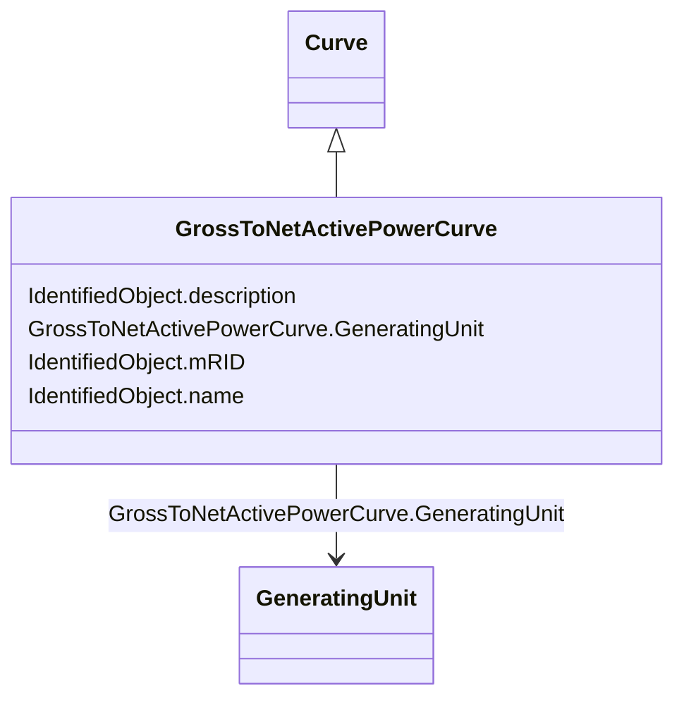

# GrossToNetActivePowerCurve

_Relationship between the generating unit's gross active power output on the X-axis (measured at the terminals of the machine(s)) and the generating unit's net active power output on the Y-axis (based on utility-defined measurements at the power station). Station service loads, when modeled, should be treated as non-conforming bus loads. There may be more than one curve, depending on the auxiliary equipment that is in service._

**URI**: [cim:GrossToNetActivePowerCurve](http://iec.ch/TC57/2013/CIM-schema-cim16#GrossToNetActivePowerCurve) 
**Type**: Class

## Inheritance
* [IdentifiedObject](IdentifiedObject.md)
    * [Curve](Curve.md)
        * **GrossToNetActivePowerCurve**

## Attributes

| Name | URI | Cardinality and Range | Description | Inheritance |
| ---  | --- | --- | --- | --- |
| GeneratingUnit | [cim:GrossToNetActivePowerCurve.GeneratingUnit](http://iec.ch/TC57/2013/CIM-schema-cim16#GrossToNetActivePowerCurve.GeneratingUnit) | 1    [GeneratingUnit](GeneratingUnit.md)  | A generating unit may have a gross active power to net active power curve, de... | direct |
| mRID | [cim:IdentifiedObject.mRID](http://iec.ch/TC57/2013/CIM-schema-cim16#IdentifiedObject.mRID) | 0..1    string  | Master resource identifier issued by a model authority | [IdentifiedObject](IdentifiedObject.md) |
| description | [cim:IdentifiedObject.description](http://iec.ch/TC57/2013/CIM-schema-cim16#IdentifiedObject.description) | 0..1    string  | The description is a free human readable text describing or naming the object | [IdentifiedObject](IdentifiedObject.md) |
| name | [cim:IdentifiedObject.name](http://iec.ch/TC57/2013/CIM-schema-cim16#IdentifiedObject.name) | 1    string  | The name is any free human readable and possibly non unique text naming the o... | [IdentifiedObject](IdentifiedObject.md) |

## Comments

* –  Because the x and y values will always be specified in MW, the xMultiplier and y1Multiplier attributes do not need to be supplied.

## Identifier and Mapping Information

### Schema Source

* from schema: http://iec.ch/TC57/2013/CPSM-Operation#

## Mappings

| Mapping Type | Mapped Value |
| ---  | ---  |
| self | cim:GrossToNetActivePowerCurve |
| native | this:GrossToNetActivePowerCurve |

