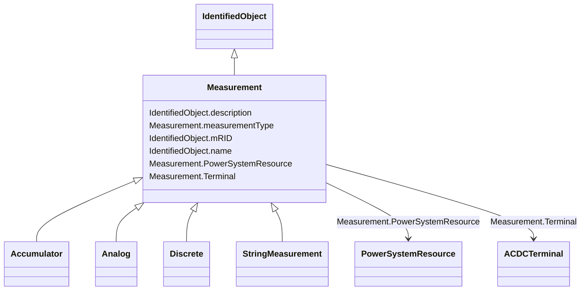

# Measurement

_A Measurement represents any measured, calculated or non-measured non-calculated quantity. Any piece of equipment may contain Measurements, e.g. a substation may have temperature measurements and door open indications, a transformer may have oil temperature and tank pressure measurements, a bay may contain a number of power flow measurements and a Breaker may contain a switch status measurement.The PSR - Measurement association is intended to capture this use of Measurement and is included in the naming hierarchy based on EquipmentContainer. The naming hierarchy typically has Measurements as leaves, e.g. Substation-VoltageLevel-Bay-Switch-Measurement.Some Measurements represent quantities related to a particular sensor location in the network, e.g. a voltage transformer (VT) or potential transformer (PT) at a busbar or a current transformer (CT) at the bar between a breaker and an isolator. The sensing position is not captured in the PSR - Measurement association. Instead it is captured by the Measurement - Terminal association that is used to define the sensing location in the network topology. The location is defined by the connection of the Terminal to ConductingEquipment.If both a Terminal and PSR are associated, and the PSR is of type ConductingEquipment, the associated Terminal should belong to that ConductingEquipment instance.When the sensor location is needed both Measurement-PSR and Measurement-Terminal are used. The Measurement-Terminal association is never used alone._

* __NOTE__: this is an abstract class and should not be instantiated directly

**URI**: [cim:Measurement](http://iec.ch/TC57/CIM100#Measurement) 
**Type**: Class

## Inheritance
* [IdentifiedObject](IdentifiedObject.md)
    * **Measurement**
        * [Accumulator](Accumulator.md)
        * [Analog](Analog.md)
        * [Discrete](Discrete.md)
        * [StringMeasurement](StringMeasurement.md)

## Attributes

| Name | URI | Cardinality and Range | Description | Inheritance |
| ---  | --- | --- | --- | --- |
| measurementType | [cim:Measurement.measurementType](http://iec.ch/TC57/CIM100#Measurement.measurementType) | 1    string  | Specifies the type of measurement | direct |
| PowerSystemResource | [cim:Measurement.PowerSystemResource](http://iec.ch/TC57/CIM100#Measurement.PowerSystemResource) | 1    [PowerSystemResource](PowerSystemResource.md)  | The power system resource that contains the measurement | direct |
| Terminal | [cim:Measurement.Terminal](http://iec.ch/TC57/CIM100#Measurement.Terminal) | 0..1    [ACDCTerminal](ACDCTerminal.md)  | One or more measurements may be associated with a terminal in the network | direct |
| mRID | [cim:IdentifiedObject.mRID](http://iec.ch/TC57/CIM100#IdentifiedObject.mRID) | 1    string  | Master resource identifier issued by a model authority | [IdentifiedObject](IdentifiedObject.md) |
| description | [cim:IdentifiedObject.description](http://iec.ch/TC57/CIM100#IdentifiedObject.description) | 0..1    string  | The description is a free human readable text describing or naming the object | [IdentifiedObject](IdentifiedObject.md) |
| name | [cim:IdentifiedObject.name](http://iec.ch/TC57/CIM100#IdentifiedObject.name) | 1    string  | The name is any free human readable and possibly non unique text naming the o... | [IdentifiedObject](IdentifiedObject.md) |

## Identifier and Mapping Information

### Schema Source

* from schema: http://iec.ch/TC57/2020/CPSM-Operation#

## Mappings

| Mapping Type | Mapped Value |
| ---  | ---  |
| self | cim:Measurement |
| native | this:Measurement |

