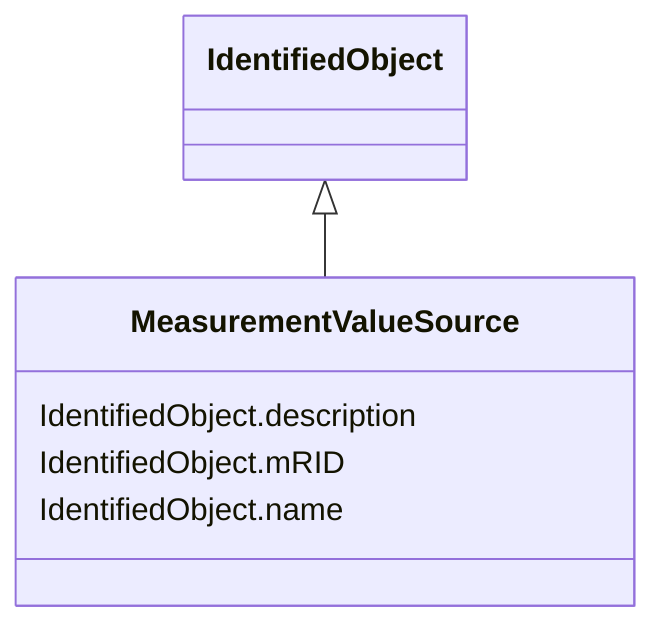

# MeasurementValueSource

_MeasurementValueSource describes the alternative sources updating a MeasurementValue. User conventions for how to use the MeasurementValueSource attributes are defined in IEC 61970-301._

**URI**: [cim:MeasurementValueSource](http://iec.ch/TC57/CIM100#MeasurementValueSource) 
**Type**: Class

## Inheritance
* [IdentifiedObject](IdentifiedObject.md)
    * **MeasurementValueSource**

## Attributes

| Name | URI | Cardinality and Range | Description | Inheritance |
| ---  | --- | --- | --- | --- |
| mRID | [cim:IdentifiedObject.mRID](http://iec.ch/TC57/CIM100#IdentifiedObject.mRID) | 1    string  | Master resource identifier issued by a model authority | [IdentifiedObject](IdentifiedObject.md) |
| description | [cim:IdentifiedObject.description](http://iec.ch/TC57/CIM100#IdentifiedObject.description) | 0..1    string  | The description is a free human readable text describing or naming the object | [IdentifiedObject](IdentifiedObject.md) |
| name | [cim:IdentifiedObject.name](http://iec.ch/TC57/CIM100#IdentifiedObject.name) | 1    string  | The name is any free human readable and possibly non unique text naming the o... | [IdentifiedObject](IdentifiedObject.md) |

## Usages

| used by | used in | type | used |
| ---  | --- | --- | --- |
| [AccumulatorValue](AccumulatorValue.md) | MeasurementValueSource | range | [MeasurementValueSource](MeasurementValueSource.md) |
| [AnalogValue](AnalogValue.md) | MeasurementValueSource | range | [MeasurementValueSource](MeasurementValueSource.md) |
| [DiscreteValue](DiscreteValue.md) | MeasurementValueSource | range | [MeasurementValueSource](MeasurementValueSource.md) |
| [MeasurementValue](MeasurementValue.md) | MeasurementValueSource | range | [MeasurementValueSource](MeasurementValueSource.md) |
| [StringMeasurementValue](StringMeasurementValue.md) | MeasurementValueSource | range | [MeasurementValueSource](MeasurementValueSource.md) |

## Identifier and Mapping Information

### Schema Source

* from schema: http://iec.ch/TC57/2020/CPSM-Operation#

## Mappings

| Mapping Type | Mapped Value |
| ---  | ---  |
| self | cim:MeasurementValueSource |
| native | this:MeasurementValueSource |

