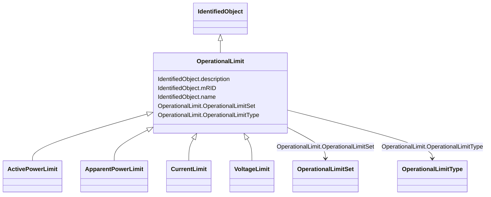

# OperationalLimit

_A value associated with a specific kind of limit.The sub class value attribute shall be positive.The sub class value attribute is inversely proportional to OperationalLimitType.acceptableDuration (acceptableDuration for short). A pair of value_x and acceptableDuration_x are related to each other as follows:if value_1 &gt; value_2 &gt; value_3 &gt;... thenacceptableDuration_1 &lt; acceptableDuration_2 &lt; acceptableDuration_3 &lt; ...A value_x with direction=high shall be greater than a value_y with direction=low._

* __NOTE__: this is an abstract class and should not be instantiated directly

**URI**: [cim:OperationalLimit](http://iec.ch/TC57/2013/CIM-schema-cim16#OperationalLimit) 
**Type**: Class

## Inheritance
* [IdentifiedObject](IdentifiedObject.md)
    * **OperationalLimit**
        * [ActivePowerLimit](ActivePowerLimit.md)
        * [ApparentPowerLimit](ApparentPowerLimit.md)
        * [CurrentLimit](CurrentLimit.md)
        * [VoltageLimit](VoltageLimit.md)

## Attributes

| Name | URI | Cardinality and Range | Description | Inheritance |
| ---  | --- | --- | --- | --- |
| OperationalLimitSet | [cim:OperationalLimit.OperationalLimitSet](http://iec.ch/TC57/2013/CIM-schema-cim16#OperationalLimit.OperationalLimitSet) | 1    [OperationalLimitSet](OperationalLimitSet.md)  | The limit set to which the limit values belong | direct |
| OperationalLimitType | [cim:OperationalLimit.OperationalLimitType](http://iec.ch/TC57/2013/CIM-schema-cim16#OperationalLimit.OperationalLimitType) | 1    [OperationalLimitType](OperationalLimitType.md)  | The limit type associated with this limit | direct |
| mRID | [cim:IdentifiedObject.mRID](http://iec.ch/TC57/2013/CIM-schema-cim16#IdentifiedObject.mRID) | 0..1    string  | Master resource identifier issued by a model authority | [IdentifiedObject](IdentifiedObject.md) |
| description | [cim:IdentifiedObject.description](http://iec.ch/TC57/2013/CIM-schema-cim16#IdentifiedObject.description) | 0..1    string  | The description is a free human readable text describing or naming the object | [IdentifiedObject](IdentifiedObject.md) |
| name | [cim:IdentifiedObject.name](http://iec.ch/TC57/2013/CIM-schema-cim16#IdentifiedObject.name) | 1    string  | The name is any free human readable and possibly non unique text naming the o... | [IdentifiedObject](IdentifiedObject.md) |

## Identifier and Mapping Information

### Schema Source

* from schema: http://iec.ch/TC57/2013/CPSM-Operation#

## Mappings

| Mapping Type | Mapped Value |
| ---  | ---  |
| self | cim:OperationalLimit |
| native | this:OperationalLimit |

