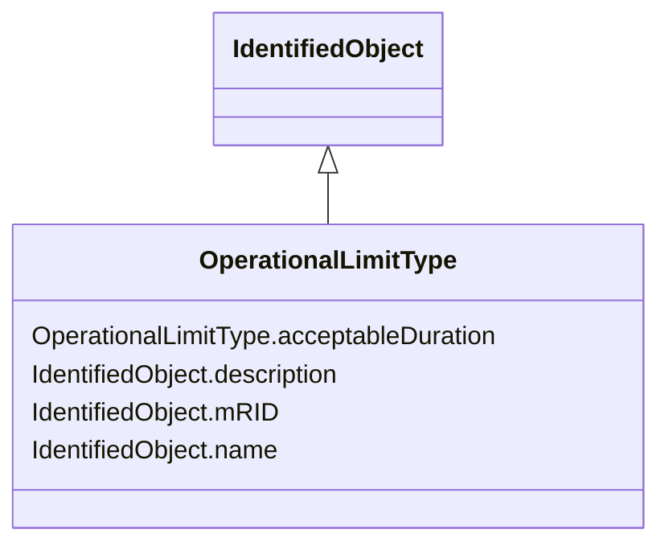

# OperationalLimitType

_The operational meaning of a category of limits._

**URI**: [cim:OperationalLimitType](http://iec.ch/TC57/2013/CIM-schema-cim16#OperationalLimitType) 
**Type**: Class

## Inheritance
* [IdentifiedObject](IdentifiedObject.md)
    * **OperationalLimitType**

## Attributes

| Name | URI | Cardinality and Range | Description | Inheritance |
| ---  | --- | --- | --- | --- |
| acceptableDuration | [cim:OperationalLimitType.acceptableDuration](http://iec.ch/TC57/2013/CIM-schema-cim16#OperationalLimitType.acceptableDuration) | 0..1    [Seconds](Seconds.md)  | The nominal acceptable duration of the limit | direct |
| mRID | [cim:IdentifiedObject.mRID](http://iec.ch/TC57/2013/CIM-schema-cim16#IdentifiedObject.mRID) | 0..1    string  | Master resource identifier issued by a model authority | [IdentifiedObject](IdentifiedObject.md) |
| description | [cim:IdentifiedObject.description](http://iec.ch/TC57/2013/CIM-schema-cim16#IdentifiedObject.description) | 0..1    string  | The description is a free human readable text describing or naming the object | [IdentifiedObject](IdentifiedObject.md) |
| name | [cim:IdentifiedObject.name](http://iec.ch/TC57/2013/CIM-schema-cim16#IdentifiedObject.name) | 1    string  | The name is any free human readable and possibly non unique text naming the o... | [IdentifiedObject](IdentifiedObject.md) |

## Usages

| used by | used in | type | used |
| ---  | --- | --- | --- |
| [ActivePowerLimit](ActivePowerLimit.md) | OperationalLimitType | range | [OperationalLimitType](OperationalLimitType.md) |
| [ApparentPowerLimit](ApparentPowerLimit.md) | OperationalLimitType | range | [OperationalLimitType](OperationalLimitType.md) |
| [CurrentLimit](CurrentLimit.md) | OperationalLimitType | range | [OperationalLimitType](OperationalLimitType.md) |
| [OperationalLimit](OperationalLimit.md) | OperationalLimitType | range | [OperationalLimitType](OperationalLimitType.md) |
| [VoltageLimit](VoltageLimit.md) | OperationalLimitType | range | [OperationalLimitType](OperationalLimitType.md) |

## Identifier and Mapping Information

### Schema Source

* from schema: http://iec.ch/TC57/2013/CPSM-Operation#

## Mappings

| Mapping Type | Mapped Value |
| ---  | ---  |
| self | cim:OperationalLimitType |
| native | this:OperationalLimitType |

