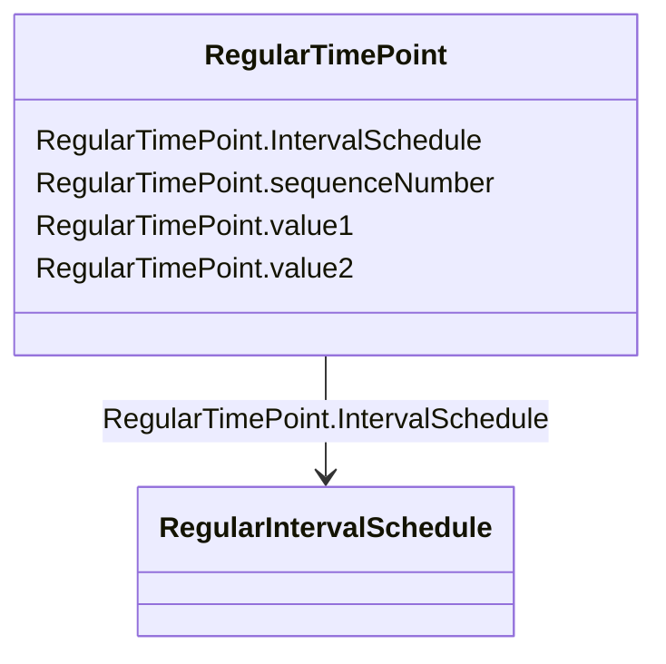

# RegularTimePoint

_Time point for a schedule where the time between the consecutive points is constant._

**URI**: [cim:RegularTimePoint](http://iec.ch/TC57/2013/CIM-schema-cim16#RegularTimePoint) 
**Type**: Class

<!-- no inheritance hierarchy -->

## Attributes

| Name | URI | Cardinality and Range | Description | Inheritance |
| ---  | --- | --- | --- | --- |
| sequenceNumber | [cim:RegularTimePoint.sequenceNumber](http://iec.ch/TC57/2013/CIM-schema-cim16#RegularTimePoint.sequenceNumber) | 1    integer  | The position of the regular time point in the sequence | direct |
| value1 | [cim:RegularTimePoint.value1](http://iec.ch/TC57/2013/CIM-schema-cim16#RegularTimePoint.value1) | 1    float  | The first value at the time | direct |
| value2 | [cim:RegularTimePoint.value2](http://iec.ch/TC57/2013/CIM-schema-cim16#RegularTimePoint.value2) | 0..1    float  | The second value at the time | direct |
| IntervalSchedule | [cim:RegularTimePoint.IntervalSchedule](http://iec.ch/TC57/2013/CIM-schema-cim16#RegularTimePoint.IntervalSchedule) | 1    [RegularIntervalSchedule](RegularIntervalSchedule.md)  | Regular interval schedule containing this time point | direct |

## Comments

* - The RegularTimePoint class is used to represent points for various schedules that derive from the RegularIntervalSchedule class. The schedules defined in this profile are ConformLoadSchedule, NonConformLoadSchedule and RegulationSchedule.-  The first SequenceNumber for a schedule is 1.  0 is not an allowed value.  The first time point is defined with SequenceNumber = 1.

## Identifier and Mapping Information

### Schema Source

* from schema: http://iec.ch/TC57/2013/CPSM-Operation#

## Mappings

| Mapping Type | Mapped Value |
| ---  | ---  |
| self | cim:RegularTimePoint |
| native | this:RegularTimePoint |

