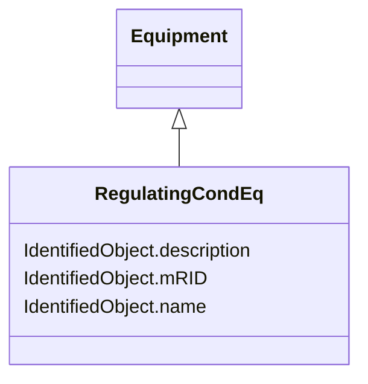

# RegulatingCondEq

_A type of conducting equipment that can regulate a quantity (i.e. voltage or flow) at a specific point in the network._

* __NOTE__: this is an abstract class and should not be instantiated directly

**URI**: [cim:RegulatingCondEq](http://iec.ch/TC57/2013/CIM-schema-cim16#RegulatingCondEq) 
**Type**: Class

## Inheritance
* [IdentifiedObject](IdentifiedObject.md)
    * [PowerSystemResource](PowerSystemResource.md)
        * [Equipment](Equipment.md)
            * **RegulatingCondEq**

## Attributes

| Name | URI | Cardinality and Range | Description | Inheritance |
| ---  | --- | --- | --- | --- |
| mRID | [cim:IdentifiedObject.mRID](http://iec.ch/TC57/2013/CIM-schema-cim16#IdentifiedObject.mRID) | 0..1    string  | Master resource identifier issued by a model authority | [IdentifiedObject](IdentifiedObject.md) |
| description | [cim:IdentifiedObject.description](http://iec.ch/TC57/2013/CIM-schema-cim16#IdentifiedObject.description) | 0..1    string  | The description is a free human readable text describing or naming the object | [IdentifiedObject](IdentifiedObject.md) |
| name | [cim:IdentifiedObject.name](http://iec.ch/TC57/2013/CIM-schema-cim16#IdentifiedObject.name) | 1    string  | The name is any free human readable and possibly non unique text naming the o... | [IdentifiedObject](IdentifiedObject.md) |

## Usages

| used by | used in | type | used |
| ---  | --- | --- | --- |
| [RegulatingControl](RegulatingControl.md) | RegulatingCondEq | range | [RegulatingCondEq](RegulatingCondEq.md) |
| [TapChangerControl](TapChangerControl.md) | RegulatingCondEq | range | [RegulatingCondEq](RegulatingCondEq.md) |

## Identifier and Mapping Information

### Schema Source

* from schema: http://iec.ch/TC57/2013/CPSM-Operation#

## Mappings

| Mapping Type | Mapped Value |
| ---  | ---  |
| self | cim:RegulatingCondEq |
| native | this:RegulatingCondEq |

