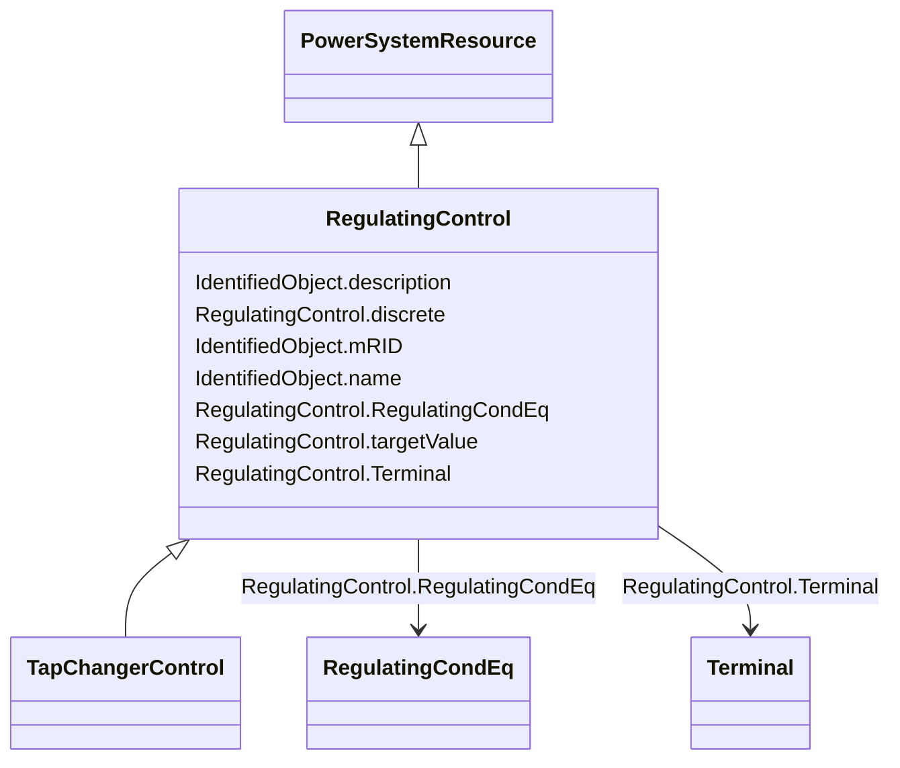

# RegulatingControl

_Specifies a set of equipment that works together to control a power system quantity such as voltage or flow.Remote bus voltage control is possible by specifying the controlled terminal located at some place remote from the controlling equipment.In case multiple equipment, possibly of different types, control same terminal there must be only one RegulatingControl at that terminal. The most specific subtype of RegulatingControl shall be used in case such equipment participate in the control, e.g. TapChangerControl for tap changers.For flow control  load sign convention is used, i.e. positive sign means flow out from a TopologicalNode (bus) into the conducting equipment._

**URI**: [cim:RegulatingControl](http://iec.ch/TC57/2013/CIM-schema-cim16#RegulatingControl) 
**Type**: Class

## Inheritance
* [IdentifiedObject](IdentifiedObject.md)
    * [PowerSystemResource](PowerSystemResource.md)
        * **RegulatingControl**
            * [TapChangerControl](TapChangerControl.md)

## Attributes

| Name | URI | Cardinality and Range | Description | Inheritance |
| ---  | --- | --- | --- | --- |
| discrete | [cim:RegulatingControl.discrete](http://iec.ch/TC57/2013/CIM-schema-cim16#RegulatingControl.discrete) | 1    boolean  | The regulation is performed in a discrete mode | direct |
| targetValue | [cim:RegulatingControl.targetValue](http://iec.ch/TC57/2013/CIM-schema-cim16#RegulatingControl.targetValue) | 0..1    float  | The target value specified for case input | direct |
| RegulatingCondEq | [cim:RegulatingControl.RegulatingCondEq](http://iec.ch/TC57/2013/CIM-schema-cim16#RegulatingControl.RegulatingCondEq) | 1..*    [RegulatingCondEq](RegulatingCondEq.md)  | The equipment that participates in this regulating control scheme | direct |
| Terminal | [cim:RegulatingControl.Terminal](http://iec.ch/TC57/2013/CIM-schema-cim16#RegulatingControl.Terminal) | 1    [Terminal](Terminal.md)  | The terminal associated with this regulating control | direct |
| mRID | [cim:IdentifiedObject.mRID](http://iec.ch/TC57/2013/CIM-schema-cim16#IdentifiedObject.mRID) | 0..1    string  | Master resource identifier issued by a model authority | [IdentifiedObject](IdentifiedObject.md) |
| description | [cim:IdentifiedObject.description](http://iec.ch/TC57/2013/CIM-schema-cim16#IdentifiedObject.description) | 0..1    string  | The description is a free human readable text describing or naming the object | [IdentifiedObject](IdentifiedObject.md) |
| name | [cim:IdentifiedObject.name](http://iec.ch/TC57/2013/CIM-schema-cim16#IdentifiedObject.name) | 1    string  | The name is any free human readable and possibly non unique text naming the o... | [IdentifiedObject](IdentifiedObject.md) |

## Usages

| used by | used in | type | used |
| ---  | --- | --- | --- |
| [RegulationSchedule](RegulationSchedule.md) | RegulatingControl | range | [RegulatingControl](RegulatingControl.md) |

## Comments

* The attributes targetRange and targetValue are not required if an associated RegulationSchedule is provided.

## Identifier and Mapping Information

### Schema Source

* from schema: http://iec.ch/TC57/2013/CPSM-Operation#

## Mappings

| Mapping Type | Mapped Value |
| ---  | ---  |
| self | cim:RegulatingControl |
| native | this:RegulatingControl |

