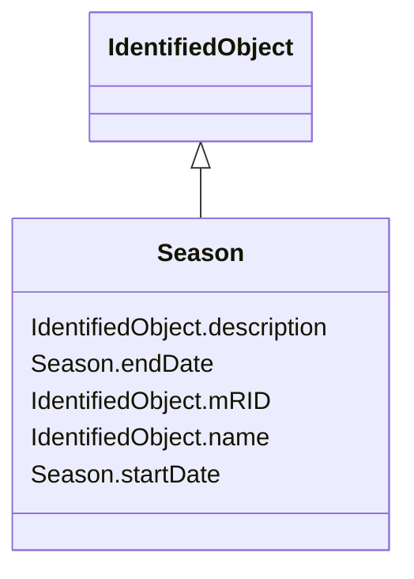

# Season

_A specified time period of the year._

**URI**: [cim:Season](http://iec.ch/TC57/2013/CIM-schema-cim16#Season) 
**Type**: Class

## Inheritance
* [IdentifiedObject](IdentifiedObject.md)
    * **Season**

## Attributes

| Name | URI | Cardinality and Range | Description | Inheritance |
| ---  | --- | --- | --- | --- |
| endDate | [cim:Season.endDate](http://iec.ch/TC57/2013/CIM-schema-cim16#Season.endDate) | 1    [MonthDay](MonthDay.md)  | Date season ends | direct |
| startDate | [cim:Season.startDate](http://iec.ch/TC57/2013/CIM-schema-cim16#Season.startDate) | 1    [MonthDay](MonthDay.md)  | Date season starts | direct |
| mRID | [cim:IdentifiedObject.mRID](http://iec.ch/TC57/2013/CIM-schema-cim16#IdentifiedObject.mRID) | 0..1    string  | Master resource identifier issued by a model authority | [IdentifiedObject](IdentifiedObject.md) |
| description | [cim:IdentifiedObject.description](http://iec.ch/TC57/2013/CIM-schema-cim16#IdentifiedObject.description) | 0..1    string  | The description is a free human readable text describing or naming the object | [IdentifiedObject](IdentifiedObject.md) |
| name | [cim:IdentifiedObject.name](http://iec.ch/TC57/2013/CIM-schema-cim16#IdentifiedObject.name) | 1    string  | The name is any free human readable and possibly non unique text naming the o... | [IdentifiedObject](IdentifiedObject.md) |

## Usages

| used by | used in | type | used |
| ---  | --- | --- | --- |
| [ConformLoadSchedule](ConformLoadSchedule.md) | Season | range | [Season](Season.md) |
| [NonConformLoadSchedule](NonConformLoadSchedule.md) | Season | range | [Season](Season.md) |
| [RegulationSchedule](RegulationSchedule.md) | Season | range | [Season](Season.md) |
| [SeasonDayTypeSchedule](SeasonDayTypeSchedule.md) | Season | range | [Season](Season.md) |
| [SwitchSchedule](SwitchSchedule.md) | Season | range | [Season](Season.md) |
| [TapSchedule](TapSchedule.md) | Season | range | [Season](Season.md) |

## Comments

* To specify a relative date as the startDate or endDate for a Season, the year component of the ISO 8601 date format (“YYYY-MM-DD”) can be omitted. The resulting format would be “MM-DD”.

## Identifier and Mapping Information

### Schema Source

* from schema: http://iec.ch/TC57/2013/CPSM-Operation#

## Mappings

| Mapping Type | Mapped Value |
| ---  | ---  |
| self | cim:Season |
| native | this:Season |

