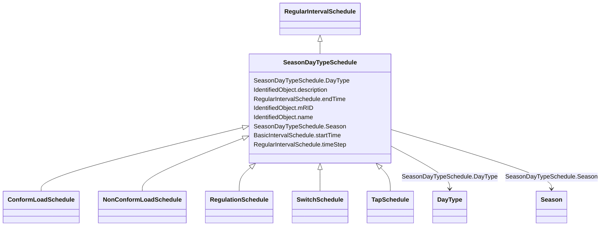

# SeasonDayTypeSchedule

_A time schedule covering a 24 hour period, with curve data for a specific type of season and day._

* __NOTE__: this is an abstract class and should not be instantiated directly

**URI**: [cim:SeasonDayTypeSchedule](http://iec.ch/TC57/2013/CIM-schema-cim16#SeasonDayTypeSchedule) 
**Type**: Class

## Inheritance
* [IdentifiedObject](IdentifiedObject.md)
    * [BasicIntervalSchedule](BasicIntervalSchedule.md)
        * [RegularIntervalSchedule](RegularIntervalSchedule.md)
            * **SeasonDayTypeSchedule**
                * [ConformLoadSchedule](ConformLoadSchedule.md)
                * [NonConformLoadSchedule](NonConformLoadSchedule.md)
                * [RegulationSchedule](RegulationSchedule.md)
                * [SwitchSchedule](SwitchSchedule.md)
                * [TapSchedule](TapSchedule.md)

## Attributes

| Name | URI | Cardinality and Range | Description | Inheritance |
| ---  | --- | --- | --- | --- |
| DayType | [cim:SeasonDayTypeSchedule.DayType](http://iec.ch/TC57/2013/CIM-schema-cim16#SeasonDayTypeSchedule.DayType) | 1    [DayType](DayType.md)  | DayType for the Schedule | direct |
| Season | [cim:SeasonDayTypeSchedule.Season](http://iec.ch/TC57/2013/CIM-schema-cim16#SeasonDayTypeSchedule.Season) | 1    [Season](Season.md)  | Season for the Schedule | direct |
| endTime | [cim:RegularIntervalSchedule.endTime](http://iec.ch/TC57/2013/CIM-schema-cim16#RegularIntervalSchedule.endTime) | 1    datetime  | The time for the last time point | [RegularIntervalSchedule](RegularIntervalSchedule.md) |
| timeStep | [cim:RegularIntervalSchedule.timeStep](http://iec.ch/TC57/2013/CIM-schema-cim16#RegularIntervalSchedule.timeStep) | 1    [Seconds](Seconds.md)  | The time between each pair of subsequent regular time points in sequence orde... | [RegularIntervalSchedule](RegularIntervalSchedule.md) |
| startTime | [cim:BasicIntervalSchedule.startTime](http://iec.ch/TC57/2013/CIM-schema-cim16#BasicIntervalSchedule.startTime) | 1    datetime  | The time for the first time point | [BasicIntervalSchedule](BasicIntervalSchedule.md) |
| mRID | [cim:IdentifiedObject.mRID](http://iec.ch/TC57/2013/CIM-schema-cim16#IdentifiedObject.mRID) | 0..1    string  | Master resource identifier issued by a model authority | [IdentifiedObject](IdentifiedObject.md) |
| description | [cim:IdentifiedObject.description](http://iec.ch/TC57/2013/CIM-schema-cim16#IdentifiedObject.description) | 0..1    string  | The description is a free human readable text describing or naming the object | [IdentifiedObject](IdentifiedObject.md) |
| name | [cim:IdentifiedObject.name](http://iec.ch/TC57/2013/CIM-schema-cim16#IdentifiedObject.name) | 1    string  | The name is any free human readable and possibly non unique text naming the o... | [IdentifiedObject](IdentifiedObject.md) |

## Identifier and Mapping Information

### Schema Source

* from schema: http://iec.ch/TC57/2013/CPSM-Operation#

## Mappings

| Mapping Type | Mapped Value |
| ---  | ---  |
| self | cim:SeasonDayTypeSchedule |
| native | this:SeasonDayTypeSchedule |

