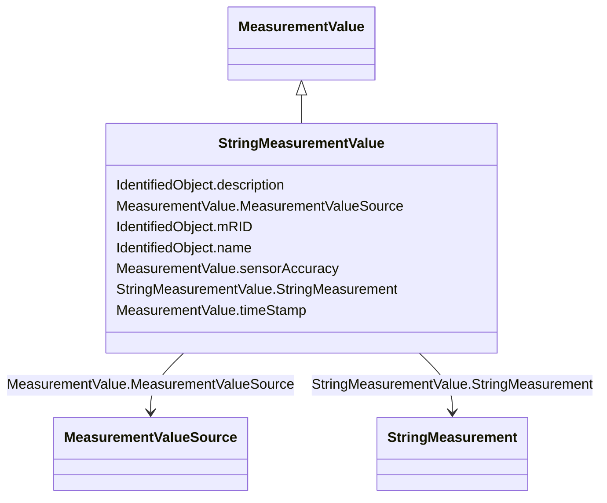

# StringMeasurementValue

_StringMeasurementValue represents a measurement value of type string._

**URI**: [cim:StringMeasurementValue](http://iec.ch/TC57/CIM100#StringMeasurementValue) 
**Type**: Class

## Inheritance
* [IdentifiedObject](IdentifiedObject.md)
    * [IOPoint](IOPoint.md)
        * [MeasurementValue](MeasurementValue.md)
            * **StringMeasurementValue**

## Attributes

| Name | URI | Cardinality and Range | Description | Inheritance |
| ---  | --- | --- | --- | --- |
| StringMeasurement | [cim:StringMeasurementValue.StringMeasurement](http://iec.ch/TC57/CIM100#StringMeasurementValue.StringMeasurement) | 1    [StringMeasurement](StringMeasurement.md)  | Measurement to which this value is connected | direct |
| sensorAccuracy | [cim:MeasurementValue.sensorAccuracy](http://iec.ch/TC57/CIM100#MeasurementValue.sensorAccuracy) | 0..1    [PerCent](PerCent.md)  | The limit, expressed as a percentage of the sensor maximum, that errors will ... | [MeasurementValue](MeasurementValue.md) |
| timeStamp | [cim:MeasurementValue.timeStamp](http://iec.ch/TC57/CIM100#MeasurementValue.timeStamp) | 0..1    datetime  | The time when the value was last updated | [MeasurementValue](MeasurementValue.md) |
| MeasurementValueSource | [cim:MeasurementValue.MeasurementValueSource](http://iec.ch/TC57/CIM100#MeasurementValue.MeasurementValueSource) | 1    [MeasurementValueSource](MeasurementValueSource.md)  | A reference to the type of source that updates the MeasurementValue, e | [MeasurementValue](MeasurementValue.md) |
| mRID | [cim:IdentifiedObject.mRID](http://iec.ch/TC57/CIM100#IdentifiedObject.mRID) | 1    string  | Master resource identifier issued by a model authority | [IdentifiedObject](IdentifiedObject.md) |
| description | [cim:IdentifiedObject.description](http://iec.ch/TC57/CIM100#IdentifiedObject.description) | 0..1    string  | The description is a free human readable text describing or naming the object | [IdentifiedObject](IdentifiedObject.md) |
| name | [cim:IdentifiedObject.name](http://iec.ch/TC57/CIM100#IdentifiedObject.name) | 1    string  | The name is any free human readable and possibly non unique text naming the o... | [IdentifiedObject](IdentifiedObject.md) |

## Comments

* In the context of this profile this class is only used to define measurements that are available via ICCP. It is not used to supply values for those measurements. Consequently the value attribute is not included in this profile.

## Identifier and Mapping Information

### Schema Source

* from schema: http://iec.ch/TC57/2020/CPSM-Operation#

## Mappings

| Mapping Type | Mapped Value |
| ---  | ---  |
| self | cim:StringMeasurementValue |
| native | this:StringMeasurementValue |

